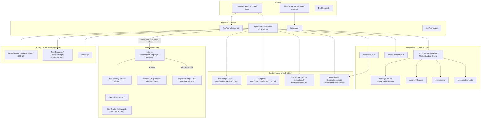

# My Tutor — Canonical Project Blueprint

**Status**: Living document — first edition, verified against repository state below
**Last verified**: 2026-08-23
**Repository**: `ammar0909291/my-tutor` (GitHub)
**Branch**: `main`
**HEAD SHA**: `f13ac3215fce51cad817572a15cbc4db3154fb6f`

This document is the single permanent, version-controlled description of My Tutor's real architecture, written so a future engineer or AI session can understand the system without any prior conversation history. Every claim below is backed by direct repository evidence (file:line citations, live validator/test runs, or exhaustive greps) gathered on the date above by six parallel research passes plus direct inspection of configuration files. Where evidence conflicts with existing project documentation (`CLAUDE.md`, ADRs, the Educational Brain Bible), the disagreement is stated explicitly rather than silently resolved — see §26. Where something could not be established from the repository alone, it is marked `UNKNOWN — NOT ESTABLISHED BY CURRENT REPOSITORY EVIDENCE` rather than guessed.

This document does not modify, redesign, or reinterpret any application behavior, curriculum content, Knowledge Graph, Educational Brain entry, Blueprint, teaching asset, visual asset, mastery threshold, certification criterion, provider/model configuration, or database schema. It is documentation only.

---

## Table of Contents

1. Executive Summary
2. Repository & Technology Stack Overview
3. High-Level System Architecture
4. Authentication & Session Management
5. Database Schema & Persistence Model
6. Curriculum & Knowledge Graph
7. Blueprints (Curriculum Content Layer)
8. Educational Brain (Teaching Science Knowledge Layer)
9. Explanation Memory / AssetIdentity System (ADR 14)
10. Teaching Runtime — End-to-End Turn Pipeline
11. Conversation Understanding Engine (CUE) & Teaching Decision Dispatch
12. Mastery / Assessment Model
13. Recovery, Confusion & Session Lifecycle
14. Lesson Completion & Excursion Handling
15. First-Lesson Protocol & Placement Verification
16. AI Provider Layer
17. Visual Intelligence / Visualization Engine
18. Frontend Architecture & the Lesson Screen
19. Coach (Separate Chat Surface)
20. Localization (i18n)
21. Dormant, Archived & Structurally Dead Systems
22. Testing Architecture & QA Safety Practices
23. CI/CD Pipeline
24. Deployment & Infrastructure
25. Known Architectural Gaps & Risks
26. Disagreements Between Documentation and Code (Consolidated)
27. Change Log
28. Decision Ownership

---

## 1. Executive Summary

My Tutor is a Next.js 14 App Router application delivering AI-tutored lessons across six subjects (mathematics, physics, chemistry, biology, computer science, English), backed by a hand-authored Knowledge Graph and a growing "Educational Brain" teaching-science knowledge tree, served through a single large chat route (`src/app/api/learn/chat/route.ts`, ~6,970 lines) that composes a system prompt from dozens of deterministic rule blocks and routes to one of four LLM providers with automatic failover.

The architecture is best understood as three layers:

- **Content layer** (mostly static, authored once): the Knowledge Graph (1,775 concepts across 6 subjects), Blueprints (1,548 markdown files, one per concept, teaching-science content), Educational Brain entries (897 markdown files, a deeper per-concept teaching-science standard), and the `AssetIdentity` system (structured explanation/probe/visual assets, DRAFT→ACTIVE lifecycle, human-review-gated).
- **Runtime/decision layer** (deterministic TypeScript, no model call): conversation-phase state machine (OBSERVE→DEMONSTRATE→GUIDE→CHECK→PRACTICE→TRANSFER), mastery gate (server-authoritative, immune to model claims), recovery/confusion detection, excursion/topic-switch handling, session lifecycle (OPENING/CORE/CLOSING), lesson completion, placement verification, and a Conversation Understanding Engine (CUE) that classifies intent and dispatches to one of several serving strategies.
- **Generation layer** (the LLM): renders the actual teaching prose inside the constraints the runtime layer sets, or is bypassed entirely when a deterministic/curated answer already exists (memory-served explanations, gate lead-ins, lesson-completion text).

The system has a documented history of finding and fixing genuine production defects through direct, repeatable measurement (live HTTP certification harnesses, transcript replay, production log analysis) rather than by design review alone — evidenced by dozens of dated entries in `CLAUDE.md`. This blueprint captures the state that resulted from that process as of the date above; it is not a design proposal.

Two facts anchor how much of this document to trust as "live": (1) 113 Prisma models exist, but several — `ConceptMasteryRecord`, `ActiveMisconception`, `ReviewSchedule`/`RetentionMetric`, the entire `Eb*`-prefixed shadow pipeline (19 models) — are schema-complete and either never written or never read by any live code path (§21); (2) roughly half of the six subjects' content pipeline (Blueprints, Educational Brain, seed assets) is complete, while biology and computer science remain at or near 0% Educational Brain / asset coverage (§7–§9).

---

## 2. Repository & Technology Stack Overview

| Layer | Technology | Evidence |
|---|---|---|
| Framework | Next.js 14.2.35, App Router | `package.json` |
| Language | TypeScript, React 18.3.1 | `package.json` |
| Auth | NextAuth v5 beta (`next-auth@5.0.0-beta.31`), JWT session strategy, no PrismaAdapter in the active auth config | `src/lib/auth/config.ts` |
| ORM / DB | Prisma `^6.2.1`, PostgreSQL (Neon and Supabase both supported), 113 models | `prisma/schema.prisma` |
| Validation | Zod `^3.24.1` | throughout `src/app/api/**` |
| AI SDKs | `@google/generative-ai` (Gemini), `groq-sdk` (Groq), `openai` SDK pointed at OpenRouter, raw `fetch` for YandexGPT | `package.json`, `src/lib/ai/providers/*` |
| 3D/visuals | `three`, `@react-three/fiber`, `@react-three/drei`, `d3`, `katex`, `mathjs`, Monaco editor | `package.json` |
| Testing | Vitest `^4.1.9` (406 test files), Playwright (E2E, present but not the primary gate) | `package.json`, `vitest.config.ts` |
| Deployment | Vercel, region `sin1`, custom build wrapper script | `vercel.json`, `scripts/ci/vercel-build.sh` |
| Email | Resend + Nodemailer/SMTP dual support | `package.json` env vars |
| Cache/queue | Redis via `ioredis`, explicitly optional (app runs without it) | `CLAUDE.md`, `src/lib/ai/budget.ts` |

No client-state library (React Query, SWR, Zustand, Redux) is used anywhere — confirmed by dependency scan. All client state is `useState` + `fetch`. No server-side streaming exists at the AI-provider layer (§16); the frontend's "streaming" is a client-side typing-effect simulation over an already-complete response.

---

## 3. High-Level System Architecture



Three deterministic "no-LLM-call" serve paths exist in the chat route, checked in this order every turn (`route.ts:3840-3938`): (1) `serveLessonComplete` — a persisted lesson attempt renders the close text with no model call; (2) `serveFromMemory` — a curated `AssetIdentity` explanation is served verbatim; (3) a server-rendered gate lead-in. Only if none apply does the route call `routeAI()` into the provider chain.

---

## 4. Authentication & Session Management

NextAuth v5, **JWT session strategy**, no `PrismaAdapter` (`src/lib/auth/config.ts:40`). Two providers: `Credentials` (bcrypt password compare) and, conditionally, `Google` OAuth (only wired if its env vars are set).

The `jwt()` callback does the work an adapter would normally do: for OAuth sign-ins it manually upserts a `User` + `Account` row (no adapter runs under JWT strategy), auto-promotes users whose email is in `ADMIN_EMAILS`, and **re-validates `token.sub` against the database on every subsequent `auth()` call** — a soft-deleted or missing user has their token invalidated on the next request. Every DB call inside this callback is wrapped in an 8-second timeout that fails open (keeps the existing token) rather than blocking, since `auth()` is called at the top of roughly 68 pages/routes.

`ADMIN_EMAILS` is an environment variable, not a database flag (confirmed consistent across all research passes and `CLAUDE.md`); it is consulted only at first sign-in for role promotion, not per-request.

---

## 5. Database Schema & Persistence Model

`prisma/schema.prisma` defines **113 models**. Grouped by function:

| Cluster | Representative models |
|---|---|
| Auth/User | `User`, `Account`, `AuthSession`, `VerificationToken`, `EmailVerificationToken` |
| Onboarding/Profile | `Profile`, `ProfileSubject`, `Subject`, `SubjectAssessment`/`Result` |
| Subscription/Payment | `Subscription`, `Payment`, `Referral` |
| Curriculum/Progress | `ModuleProgress`, `TopicProgress`, `Curriculum`, `StudentProgress`, `LessonAttempt`, `LearningPath`, `LearningCheckpoint`, `Assessment`/`Result`, `FinalAssessmentResult`, `SubjectCertificate` |
| Session/Message | `LearnSession` (carries `contextSnapshot Json?`), `Message` |
| Mastery/Evidence | `EvidenceRecord`, `MistakeRecord`, `PracticeSession`, `ConceptMasteryRecord`, `ActiveMisconception`, `BrainConfig`, `EvidenceEvent`, `SpineEvent` |
| AssetIdentity family (live, ADR 14) | `AssetIdentity`, `ExplanationAsset`, `ProbeAsset`, `VisualAsset`, `VisualGenerationOutcome` |
| `Eb*` shadow pipeline (dormant, §21) | `EbConcept`, `EbConceptEdge`, `EbMisconception`, `EbAssetIdentity`, `EbExplanation`, `EbVisual`, `EbProbe`, `EbLearnerConceptMastery`, `EbLearnerActiveMisconception`, `EbEvidenceEvent`, `EbAssetScore`, `EbBrainConfig`, `EbExperiment`, `EbExperimentAssignment`, and 5 more `Eb*` models (19 total) |
| Gamification | `XpTransaction`, `UserLevel`, `Achievement`, `UserAchievement`, `StudyStreak`, `LearningChallenge`, `WeeklyXP`, `ActivityLog` |
| Coach/Career (mostly dead, see §21) | `CoachProfile`, `LearningGoal`, `PlacementAssessment`, `AssessmentAttempt`, `LearningEstimate`, `StudyCommitment`, `CoachInsight`, `CareerProfile`, `JobReadiness`, `Roadmap`, `CapstoneProject`, `Certificate` |
| Organization/multi-tenant | `Organization`, `OrganizationMember`, `GuardianLink`, `TeacherNote` |
| Analytics/misc | `LearningAnalytics`, `SubjectAnalytics`, `RetentionMetric`, `ReviewSchedule`/`ReviewAttempt`, `Flashcard`, `TeachingStrategyEvent`, `MemoryServingEvent`, `VisualizationCache` |

### 5.1 Current-learner-state tables (read/written every turn)
- **`LearnSession.contextSnapshot`** (JSONB) — the de facto flexible per-session state store. Confirmed live keys (via grep): `memoryContext`, `lastSuccessfulTeachingStyle`, `currentConceptNodeId`, `placementVerification`, `pendingPlacementProbe`, `lastPrerequisiteGap`, `turnHistory`, `sessionFailureCount`, `narrativeState`, `lessonStageProgress`, `lastSignal`, `trackLevel`, `masteredConcepts`, `weakConcepts`, `misconceptions`, `retentionScore`, `learningSpeed`, `fatigueLevel`, `conversationState`, `teachingHistory`, `questionLedger`, `sessionEpisode`, `objectiveState`, `capabilities`, `progressionMetrics`, `kernelParity`, `enginePolicyParity`, `consecutiveOutages`, `frustration`, `verifierMetrics`, `excursion`, `visualSession`. Written via `writeSnapshotDelta()`, **optimistic-concurrency versioned** and explicitly **awaited** (changed from fire-and-forget after a documented incident where a frozen serverless instance dropped the write).
- **`Message`** — the transcript, carrying `provider`, `llmCallCount`, `dependencyInstrumentation` (teaching decision/rule id/compliance status/dispatch executor/memory-fallback reason).
- **`TopicProgress`** — per (user, subject, topic) mastery state, written by `applyTopicProgressEvidence()`, idempotency-stamped against the originating `Message.id`. **This write is fire-and-forget** (an un-awaited async IIFE) — unlike the snapshot write, the same serverless-freeze risk that motivated awaiting the snapshot write is left open here (§25, §26).
- **`LessonAttempt`** — per-attempt record for curriculum-ordered lessons: status, concept-id arrays (mastered/needs-review/misconceptions-corrected), "written by the server from persisted outcomes — never from model output" per its own schema comment.
- **`StudentProgress`** — per (user, subject) furthest-progress pointer: `currentLesson` (monotonic completion counter, raised via `Math.max`, never lowered) and `activeLessonSlug` (the lesson actually open, independently tracked). **These two fields diverging is the confirmed root cause of a real 2026-08-19 mobile-navigation bug** — see §14.

### 5.2 Migrations
**26 real migration directories** exist in `prisma/migrations/` (`0_baseline` plus 25 timestamped migrations, newest `20260821120000_user_model_override_allowed`). The Vercel build runs `bash scripts/ci/vercel-build.sh`, which runs `prisma generate` unconditionally and `prisma migrate deploy` **only when `VERCEL_ENV=production`** — a deliberate guard, because Preview deployments inherit Production's `DATABASE_URL`, and running migrations unconditionally would apply pending schema changes to the production database from a Preview build ahead of the real Production deploy. This is a real, documented past incident, not a hypothetical safeguard.

`DATABASE_URL`/`DIRECT_URL` support both Neon and Supabase; a schema comment documents a Supabase-specific constraint (its direct host is IPv6-only, unreachable from Vercel's IPv4-only egress, so migrations must use the session-mode pooler URL).

### 5.3 Connection pooling
`src/lib/db/poolConfig.ts` appends explicit pool parameters to `DATABASE_URL` at client construction (`connection_limit=15`, `pool_timeout=20s`, `statement_timeout=15000ms`, `socket_timeout=20s`), fixing a documented production incident where Prisma's serverless default (`connection_limit = CPU count`, i.e. 5 on Vercel) was exhausted by concurrent traffic. `src/lib/db/prisma.ts` also wraps calls in `withRetry()` for Neon's auto-suspend-on-idle cold-start failures.

---

## 6. Curriculum & Knowledge Graph

One JSON file per subject at `docs/{subject}/kg/graph.json`. Live-validated concept counts (2026-08-23, `scripts/validate-knowledge-graph.ts` run against all 6 subjects, all PASS, 0 failures, 0 warnings):

| Subject | Concepts | Domains | Status | Version |
|---|---|---|---|---|
| mathematics | 908 | 24 | frozen | 1.0.1 |
| physics | 238 | 12 | production | 1.0.0 |
| chemistry | 186 | (no domains array) | production | 1.0.0 |
| computer_science | 119 | (no domains array) | production | 1.0.0 |
| biology | 108 | (no domains array) | production | 2.0.0 |
| english | 216 | 12 | production | 1.0.0 |
| **Total** | **1,775** | | | |

**A real, previously-undocumented schema divergence**: chemistry/computer_science/biology carry exactly the 10 canonical fields (`id, name, requires, unlocks, cross_links, difficulty, bloom, mastery_threshold, estimated_hours, description`). Mathematics/physics/english carry those 10 plus 5 more (`aliases, parent, children, related, references`). The adapter tolerates this (`RawKGConcept` has `[key: string]: unknown`), but no documentation states this divergence is intentional.

`cross_links` and `mastery_threshold` are parsed by `subjectKgAdapter.ts` but **never mapped onto either output type** (`KnowledgeNode`/`ConceptNode`) — confirmed still true. `domain`/`concept_type` are derived at runtime from id prefix / Bloom level, never stored in the JSON.

**"A lesson IS a concept" — the runtime's defining relationship**: confirmed 1:1 across three independent call sites (chat route KG branch, Library-catalog branch, `/api/curriculum`) and stated verbatim in `lessonCompletion.ts`'s own header.

### 6.1 Placement
`CURRICULUM_LEVELS = ['beginner','intermediate','advanced']` is the one canonical, end-to-end-reachable learner-level system (selected 2026-07-08 from six historical level enums found in the repo — the other five are dead or cosmetic, see §21). `computeCurriculumEntryOrder` walks flat KG node order to the first node at/above the learner's level floor. Pre-entry nodes are consulted only as prerequisite-unlock defaults, **never written as fake completions**.

### 6.2 School Mode vs. Library Mode
Architecturally distinct. School Mode consumes `BoardSubjectCatalog`/`Chapter` directly, keyed by external board/grade order — no KG synthesis, no `Curriculum` rows generated. `StudentProgress.subjectCode` is namespaced `"<board>:<subjectSlug>:<grade>"` so School and Library progress can never collide for the same subject slug.

### 6.3 Lesson navigation — a real, fixed production bug
`resolveActiveLesson()` precedence is `activeLessonSlug → currentLesson → first lesson`. `findNextLesson`/`findPreviousLesson` previously anchored on `progress.currentLesson` (a completion counter) instead of the actually-open lesson — the ordinary case of a learner opening a lesson ahead of their recorded completions caused "Next" to jump backward and "Previous" to render disabled. Fixed 2026-08-19 by resolving the anchor via `resolveActiveLesson()` inside the navigation functions themselves. Full detail in §14 and §26.

---

## 7. Blueprints (Curriculum Content Layer)

Location: `docs/curriculum/blueprints/*.md`, one file per KG concept id. Measured count: **1,548 files**.

| Subject | Blueprints | KG concepts | Coverage |
|---|---|---|---|
| mathematics | 908 | 908 | 100% |
| physics | 238 | 238 | 100% |
| english | 216 | 216 | 100% |
| chemistry | 186 | 186 | 100% |
| biology | 0 | 108 | 0% |
| computer_science | 0 | 119 | 0% |

Structure: 15-section numbered format (Metadata, Concept Spine, CPA+ Mental Model, Why Beginners Fail, Misconception Library, Explanation Library, Analogy Library, Demonstration Library, Discovery Lesson, Teaching Actions, Voice Teaching, Assessment, Recovery Notes, Memory & Review, Transfer Map, Curriculum Feedback).

`blueprintLoader.ts` parses by heading **vocabulary**, not ordinal position — a documented fix, since the corpus spans multiple incompatible authoring generations whose section numbers collided (pre-fix, 958 of 1,333 blueprints, including 214/216 English, parsed to empty content while reporting `found: true`).

**A real, now-fixed production bug that silently zeroed out Blueprint content in production**: two stacked `next.config.js` defects — (1) `experimental.instrumentationHook` defaulted false in Next 14, so the entire Knowledge Asset cold-start bootstrap was dead code in every deployment; (2) `outputFileTracingIncludes` only follows static `import()`, never `fs.readFileSync`-computed paths, so Blueprint/Educational Brain markdown was never traced into the Vercel bundle — `blueprintLoader`'s reads hit `ENOENT` in production, returning 0 characters of content for every concept (measured live: 0 chars in prod vs. 555 chars locally for one sampled concept). Both are now fixed: `instrumentationHook: true`, and the include list explicitly lists both `docs/curriculum/blueprints/**/*.md` and `educational-brain/concepts/**/*.md`.

---

## 8. Educational Brain (Teaching Science Knowledge Layer)

Location: `educational-brain/` at repo root. Standard: `EDUCATIONAL_BRAIN_STANDARD.md` v1.0, a 21-section canonical template (Identity, Learning Objective, Core Understanding, Mental Models, Why Students Fail, Misconceptions, Analogies, Demonstrations, Discovery Questions, Teaching Sequence, Tutor Actions, Voice Teaching Notes, Assessment Signals, Tutor Recovery Strategy, Memory Hooks, Transfer Connections, Cross-Subject Connections, Blueprint References, Runtime Asset References, Curriculum Feedback, Version History).

Measured entry counts (2026-08-23):

| Subject | EB entries | KG concepts | Coverage |
|---|---|---|---|
| mathematics | 257 | 908 | 28.3% |
| physics | 238 | 238 | 100% |
| chemistry | 186 | 186 | 100% |
| english | 216 | 216 | 100% |
| biology | 0 | 108 | 0% |
| computer_science | 0 | 119 | 0% |
| **Total** | **897** | **1,775** | **50.5%** |

Mapping is 1:1 by filename: `educational-brain/concepts/{subject}/{kg-id}.md`.

**This content genuinely reaches the LLM prompt at request time, not just at authoring time.** `blueprintLoader.ts` reads Educational Brain markdown directly via `fs.readFileSync` (subject to the same `outputFileTracingIncludes` fix as Blueprints) and extracts recovery notes, anti-analogies, voice cues, opening scenario, teaching sequence, tutor actions, discovery questions, assessment signals, and the entry's own Misconceptions library — merged with, and deduplicated against, the Blueprint's own misconception register (a documented fix for a scientifically-wrong tutor response caused by unmerged duplicate registers).

Separately, a subset of Educational Brain content is also hand-transcribed in small batches into `brainSeedAssets.ts` (a data-only per-concept seed file) feeding the `AssetIdentity` population script — a **separate** path from the direct-markdown-read path above; the two do not conflict but are not the same mechanism.

---

## 9. Explanation Memory / AssetIdentity System (ADR 14)

Schema: a central `AssetIdentity` table (assetId, family, familyKind, conceptId, language, gradeBand, authorId, authorKind, `status` defaulting to `DRAFT`, version/parentVersionId chain, `canonicalSlug`, quality fields marked single-writer to the Evidence Engine, incompatibilities/prerequisites safety gates) plus three family tables: `ExplanationAsset` (content, style, readingLevel, targetedMisconceptions), `ProbeAsset` (stem, choices, correctValue, difficulty, targetedMisconceptions), `VisualAsset` (renderer, specPayload, mandatory `a11yDescription`).

**Lifecycle**: `DRAFT → REVIEW → ACTIVE → DEPRECATED → RETIRED`. Only `ACTIVE` rows are ever served (`matcher.ts` scores any non-`ACTIVE` row 0). Promotion is exclusively via the admin-gated `PATCH /api/admin/knowledge-assets` — with **one documented, deliberate exception**: `instrumentation.ts`'s cold-start bootstrap writes seed rows directly as `ACTIVE` and promotes pre-existing seed-owned `DRAFT` rows to `ACTIVE` on every cold start (opt-out: `DISABLE_SEED_ACTIVATION=true`); the file's own comment calls this an intentional lifecycle bypass, not an oversight.

`assetContract.ts` requires exactly `MIN_EXPLANATIONS = 1` and `MIN_CLOSED_CHOICE_PROBES = 3` per served (concept, band) pair — 3 is the mastery bar itself (`checkCorrect >= 1` plus `practiceCorrect >= 2`, no re-asking of a spent probe), not an arbitrary margin. A concept below this contract falls back to model-generated prose questions at mastery gates, which cannot be graded — see §12, §25.

`matcher.ts`'s `scoreMatch()`: hard-disqualifies (score 0) on concept/status/language/misconception-incompatibility mismatch; otherwise base 50 (already reviewer-approved) + up to 25 for grade-band fit + tag overlap (max 15) + a quality bonus (max 10, Evidence-Engine-owned only) + a difficulty-ladder bonus. Default confidence threshold is 65, calibrated so a freshly-approved zero-evidence `ACTIVE` asset with exact grade-band match (75) clears it on fit alone.

`instrumentation.ts` (the cold-start bootstrap) now **awaits its own work under a bounded deadline** (default 12s), not fire-and-forget — a fix for the same "serverless instance freezes the instant its response is sent" class of bug noted in §5.1. It seeds only `brainSeedAssets.ts` + `authoredSeedAssets.ts` + `chemistrySeedAssets.ts` — **not** the ~29 mathematics slice-asset files and **not** biology/computer-science seed files; those remain reachable only via the standalone `scripts/brain/seed-knowledge-assets.ts`, which needs a real `DATABASE_URL` this sandbox has never had (see §25).

Whether biology/computer-science content ever reaches `ACTIVE` in the live production database, and the exact current row counts for every subject, is **UNKNOWN — NOT ESTABLISHED BY CURRENT REPOSITORY EVIDENCE** (no direct database access during this documentation pass); `CLAUDE.md` carries prior-session self-reported production numbers that were not independently re-verified for this document.

---

## 10. Teaching Runtime — End-to-End Turn Pipeline

The chat route (`src/app/api/learn/chat/route.ts`) processes one learner turn as follows.

### 10.1 Ingress
`auth()` gate (403 if unauthenticated) → rate limit (30 requests/60s) → zod-validated body → `turnReceivedAt = Date.now()` captured (the one genuine server-side latency instrument, used for `PROBE_OUTCOME` evidence) → last 30 `Message` rows + `LearnSession` loaded → `Profile` loaded → the learner's message row is persisted **unless marked `ephemeral`** (used for resume-greeting instructions the model must see but that must never be replayed as if the learner said them — a documented fix for a prompt-leak bug).

### 10.2 Concept resolution
`resolvedConceptId` is set in strict precedence: (1) canonical KG synthesis — builds one synthetic lesson per KG node, selects the current one via `selectCurrentLesson()` (`StudentProgress.currentLesson`/`activeLessonSlug` > in-progress `TopicProgress` cache > first node); (2) legacy `Curriculum` table fallback; (3) Subject-catalog synthesis for KG-less Library subjects. KG synthesis must run **before** the legacy check — a documented P0 fix, since English previously never reached KG synthesis because it had legacy rows.

### 10.3 Conversation state — the phase ladder
`src/lib/teaching/conversationState.ts` owns a `ConversationState` carrying `phase`, `correctAtCheck`/`correctAtPractice` (plus independently-verified counters), `consecutiveFailures`, and more. The phase ladder is:

```
OBSERVE → DEMONSTRATE → GUIDE → CHECK → PRACTICE → TRANSFER
```

OBSERVE/DEMONSTRATE/GUIDE are delivery phases (advance on delivery/acknowledgement); CHECK/PRACTICE/TRANSFER are **mastery gates** — they advance only on graded evidence, never on acknowledgement. `advanceConversationState()` is the pure fold that applies each turn's evidence; §12 covers its exact increment logic.

A degraded (all-providers-failed) turn is specially guarded: phase and mastery counters are explicitly re-pinned to their previous values even if a stray `signalCorrect: true` somehow arrived — closing a measured bug where an outage turn could bank progress toward mastery with zero real teaching having occurred.

### 10.4 No-LLM-call serve paths (checked in this order)
1. **`serveLessonComplete`** — reads the persisted `LessonAttempt`, renders the close text purely from stored data (`provider: 'memory'`).
2. **`serveFromMemory`** — serves a curated `AssetIdentity` explanation verbatim (`provider: 'memory'`). Explicitly suppressed when the turn is answering a pending question, confirming readiness at a mastery gate, or otherwise responding to the learner's actual last message — each suppression closes a measured defect where a canned asset overrode direct feedback.
3. **Gate lead-in** — a server-rendered probe introduction (`provider: 'gate'`).

Only if none apply does `routeAI()` invoke the provider chain (§16).

### 10.5 Persistence at end of turn
- **`Message`** rows: assistant row carries `provider`, `dependencyInstrumentation` (teaching decision, rule id, dispatch executor, memory-fallback reason, LLM call count).
- **`contextSnapshot`**: written via `writeSnapshotDelta()`, optimistic-concurrency versioned, **awaited**.
- **`TopicProgress`/`MistakeRecord`**: written in a **fire-and-forget** IIFE — inconsistent with the snapshot write's explicit "must be awaited, serverless instances freeze" rationale (flagged in §25/§26 as an unaddressed inconsistency, not something either the code comments or `CLAUDE.md` call out).
- **`StudentProgress`**: upserted (auto-save lesson position).

### 10.6 `lesson-init` — a deliberately separate, minimal pipeline
`/api/learn/lesson-init` authenticates, builds a concise system prompt from client-supplied lesson context, calls `routeAI()`, and saves only the assistant reply. It runs **no mastery gate, no CUE, no evidence blocks, no visualization pipeline** — a documented historical gap (a learner's first contact with a lesson could reference a figure that was never attached) that was fixed by adding a visual gate specifically to this path, not by merging it into the main route.

---

## 11. Conversation Understanding Engine (CUE) & Teaching Decision Dispatch

`src/lib/understanding/` implements a Conversation Understanding Engine. `understandStudentTurn()` fans out to five guarded readers (`conversationReader`, `studentMemoryReader`, `progressReader`, `misconceptionReader`, `explanationMemoryReader`), each wrapped so a throw degrades to an `unknown`-valued fallback rather than failing the turn. The fused `StudentTurnUnderstanding` feeds `decideTeaching()` (`decisionEngine.ts`), producing a `TeachingDecision`, which `planDispatch()` maps onto exactly one `DispatchExecutor` via a static routing table:

- `SERVE_EXPLANATION_MEMORY → EXPLANATION_MEMORY` (no LLM call)
- `SERVE_LESSON_COMPLETE → LESSON_COMPLETE` (no LLM call)
- `ESCALATE_TO_LLM → LLM_OPEN`
- every other decision type (`ASK_DIAGNOSTIC_QUESTION`, `DETECT_MISCONCEPTION`, `REVIEW_PREREQUISITE`, `TEACH_DIRECTLY`, `PRACTICE`, `VISUALIZATION`, `CONTINUE_LESSON`, `ADVANCE_DIFFICULTY`) → `LLM_RENDERER` (the model is still called, but scoped to render inside the specific engine block the decision selected)

**Is this active in production?** `isBrainRuntimeEnabled()` defaults ON (`ENABLE_BRAIN_RUNTIME` unset or anything other than `'0'`/`'false'`). When active, the dispatch plan genuinely **drives** two real no-LLM-call serving forks (`EXPLANATION_MEMORY`, `LESSON_COMPLETE`). For every other decision type it is active only in the weaker sense of "selects which prompt block(s) govern the model's answer" — the model is still called on essentially every ordinary teaching turn.

`isGenuineQuestion()` (`conversationReader.ts`) — a core signal for whether a message is a question — was widened from "`?` at the end of the trimmed string" to "`?` anywhere in the message" as a documented fix (a hesitant learner asking one thing and explaining in the same breath, e.g. *"wait did i pass? i dont think i understand it"*, was previously invisible to every downstream consumer of this signal).

---

## 12. Mastery / Assessment Model

`MasterySummary` (`masteryGate.ts`) is built directly from `ConversationState`: `checkCorrect = state.correctAtCheck`, `practiceCorrect = state.correctAtPractice`, `checkRequired = 1`, `practiceRequired = 2`, `verified = (checkCorrect >= 1 && practiceCorrect >= 2)`. `masteryVerifiedStrict()` additionally requires independently-verified counters when present, and is what actually gates lesson completion.

**Exact increment site** (`conversationState.ts`, inside `advanceConversationState`'s `succeeded` branch):
```ts
case 'CHECK':
  next.correctAtCheck = prev.correctAtCheck + 1
  if (next.correctAtCheck >= 1) next.phase = 'PRACTICE'
  break
case 'PRACTICE':
  next.correctAtPractice = prev.correctAtPractice + 1
  if (next.correctAtPractice >= 2) next.phase = 'TRANSFER'
  break
```
Confirmed: these counters increment **only** when `prev.phase` is literally `'CHECK'`/`'PRACTICE'` and the answer succeeded — a correct answer during OBSERVE/DEMONSTRATE/GUIDE cannot touch them (a different case in the same switch only moves `phase`), and an acknowledgement can never touch them (enforced by both code and an explicit design comment: *"CHECK, PRACTICE and TRANSFER are mastery gates … An acknowledgement never moves those"*).

`masteryGate.ts` is the server-authoritative lesson-completion gate: it strips an unauthorized `[LESSON_COMPLETE]` tag server-side, so the client's completion flow structurally cannot fire without genuine verified evidence — only verified mastery evidence, never turn count, elapsed time, or acknowledgement, can complete a lesson.

**`withholdUngradedGateQuestion`** (`gateAssessment.ts`) is a deterministic backstop for a documented, measured real bug: prompt rules telling the model not to ask ungradeable questions at a mastery gate are advisory, and the model has been observed asking a second, ungradeable prose question at CHECK/PRACTICE phase — especially when the asset pool lacks a graded probe for that (concept, band) pair. This function strips such a stray question server-side. Its existence is itself evidence that **prose-only instructions to the model are not reliably obeyed** and require a deterministic backstop wherever the stakes (here: the mastery ladder stalling indefinitely) are high enough — the same lesson `CLAUDE.md`'s Mathematics/Chemistry build-status entries independently document at scale (0 of 43 mathematics concepts initially met the 3-probe asset contract).

### 12.1 Prisma models: live vs. schema-present-but-dead
- **`TopicProgress`**, **`LessonAttempt`**, **`MistakeRecord`** — real, live writers, confirmed above.
- **`ConceptMasteryRecord`** and **`ActiveMisconception`** — schema-complete, **zero writers anywhere in `src/` or `scripts/`** (confirmed by exhaustive grep). The one read site for `ConceptMasteryRecord` is itself gated behind an opt-in flag (`ENABLE_CONCEPT_MASTERY_READ`) and, since nothing writes the table, always resolves `null`. These are ADR-10-proposed tables that never received a writer — see §21, §26.
- **`ReviewSchedule`/`RetentionMetric`** — a complete writer exists (`src/lib/memory/update-pipeline.ts`) but has **zero callers anywhere in the live runtime**, confirmed by exhaustive grep. These tables are therefore permanently empty in production despite being read at multiple sites. The actual live spaced-review logic runs on an entirely separate code path (`spacedRetrievalScheduler.ts`, deriving `forgettingRisk` from `TopicProgress`/Student Intelligence, explicitly documented as never querying the database beyond that existing loader chain) — real, live decay/return-after-days behavior exists, just not through the models nominally named for it. See §21, §26.

---

## 13. Recovery, Confusion & Session Lifecycle

`recoveryGuard.ts`'s `detectFailureState()` checks two pattern tiers: `STRONG_PATTERNS` (unambiguous distress/surrender statements, shouting caps, matched anywhere in the message) and `MILD_PATTERNS` (ambiguous statements like "I don't understand", matched only when the message is ≤120 characters and not a rephrase request, to avoid false positives inside longer unrelated text). A `dont_understand` pattern fix allows an optional "think I" hedge (*"I don't **think I** understand"*) — closing a gap where a hedged phrasing was invisible to the detector while the unhedged form matched.

When a failure state is detected, `buildRecoveryBlock()` is injected **last** in the system prompt — deliberately after the lesson-close block, so the affect band always outranks teaching instructions above it.

`sessionLifecycle.ts` owns `SessionPhase = OPENING | CORE | CLOSING`. Episode boundary = a 30-minute inactivity gap, computed once and shared by both the failure counter and the episode derivation so they cannot disagree (itself a documented fix for a prior bug where they were computed separately and drifted). `deriveEpisode()` resets visible-failure count at a fresh boundary and sets a "retro-win-owed" flag when the previous episode's last signal was a failure, so a learner who vanishes mid-failure gets an engineered win on return rather than being dropped back into the same failure state.

**The CLOSING trigger is the affect budget (repeated graded failure — 2 visible failures generally, 1 in lesson one), not a single confusion utterance.** A confusion/recovery turn is instead absorbed by phase demotion in `advanceConversationState` without necessarily ending the session — confusion and session-ending failure are deliberately different mechanisms.

`lessonCompletionRespectsNewIntentHoisted` (`route.ts`) is a six-condition OR-chain deciding whether a message after lesson completion should be answered on its own terms rather than met with the canned "you've already finished" text: an open/started excursion, a resolved concept/topic request this turn, a genuine question, a recovery/distress utterance, or an explicit "I have a question" announcement. This closes a measured bug where *"wait did i pass? i dont think i understand it"* on a completed lesson received the identical canned completion text regardless of what was actually asked (fixed together with the `isGenuineQuestion()` widening in §11 and the `dont_understand` hedge fix above — three coordinated, narrow regex changes, no new phrase list, no new detection layer).

---

## 14. Lesson Completion & Excursion Handling

`lessonCompletion.ts` is confirmed **fully deterministic**: `requiredConceptsForLesson()` returns `[resolvedConceptId]` (the 1:1 lesson-is-a-concept mapping), `areAllRequiredConceptsClosed()` checks every required id is in the persisted attempt's mastered-or-needs-review sets, and `buildLessonCloseText()` builds the closing message purely from persisted `LessonAttempt` data — **no LLM call, no model output**. The module's own header explains why: by the time completion is known (after evidence folds at the end of a turn), the model has already produced its teaching turn, so the runtime **replaces** the outgoing text rather than asking the model to render the close.

`buildLessonCloseText()` guards against a measured false-celebration bug: it never says the equivalent of "nice work" when nothing was actually mastered and something needs review (`nothingMastered` branch) — this exact defect (F1 in a recent QA loop) was found via a real disposable-account student session, root-caused, fixed, and regression-tested with 12 new tests plus 94 pre-existing tests unchanged.

**Excursion handling** (`excursion.ts`): `ExcursionState` tracks `active`, `targetConceptId` (or, since a 2026-08-11 fix, an unresolved `targetTopicTitle` when the learner's question names something outside the curriculum), `returnToConceptId`, `turns`. Design invariants: the lesson's own concept id owns PROGRESS and is never touched by this module; the excursion target owns TEACHING for its duration; there is **no nesting** — a second off-lesson question replaces the target while keeping the original return point. `isSatisfactionSignal()` closes an excursion on natural-language satisfaction ("got it," "that helps"), but a doubt word or trailing `?` always vetoes closing — **confusion keeps an excursion open; only satisfaction closes it.**

A lesson **cannot** finalize while an excursion is active (`CompletionGateOptions.excursionActive` pauses `gateLessonCompletion`), and evidence writes explicitly exclude excursion turns so a side-quest's correctness never gets folded into the actual lesson's `TopicProgress`.

### 14.1 Mobile lesson navigation — a real, fixed production bug
`findNextLesson`/`findPreviousLesson` previously anchored on `StudentProgress.currentLesson` (a monotonic *completion* counter) instead of the lesson actually open (`resolveActiveLesson()`, which honors `activeLessonSlug`). These two diverge the moment a learner opens a lesson ahead of their recorded completions — the ordinary case, not an edge case. Reproduced against real production data: `currentLesson=1`, `activeLessonSlug` pointing at order-3 lesson → "Next" returned order 2 (**behind** the open lesson) and "Previous" returned `null` (rendered disabled). Fixed by resolving the anchor via `resolveActiveLesson()` inside the navigation functions themselves, plus a client-side fix so the local `activeLessonSlug` state is written immediately after a successful lesson-init call (previously nothing wrote it back locally, so a second tap of "Next" could re-open the same lesson until the next chat turn's opportunistic sync).

---

## 15. First-Lesson Protocol & Placement Verification

`isFirstLessonContext()` fires deterministically for Library-mode beginners at lesson order 1 with zero completions, and only while the conversation is in a delivery phase (it hands control back to the ordinary ladder once CHECK is reached — a fix for a case where the protocol kept firing past its intended window). **The trigger condition and its position in the prompt are deterministic code; the constraints it enforces (word budgets, sentence-length bursts, question counts, failure budget, vocabulary bans) are delivered as advisory prompt prose, with no code that counts words, sentences, or questions to verify the model complied.** This is a real, worth-flagging distinction from how the protocol is sometimes described (§26): the runtime deterministically controls *when* the first-lesson override fires, not what the model actually produces under it.

`placementVerification.ts` implements a three-bracket protocol (below→at→above, nerve-settler question first) for **unverified intermediate/advanced Library learners only** — beginners are excluded by design, since their entry point is lesson 1 and there is nothing below it to verify. It stops early after 2 failures (an affect budget). Adjustment is asymmetric: a downward correction is automatic and silent; an upward correction is never made from probe evidence alone. Placement calibration is explicitly suppressed on recovery/distress turns.

---

## 16. AI Provider Layer

Four provider adapters, all implementing a shared `AIProvider` interface (`name`, `model`, `complete()`, `healthCheck()`):

| Provider | Default model | Notes |
|---|---|---|
| Groq | `openai/gpt-oss-20b` | `groq-sdk` |
| Gemini | `gemini-3.5-flash-lite` | `@google/generative-ai`; hard-rejects `gemini-2.5-*` overrides (deprecated) |
| OpenRouter | `deepseek/deepseek-chat-v3.1` | `openai` SDK pointed at `https://openrouter.ai/api/v1`; key unset in production, so filtered out of the live chain |
| YandexGPT | `yandexgpt-lite/latest` | raw `fetch`; requires both `YANDEX_API_KEY` and `YANDEX_FOLDER_ID` |

**`chainKeyForLanguage()` is the single provider-selection authority** — it takes the learner's teaching language and nothing else; `routeAI`'s `country` parameter is explicitly documented as not a routing signal, logged only.

**Default (non-Russian) chain**: **Groq → Gemini → OpenRouter** (OpenRouter filtered out live). **Russian chain**: **Yandex → Gemini → OpenRouter → Groq**, an independent array deliberately untouched by the default-chain ordering. This is Groq-primary as of a 2026-08-20 reversal, documented in code comments as a direct response to a Gemini-only default having caused a total teaching outage during a Gemini rate-limit incident.

`isGeminiOnlyMode()` (`AI_PROVIDER_MODE=gemini_only`) is an **opt-in diagnostic escape hatch** — unset or any other value uses the full failover chain. A prior (2026-08-12) version of this function had the logic inverted; that inversion is what the 2026-08-20 change reversed.

### 16.1 Error classification
| Class | HTTP | Retryable |
|---|---|---|
| `AIRateLimitError` | 429 | true |
| `AITimeoutError` | — | true |
| `AIQuotaError` | 429 | **false** (exhausted daily allowance) |
| `AIServerError` | ≥500 | true |
| `AINetworkError` | — | true |
| `AIEmptyResponseError` | — | true |

A documented fix: Groq's classifier checks daily-token-quota phrasing *before* the generic 429 check, since the SDK throws the same error class for both a transient rate limit and permanent daily-quota exhaustion — misclassifying the latter as retryable previously wasted a guaranteed-fail retry on every affected turn.

Same-provider retry is gated by `disableSameProviderRetry`, which the router passes as `true` everywhere it constructs a chain — **in practice, no same-provider retry ever runs live**; a failed provider falls straight to the next tier.

### 16.2 All-providers-fail path
`routeAI()` does not swallow a total failure — it rethrows (a documented fix for a prior bug where a swallowed timeout returned fake success text). The chat route's catch site builds a `degradedTurn()`: a deterministic, verifier-clean-by-construction template chosen from a fixed chain (`SHOW_EASIEST_LEGAL → ECHO_MICROWIN → WARM_CLOSE`), never a second content author. `provider: 'degraded'` is the literal return value, consumed everywhere via `isDegradedProvider()` rather than a bare string comparison. A degraded turn (1) skips the full output-verifier pipeline (nothing to verify), and (2) is fed into `advanceConversationState` with mastery counters explicitly re-pinned to their previous values — **an outage turn can never be credited as learning evidence.** Consecutive outages escalate the learner-facing copy (rung-based, `degradedCopy.ts`) so a third consecutive outage states plainly that something is wrong rather than repeating an identical content-free template.

### 16.3 `src/lib/ai/client.ts` and system-prompt assembly
A second AI-facing module, used by ~43 non-chat call sites (flashcards, curriculum generation, assessments). As of 2026-08-02 it was rewired onto the same failover chain as `routeAI`. `buildTutorSystemPrompt()` returns the base per-language system prompt; the chat route then appends dozens of additional blocks. A repo-wide grep found **~48 distinct `build*Block()` functions across ~30 files**, of which **37 are invoked from `route.ts` alone**; several found elsewhere are dead stubs (`return ''`), e.g. `buildLessonPlanBlock`/`buildTransferReasoningBlock`/`buildMasteryIntelligenceBlock` in `src/lib/school/adaptive/*`. A typical Library-mode turn composes on the order of two to three dozen of these into one system-prompt string.

### 16.4 "One LLM call per turn" — a documented norm with named exceptions
`llmCallCount` is a per-turn instrumentation counter, not a hard cap. `route.ts` increments it at up to three points in some turns: the main completion, a "definition-agreement repair" re-call, and a "verifier-gate re-render" re-call. The architectural documentation (`EDUCATIONAL_BRAIN_BIBLE.md`, "Permanent Rule 9") states one LLM call per turn as a norm; the code shows this is a **strong norm with named, code-visible, bounded exceptions**, not an enforced ceiling — see §26.

### 16.5 No streaming, no app-level caching
None of the four provider adapters use SSE/streaming — all call the non-streaming completion method. The frontend's "streaming" is a client-side typing-effect simulation over an already-complete response. No app-implemented prompt caching exists; the only caching signal is Gemini's own implicit context caching, surfaced as read-only telemetry.

### 16.6 A residual finding, not independently confirmed as intentional
Two of the four provider adapters (Groq, OpenRouter) independently re-truncate conversation history to the last 6 messages internally, even though the router already windows history to `MAX_HISTORY_MESSAGES = 20` before calling `.complete()`. This is not documented anywhere as intentional (e.g. cost control for fallback tiers); the Yandex adapter explicitly comments that it does *not* re-slice, citing exactly this defect class as something it deliberately avoids — implying the Groq/OpenRouter behavior was simply missed rather than designed. **UNKNOWN — NOT ESTABLISHED BY CURRENT REPOSITORY EVIDENCE** whether this is intentional or a residual bug.

---

## 17. Visual Intelligence / Visualization Engine

The chat response carries four mutually-exclusive visual fields, refilled from exactly one place each turn (an "authority clamp" that unconditionally clears all four, then fills at most one via a `switch` over the single `VisualDecision.payload.renderer`):

| Field | Represents | Live? |
|---|---|---|
| `visual` | A curated registry key resolved to a static illustration card | Yes |
| `visualSpec` | A structured, Zod-validated 2D spec (graph/number-line/geometry/process-flow/...) | Yes |
| `sceneSpec` | A structured, step-based 3D scene (parametric scene builders) | Yes |
| `dynamicVisualizationCode` | LLM-generated React/Three.js source in a sandboxed iframe | **No — structurally dead on the live path.** Declared, reset to null in the authority clamp, never assigned again. |

Exactly one of `visual`/`visualSpec`/`sceneSpec` can be non-null per turn, never more than one.

### 17.1 Serving tiers (`resolveVisualForTurn`)
```
1. CURATED    — registry-named scene generator or curated binding      → use it
2. APPROVED   — a human-promoted ACTIVE VisualAsset for this concept    → use it, re-validated, never trusted on approval alone
3. GENERATED  — the engine builds one and it passes semantic validation → use it
4. NONE       — anything else, including every rejection                → no figure
```
The APPROVED tier does **not** consult the generation kill-switch or allowlist — reviewed content serves regardless; the env flags gate GENERATION only.

### 17.2 Eligibility flags — a documented naming trap
`ENABLE_AI_SCENE_GENERATION` reads like an opt-in but is actually a **kill switch defaulting to permitted** (only the exact strings `false`/`0`/`off`/`no` disable it). `VISUAL_AI_SCENE_ALLOWLIST` reads like a required allowlist but is actually **optional narrowing** (empty = no restriction). Four independent bounds still apply regardless: the kill switch, the optional narrowing, a grounding floor (≥40 characters of describable text), and generation budgets (`perSession: 6`, `perDay: 500`; an unreadable daily count is treated as over-budget, failing safe).

### 17.3 The Figure Critic
Two layers: **STATIC** (deterministic, free — equation compiles/varies, number-line highlights in range, safe layout at every viewport, figure carries speakable text, a comparison title needs ≥2 drawn elements) and **JUDGED** (one model call, a separate prompt never shown the generation rules — relevance/correctness/explanatoryValue/claimSupport). Any `unsure` verdict (including a judge timeout) resolves to `hold`, never `promote`. The critic never repairs, only accepts/rejects/holds. A cached `promote` verdict **never auto-promotes an asset to ACTIVE** — promotion stays exclusively human, via the same admin endpoint as every other asset family (a proposal to auto-promote on critic-PASS was explicitly rejected by the product owner and reverted).

### 17.4 Off-KG topics
`topicIdentity.ts`/`requestedTopic.ts` allow a topic outside the Knowledge Graph to still be drawn: identity is a hash of the normalized title, grounding text comes **exclusively from the learner's own words** — never assistant/model text, on the stated principle that "judging generated output against generated prose asks a model whether it agrees with itself." Below the 40-character grounding floor, the request declines with no provider call.

### 17.5 A confirmed, unfixed architectural gap
**No mechanism exists that compares the tutor's prose description of a visual against the structure of the attached `visualSpec`/`sceneSpec`.** All enforcement found is either presence-only (`figureReference.ts` strips a pointing sentence when no figure fired, but never checks content against a figure that *did* fire) or judged at generation time against the figure's own embedded text (the Figure Critic's `claimSupport`), never against the tutor's later free-text explanation. This is confirmed to be the exact mechanism behind a real defect found in an earlier ad-hoc QA session in this project's history: the tutor described "particle boxes with dots" while the attached visual spec was a bare `process_flow` of state names. This gap remains open — flagged, not fixed, by this document.

---

## 18. Frontend Architecture & the Lesson Screen

### 18.1 Routes
| Route | Purpose |
|---|---|
| `/learn` | The Tutor Max lesson surface, forced `dynamic = 'force-dynamic'` so subject-switching never serves a stale payload |
| `/dashboard` | Renders `DashboardV2` exclusively (composed of `NavHeader`, `TopBar`, `HeroBanner`, `DailyGoalCard`, `ContinueCard`, `PracticeModes`, `SkillPath`, `LeagueCard`, `DailyQuests`, `SubjectsGrid`, `AchievementCenter`, `ActivityTimeline`, `ExploreLinks`, `LearningCoachCard`, `ReviewQueueCard`) |
| `/onboarding` | New-user setup wizard |
| `/coach` | A separate, stateless AI study-planning chat (§19) |
| `/library`, `/library/[slug]` | Subject Library — browse/enroll/remove subjects |
| `/settings` | Voice/teaching-language/theme settings |
| `/admin/*` | Admin console, gated by `ADMIN_EMAILS` |
| `/progress`, `/progress/[sessionId]` | Mastery summary, XP level, streak, recent sessions |
| `/quiz`, `/flashcards`, `/leaderboard` | Separate practice/gamification surfaces |
| `/certificates`, `/certificates/[code]` | Certificate list + public verification page |
| `/auth/{login,signup,forgot-password,reset-password}` | Auth flow |
| `/dev/*` | Developer-only visual/simulation preview pages, not part of the learner-facing product |

### 18.2 The lesson transition contract
`completeAndAdvance()` (`LessonScreen.tsx`) is explicitly documented as **the single canonical lesson-transition path** used by every completion trigger: auto-complete, the "Complete lesson" button, the completion card's "Next lesson" button, and "Skip anyway." Order of operations: PATCH `/api/curriculum/progress` (the sole server-progress owner) → abort without transitioning if that fails ("a failed PATCH must not fake a transition") → compute the next lesson from **post-completion** progress via a pure function → clear chat state → call lesson-init for the next lesson.

`lessonInitModeFor()` centralizes the mode mapping (`introduction→'next'`, `resume→'resume'`, `review→'review'`, `restart→'restart'`); `decideLessonEntryMode()` earns `'resume'` only when genuine `IN_PROGRESS`/`REVISION` progress exists on that specific lesson.

### 18.3 Visual channel rendering
| Response field | Component |
|---|---|
| `msg.visual` | `<VisualCard>` — curated illustration, autoplay, narration timeline extracted from message text |
| `msg.visualSpec` | `<VisualRenderer>` — dispatches to `GraphRenderer`/`NumberLineRenderer`/`GeometryRenderer`/etc. |
| `msg.sceneSpec` | `<SceneSpecFigure>` — 3D scenes, only rendered when no 2D spec fired for the same message |
| `msg.dynamicVisualizationCode` | `<DynamicVisualRenderer>` — present in the component tree but structurally never populated server-side (§17) |

### 18.4 MCQ handling
A structured `mcq: {question, options, correctIndex}` is re-validated client-side (defense-in-depth against a server-validated shape) and renders as an inline answer panel. **Clicking an option sends the option's text as an ordinary chat message** through the same `/api/learn/chat` turn as free text — there is no dedicated answer-submission endpoint.

### 18.5 State management and failure handling
No client-state library (React Query/SWR/Zustand/Redux) — plain `useState` + `fetch` throughout. Server-component data-loading failures (DB timeout/pool exhaustion during `auth()` or dashboard load) degrade to an auto-retrying `<ConnectionRecovery>` screen (up to 3 auto-retries with 3s/6s/12s backoff, then a manual retry button) instead of throwing to the Next.js global error boundary. A dedicated "connect watchdog" pattern handles a stalled lesson-init call, surfacing an explicit error state with a retry button rather than an indefinite spinner.

### 18.6 A stale documentation claim, resolved by direct check
`CLAUDE.md` states `src/components/dashboard/SchoolDashboard.tsx` exists on disk as a confirmed-orphaned, unrendered component. **No file named `SchoolDashboard*` exists anywhere under `src/` in this checkout**, and the only text match for the string is an unrelated test helper function name (`canAccessSchoolDashboard`) in `src/tests/roleEnforcement.test.ts`. The live `/dashboard` route unambiguously renders `DashboardV2`, matching `CLAUDE.md`'s conclusion about which dashboard is live — but the claim that the old file still physically exists appears stale (either deleted since that note was written, or never present under that exact path). See §26.

---

## 19. Coach (Separate Chat Surface)

`/coach` renders `<CoachChat>`, which is **architecturally distinct from Tutor Max**: entirely client-side chat state (`useState<Message[]>`), no session persistence, no `sessionId`, no database-backed conversation. It POSTs to `/api/coach`, a thin wrapper that zod-validates the message array and calls the raw AI provider chain directly — **no Teaching Engine, no lesson/curriculum context, no mastery gate, no visual channels, no MCQ, no `[LESSON_COMPLETE]` handling**. The system prompt is a hardcoded per-language "study coach" persona producing a week-by-week study roadmap in prose — a planning conversation, not a teaching one.

Separately, `src/lib/coach/onboardingInterview.ts` + `<CoachInterviewStep>` is the **onboarding-time** "Coach" — a deterministic, non-AI, multiple-choice interview explicitly documented as knowing "nothing about teaching, and nothing here talks to a model" — that seeds `goalCategory`/`studyTime`/`learningStyle`/`confidenceBaseline` on the `Profile`. **`/coach`'s `CoachChat` and the onboarding interview share no code** — two different surfaces under one product name, worth distinguishing explicitly since the shared name invites conflation.

---

## 20. Localization (i18n)

`src/lib/i18n.ts` defines exactly three languages: `Lang = 'ru' | 'en' | 'hi'` (Russian, English, Hindi/Hinglish), each with **1,232 translation keys** — confirmed perfectly balanced key parity across all three blocks.

Localization operates on three genuinely different mechanisms, not one:
1. **UI chrome** — fully localized via the static `translations` dictionary (every button, header, error banner, completion-card label).
2. **Lesson-completion narrative content** (the mastered/needs-review lists, closing prose) — localized, but **not** via the static dictionary. It is produced by the LLM per-language, because `buildTutorSystemPrompt()` embeds three entirely separate, fully-written prompt strings (one per `teachingLanguage`) instructing the model on the closing-summary structure in that language.
3. **AI-generated teaching dialogue itself** — localized entirely by system-prompt instruction (*"Communicate ONLY in English unless the student explicitly asks otherwise"* for English; full separate prompt bodies for Russian/Hindi). A deliberate exception: `outputLanguage.ts` keeps the ~60 machine-instruction blocks the route appends (teaching-strategy directives, hint policy, etc.) in **English regardless of `teachingLanguage`**, since those are instructions to the model, not learner-facing text.

---

## 21. Dormant, Archived & Structurally Dead Systems

This section consolidates every system confirmed present in the codebase but not reachable from live traffic, to prevent future work from assuming aspirational documentation describes running behavior.

| System | Evidence of dormancy |
|---|---|
| `src/lib/educationalBrain/*` (`Eb*`-pipeline) | Own header: "ARCHIVED — SHADOW CODE, NOT THE BRAIN OF RECORD... its output never reaches a student." `isEducationalBrainEnabled()` defaults false; invocation site is fire-and-forget and un-awaited; zero live API-route writers to any `Eb*` Prisma model. Structurally separate from the live `AssetIdentity` family — different tables, different enums, different primary keys, no aliasing. |
| `ConceptMasteryRecord`, `ActiveMisconception` | Schema-complete, zero writers anywhere in `src/` or `scripts/`. The one `ConceptMasteryRecord` read site is opt-in-flagged and always resolves `null` since nothing populates the table. |
| `ReviewSchedule`, `RetentionMetric` | A complete writer (`memory/update-pipeline.ts`) exists but has zero callers in the live runtime — permanently empty in production. Real spaced-review logic runs on a separate path (`spacedRetrievalScheduler.ts`) that does not use these tables. |
| `CoachProfile`, `LearningGoal`, `PlacementAssessment`, `AssessmentAttempt`, `LevelBand` enum | Confirmed dead (zero writers) as of a 2026-07-08 audit; superseded by `CURRICULUM_LEVELS`. |
| `src/components/dashboard/SchoolDashboard.tsx` | Previously documented as an orphaned unrendered component; no longer found anywhere in this checkout — either deleted or the prior claim was never accurate for this exact path. |
| `sceneGenerators/sceneRouter.ts` (`routeSceneGenerator`) | Own header claims it's wired behind `ENABLE_PARAMETRIC_SCENE_GENERATION` (default off); grep confirms **zero call sites** in `route.ts` — only a test file imports it. Header is stale. |
| `generateVisualizationCode.ts` / `dynamicVisualizationCode` | Own header claims it's wired behind `ENABLE_DYNAMIC_VISUALIZATION` (on by default); zero real imports anywhere in `src/`. Declared in `route.ts`, reset to null, never assigned again — structurally always undefined on every live response. |
| `src/lib/school/adaptive/*` dead stubs | Several `build*Block()` functions (`buildLessonPlanBlock`, `buildTransferReasoningBlock`, `buildMasteryIntelligenceBlock`, `buildOutputBiasBlock`, `buildMomentumBlock`, `buildConfidenceCalibrationBlock`, `buildTeachingActionBlock`) are literally `return ''` stubs. |
| Six historical learner-level enums | Only `CURRICULUM_LEVELS` (`beginner`/`intermediate`/`advanced`) is end-to-end reachable; the other five (including `MASTERY_LEVELS`, the 6-tier Subject Library `LEVELS`, `LevelBand`) are dead or purely cosmetic, per a 2026-07-08 audit. |

**K3/K4/K5/K6 "EOS runtime"** (`src/lib/eos-runtime/`, `src/lib/kernel/`) is a partial case, not fully dormant: `degradedTurn()`/`isDegradedProvider()` (K6) are **unconditionally live regardless of any flag**, called directly from both the chat route and lesson-init. The K4 policy engine and K5 output verifier, however, default to `'off'`; setting the master flag (`ENABLE_EOS_RUNTIME=1`) alone moves them to `'shadow'`/`'log'` mode (compare-and-discard/observe-only) — **not** `'primary'`/`'enforce'` — a deliberate design choice documented inline to prevent accidentally handing the verifier authority to replace a lesson. The K5 verifier's unconditional safety floor (blocking the model from affirming a stated misconception) runs regardless of flag state. The M1 Evidence Spine (`src/lib/evidence-spine/`) is unconditional and runs on every turn, unlike K3/K4/K5.

`src/lib/brain-compiler/` and `src/lib/cekr/` are live but as an **offline compilation toolchain** — not directly imported from any API route, but consumed indirectly (their compiled output is loaded at runtime by `eos-runtime`'s pack loader).

---

## 22. Testing Architecture & QA Safety Practices

**Framework**: Vitest `^4.1.9`, `environment: 'node'`, `fileParallelism: false` (a deliberate workaround for an upstream Vitest 4.x race condition that caused spurious CI failures even when every test passed). **Current file count: 406 test files** — the previously-recorded "374 files / 8,273 passed" figure in `CLAUDE.md` (2026-08-19) is now stale; a full pass/fail count could not be established within this session's time budget and should not be treated as current (§26).

### 22.1 Replica-drift — a named, actively-managed risk
Multiple test files explicitly acknowledge testing **pure replicas** of production logic rather than the real module, and name this as a risk in their own header comments (e.g. *"the observable contracts through pure replicas of the logic"*, *"hand-copied replica, so a change to the real IST math cannot silently drift"*). `docs/architecture/VALIDATION_FRAMEWORK_P10.md` formalizes this as "Replica drift," Failure Class 1 of a two-class risk taxonomy, and defines a three-tier remediation ladder: Tier 1 (existing pure-replica units, kept), Tier 2 (import the real engine module — "a replica may only be written when importing the real module is impossible, and the test file must say why"), Tier 3 (fixture/HTTP replay of the real route, further split into buildable-now HTTP replay and a gated in-process orchestrator replay). `replayDrift.test.ts` actively checks the replay harness itself against `route.ts` for divergence.

### 22.2 Live production certification harness
`scripts/math/certify.ts` is a standalone, non-Vitest harness that drives the **real deployed app** over HTTP as an authenticated learner — explicitly built because a harness asserting against a replica "would inherit exactly that risk." It asserts six criteria per concept: D1 (taught before quizzed), D2 (every counted question is gradeable — never bare prose at a mastery gate), D3 (CHECK→TRANSFER reachable without unbounded repetition, bounded at 24 turns), D4 (mastery agrees — `verified === true` and the lesson actually closes), D5 (band-appropriate content — needs a database, explicitly "reported, not guessed" rather than checked by this harness alone), D6 (no referenced-but-missing figure, no malformed LaTeX). It answers using the API's own `correctIndex` so failures are attributable to the system, not a simulated mistake, and reports a distinct "unmeasured" outcome bucket to avoid mistaking an AI-provider outage for a teaching-quality failure — a documented lesson from the harness itself having previously condemned the product for its own blind spot. `scripts/audit/engine-sweep.ts` (invoked by `.github/workflows/audit-sweep.yml`) is a related HTTP-driven harness for physics/chemistry.

### 22.3 QA account safety — enforced in code, not just discipline
`FORBIDDEN_ACCOUNTS = ['suaibamr@gmail.com']` is defined identically in two places (`scripts/math/certify.ts`, `scripts/qa/liveAccount.ts`) and enforced by throwing if a session's email matches — with an explicit code comment stating this is enforced in code specifically because "every prior mix-up in this project was a discipline failure, not a knowledge failure." The disposable-account pattern (register `qa-<label>-<timestamp>@mytutor-qa.invalid`, drive it, call `DELETE /api/user/delete-account`, then independently confirm deletion by attempting and expecting failure of a re-login) is documented in `liveAccount.ts`'s own header as policy: *"a delete that is merely requested is not a delete that happened."*

---

## 23. CI/CD Pipeline

Two GitHub Actions workflows exist in `.github/workflows/`.

### 23.1 `validate.yml` — the standard push/PR gate
Triggers on every push (`branches: ['**']`) and every pull request. Single job, 20-minute timeout, steps in order:
1. Checkout, Node 20, `npm ci`.
2. **Type-error ratchet** (`scripts/ci/tsc-ratchet.sh`) — fails a PR only if `tsc --noEmit`'s error count *increases* relative to a committed baseline (`scripts/ci/tsc-baseline.txt`), never a raw zero-error requirement by original design. **The baseline file currently contains `0`**, so the gate has quietly converged to a de-facto hard zero-error gate — the script's own comments still describe an earlier "bootstrap: reports and passes" mode that no longer applies (§26).
3. **`npx vitest run`** — the hard unit/contract-test gate.
4. **Knowledge Graph validator** — runs the validator read-only against all 6 subject KGs.
5. **Educational Package determinism check** — re-compiles every committed `brain/packages/*.package.json` from source and diffs byte-for-byte.
6. **Visualization Registry coverage** — orphan concept→visual mappings checked against a committed baseline that can only shrink, never grow.

### 23.2 `audit-sweep.yml` — manual-dispatch production audit
Trigger: `workflow_dispatch` **only**, deliberately — its header states it "hits PRODUCTION with real authenticated turns and creates real sessions and messages on the audit account. It must never fire on push or on a schedule." Inputs: subject (physics|chemistry), limit, concurrency (limited to one run at a time to avoid session collisions on the shared audit account). Fails fast if `AUDIT_EMAIL`/`AUDIT_PASSWORD` secrets are unset. Runs `scripts/audit/engine-sweep.ts`, publishes output to the job summary, uploads a 30-day artifact, and reflects the sweep's own exit code — an "inconclusive" result fails the run rather than reading green. Rationale for why this must run in GitHub Actions rather than Vitest: this development sandbox's own egress policy blocks outbound HTTPS to the app's production domain, so only a runner with ordinary internet access can drive it.

---

## 24. Deployment & Infrastructure

`vercel.json`: `buildCommand: "bash scripts/ci/vercel-build.sh"` (not a bare `next build`), `installCommand: "npm install"`, `regions: ["sin1"]`. Nine API routes carry per-route `maxDuration` overrides (30-60s). Two crons: `/api/cron/reminders` (daily) and `/api/cron/evidence-report` (weekly).

`scripts/ci/vercel-build.sh` runs `prisma generate` unconditionally, then `prisma migrate deploy` only when `VERCEL_ENV=production` (§5.2), then `next build`.

### 24.1 `next.config.js` — deployment-relevant items
- Only two allowed remote image hosts: `lh3.googleusercontent.com` (Google OAuth avatars), `ui-avatars.com`.
- Baseline security headers on every route (`X-Content-Type-Options`, `X-Frame-Options: DENY`, `Referrer-Policy`, `Permissions-Policy`). **No Content-Security-Policy is set, deliberately** — the app loads Monaco, Three.js/WebGL, a sandboxed AI-visualization iframe, and Google OAuth, and the code comment states a CSP for that surface "needs dedicated testing per directive, not a guess."
- A custom webpack hook disables edge-runtime source maps (Vercel counts source maps toward the 1MB Edge Function limit) and substitutes `src/instrumentation.edge.ts` for `src/instrumentation.ts` specifically on edge builds.

### 24.2 Why two `instrumentation` files
Next.js compiles `instrumentation.ts` for **both** the Node and Edge runtimes. The real file's runtime guard (`if (process.env.NEXT_RUNTIME !== 'nodejs') return`) is a *runtime* check that cannot prevent webpack from *build-time* inlining every `await import(...)` inside the file into the edge bundle, since the edge runtime has no code splitting. The real file's job — the Knowledge Asset cold-start bootstrap — dynamically imports large authored seed corpora (one file alone is 1.37MB of source). A real, measured incident: a deploy failed on `NOW_SANDBOX_WORKER_MAX_MIDDLEWARE_SIZE` because the edge bundle carrying seed content gzipped to 1.12MB against a 1MB limit. Fixed by having the webpack hook substitute an honestly-empty `instrumentation.edge.ts` for edge compilation only, reducing the edge bundle from 1.2MB to 79.7KB, while the Node build (which actually runs the bootstrap) is untouched.

### 24.3 Environment variables (names only; no values printed)
| Subsystem | Variables |
|---|---|
| Database | `DATABASE_URL`, `DIRECT_URL` |
| Auth | `AUTH_SECRET`, `NEXTAUTH_URL`, `GOOGLE_CLIENT_ID`, `GOOGLE_CLIENT_SECRET` |
| AI providers | `AI_PROVIDER_MODE`, `AI_GLOBAL_RPM`, `GROQ_API_KEY`, `GROQ_MODEL`, `GEMINI_API_KEY`, `GEMINI_MODEL`, `OPENROUTER_API_KEY`, `OPENROUTER_MODEL`, `YANDEX_API_KEY`, `YANDEX_FOLDER_ID`, `YANDEX_MODEL`, `SARVAM_API_KEY`, `SARVAM_BASE_URL` |
| Visual/scene generation | `ENABLE_AI_SCENE_GENERATION`, `VISUAL_AI_SCENE_ALLOWLIST`, `VISUAL_AI_SCENE_REVIEW_ONLY`, `ENABLE_DYNAMIC_VISUALIZATION`, `ENABLE_PARAMETRIC_SCENE_GENERATION` |
| Educational Brain / EOS runtime flags | `ENABLE_BRAIN_PACKS`, `ENABLE_BRAIN_RUNTIME`, `ENABLE_CONCEPT_MASTERY_READ`, `ENABLE_EDUCATIONAL_BRAIN_PIPELINE`, `ENABLE_EOS_RUNTIME`, `ENABLE_EVIDENCE_SPINE`, `ENABLE_KERNEL_PIPELINE`, `ENABLE_LESSON_STAGE_CONTINUITY`, `ENABLE_LIBRARY_CONCEPT_TRACKING`, `ENABLE_OUTPUT_VERIFIER`, `ENABLE_PACKAGE_RUNTIME`, `ENABLE_POLICY_PACKS`, `ENABLE_ATTEMPT_CAPTURE`, `BRAIN_RUNTIME_MODE`, `DISABLE_EXPLANATION_MEMORY` |
| Asset bootstrap | `ASSET_BOOTSTRAP_DEADLINE_MS`, `ASSET_BOOTSTRAP_WRITE_BUDGET`, `DISABLE_ASSET_BOOTSTRAP`, `DISABLE_SEED_ACTIVATION` |
| Admin | `ADMIN_EMAILS` |
| Email | `RESEND_API_KEY`, `EMAIL_FROM`, `SMTP_HOST`, `SMTP_PORT`, `SMTP_SECURE`, `SMTP_USER`, `SMTP_PASS`, `SMTP_FROM` |
| Telegram | `TELEGRAM_BOT_TOKEN`, `TELEGRAM_WEBHOOK_SECRET` |
| Redis (optional) | `REDIS_URL` |
| Observability | `SENTRY_DSN`, `MONITORING_WEBHOOK_URL`, `GOLDEN_GRID_PRINT` |
| Cron auth | `CRON_SECRET` |
| Misc app | `NEXT_PUBLIC_APP_URL`, `REDACT_MINOR_VERBATIMS` |
| CI/audit-only | `AUDIT_EMAIL`, `AUDIT_PASSWORD`, `AUDIT_BASE`, `AUDIT_CHROME`, `MATH_CERT_BASE_URL`, `MATH_CERT_EMAIL`, `MATH_CERT_PASSWORD`, `MATH_CERT_COOKIE`, `QA_BASE_URL`, `CERT_GROQ_MODEL`, `DEMO_CERT_CODE`, `DEMO_SUBJECT_CERT_CODE` |

---

## 25. Known Architectural Gaps & Risks

1. **No text-visual consistency check** (§17.5) — the tutor's prose can describe a figure the attached spec does not actually contain; only presence, never content, is checked.
2. **`TopicProgress`/`MistakeRecord` evidence write is fire-and-forget** while the immediately-adjacent `contextSnapshot` write was deliberately changed to awaited for the exact same serverless-freeze reason (§5.1, §10.5). The risk this asymmetry poses has not been measured to have caused actual data loss in production — flagged as a structural risk, not a confirmed incident.
3. **Asset contract gaps cause silent lesson stalls**: a (concept, band) pair below the 3-probe contract falls back to ungradeable model prose at a mastery gate; `withholdUngradedGateQuestion` is an explicitly-named "backstop... never the cure" for this, not a fix for the underlying content gap. `CLAUDE.md`'s Mathematics/Chemistry sessions document this at scale (0/43 mathematics concepts initially met the contract; a chemistry sweep found 0/186 concepts at contract before a dedicated seeding pass).
4. **Biology and Computer Science have 0% Educational Brain / Blueprint coverage** and their `AssetIdentity` seed files are not part of the cold-start bootstrap corpus — these two subjects cannot serve curated content, only raw model generation, until a dedicated authoring/seeding pass.
5. **Seeding requires a real `DATABASE_URL`** that no session in this development sandbox has had; the Supabase MCP surface available to prior sessions was a read-only transaction and could not run `CREATE TABLE`/seed statements — this is a repeatedly-documented, still-open operational blocker for completing remaining seed content, not an architectural defect.
6. **AI provider capacity bounds live certification**: a documented mathematics certification sweep hit `429`/quota exhaustion mid-run, producing an "unmeasured" (not failed) result for the remaining concepts — full end-to-end verification at scale is gated on provider quota, not on the engine.
7. **`ConceptMasteryRecord`/`ActiveMisconception`/`ReviewSchedule`/`RetentionMetric` are schema-present but unreachable from live code** (§12.1, §21) — a future engineer reading only the schema or ADR 10's narrative would reasonably but incorrectly assume these are populated.
8. **No Content-Security-Policy** is set, deliberately deferred pending dedicated per-directive testing given the app's iframe/WebGL/Monaco/OAuth surface (§24.1) — a real, acknowledged, open security-hardening gap.
9. **Groq/OpenRouter's internal 6-message re-truncation** (§16.6) may silently discard conversation history the router already decided should be visible — unconfirmed whether intentional.

---

## 26. Disagreements Between Documentation and Code (Consolidated)

This section consolidates every disagreement surfaced by the six research passes and this document's own synthesis. Each entry states what the documentation (`CLAUDE.md` or an ADR/architecture doc) claims, what the code shows, and which is treated as authoritative per this document's Phase-0 rule (code/repository state over prior documentation, always disclosed rather than silently resolved).

1. **KG "uniform 10-field schema" claim** (`CLAUDE.md`, Educational Brain Bible) is false for mathematics/physics/english, which carry 5 extra fields (`aliases, parent, children, related, references`) not present in chemistry/computer_science/biology. **Code is authoritative**; the divergence is real and was previously undocumented as intentional.
2. **English KG registration** — `CLAUDE.md`'s 2026-07-04 note that English routed to a legacy static graph is **stale**; English is now registered identically to every other subject.
3. **Educational Brain `ROADMAP.md` self-reported count** is stale by 1 mathematics entry (records 256, actual 257) despite its own header instructing "never hand-estimate, regenerate from source."
4. **Blueprint count** — `CLAUDE.md`'s 2026-07-22 figure (962 files, 0 chemistry) is stale; actual is 1,548 files, chemistry now at 100%.
5. **`generateVisualizationCode.ts` and `sceneGenerators/sceneRouter.ts` header comments** both claim to be live/wired; both are confirmed dead code by exhaustive grep. The comments are stale, not the behavior.
6. **Visual eligibility env var naming** (`ENABLE_AI_SCENE_GENERATION`, `VISUAL_AI_SCENE_ALLOWLIST`) is a deliberate, documented inversion from an earlier canary design — confirmed intentional, not a bug, but a naming trap for anyone reading the names alone without the code.
7. **`VISUAL_AI_SCENE_AUTO`** (referenced in some older docs) was replaced by `VISUAL_AI_SCENE_REVIEW_ONLY`; any doc still using the old name is stale.
8. **`SchoolDashboard.tsx`** — `CLAUDE.md` asserts this file exists on disk as confirmed orphaned code. It does not exist anywhere in this checkout under that name; the only text match is an unrelated test helper function. Either deleted since the claim was written, or the claim was inaccurate for this exact path.
9. **`ConceptMasteryRecord`/`ActiveMisconception`** — ADR 10's narrative (echoed in `CLAUDE.md`) describes these as part of the live Student Memory architecture ("`ActiveMisconception` replaces scattered `MistakeRecord` reads"). Code shows both are read-only-dead (zero writers), and `MistakeRecord` — the thing ADR 10 says is being replaced — is in fact the table still being written live today.
10. **`ReviewSchedule`/`RetentionMetric`** have a complete writer with zero live callers — permanently empty in production despite being schema-complete and read at multiple sites. Neither `CLAUDE.md` nor the schema comments flag this dormancy; it was only surfaced by this document's synthesis pass.
11. **First-lesson protocol "MANDATORY constraints"** — `CLAUDE.md`'s Wave-0 entry and the module's own header both use "MANDATORY" language. Reading the code shows this is accurate only for *when* the guard fires (deterministic), not for the *content constraints themselves* (word/sentence/question budgets), which are advisory prompt prose with no code-level verification of compliance. A reader taking "MANDATORY" to mean runtime-enforced content limits would be misled.
12. **Migration count** — `CLAUDE.md` states "10 real migration directories on disk" (from a 2026-07-26 session). The current count is **26**. Expected staleness from ongoing work, not a contradiction of the underlying claim (migrations vs. `db push`, which is correct).
13. **Migration mechanism detail gap** — `CLAUDE.md` states "`vercel.json`'s build command runs `prisma migrate deploy`" without mentioning the actual mechanism is a wrapper script that conditionally runs it only when `VERCEL_ENV=production`, specifically to prevent Preview builds from double-applying migrations against the shared production database. Not a factual error, but a materially significant omission.
14. **"Permanent Rule 9 — one LLM call per turn"** is documented in the Educational Brain Bible and `PHASE_03_ADAPTIVE_TEACHING_ARCHITECTURE.md` as a hard architectural invariant. The code increments `llmCallCount` at up to three points in some turns (main completion, definition-agreement repair, verifier-gate re-render) — a strong norm with named, bounded, code-visible exceptions, not an enforced ceiling. Not necessarily a violation (the docs describe these as deliberate bounded escapes), but a reader taking the rule as absolute would be misled.
15. **Type-error ratchet's bootstrap-mode description** — the script's own comments describe a "reports and passes" bootstrap mode pending until a baseline file is committed. That file is now committed and contains `0`; the gate has quietly become a hard zero-error gate. The comment is stale relative to the gate's actual current behavior.
16. **`VALIDATION_FRAMEWORK_P10.md`'s "no CI exists" claim** (as of its 2026-07-02 writing) is now outdated — both `validate.yml` and `audit-sweep.yml` were added afterward, matching that same document's own anticipated Tier-3 plan.
17. **Test file/pass counts throughout project documentation** (`VALIDATION_FRAMEWORK_P10.md`: "39 files"; `validate.yml`'s own comment: "506/507, ~10s, as of 2026-07-02"; `CLAUDE.md`'s latest: "374 files / 8,273 passed," 2026-08-19) are all stale relative to the actual current count of **406 test files**; a fresh pass/fail count could not be established within this documentation session's time budget (§22).
18. **The instrumentation.ts seed bootstrap corpus is narrower than `CLAUDE.md`'s general "seed content" framing might suggest** — it excludes the mathematics campaign's own slice-asset files and biology/computer-science entirely, consistent with (not contradicted by) `CLAUDE.md`'s repeated "still blocked on `DATABASE_URL`" notes for those subjects, but worth stating explicitly rather than leaving implicit.
19. **Persistence-write symmetry is not documented as an inconsistency anywhere** — the `contextSnapshot` write's explicit "must be awaited, serverless freezes drop fire-and-forget work" rationale is not applied to the adjacent `TopicProgress`/`MistakeRecord` write, which remains fire-and-forget. This is a genuine, unflagged inconsistency surfaced only by reading both blocks together during this synthesis (§10.5, §25).

Where this document and `CLAUDE.md`/existing ADRs agree (the majority of claims checked — AI provider chain order and reversal history, the KG/Blueprint/Educational Brain coverage shapes, `AssetIdentity` lifecycle and lifecycle-bypass exception, the `Eb*` pipeline's dormancy, School vs. Library Mode separation, the placement/level-system consolidation, the mobile-navigation and lesson-completion bug histories, the QA account safety rules), no disagreement is recorded — that agreement was verified independently by the relevant research pass, not assumed.

---

## 28. Decision Ownership (Series A Phase 3, 2026-08-23)

> **Two different phase series both ran on 2026-08-23 and both number their
> phases from the start.** This section belongs to SERIES A (Phase 0-4,
> TurnDecision / decision ownership / ambiguity propagation, commits
> `5741148`..`34f15fa1`). The architecture-hardening SERIES B (Phase 1 stop
> persistence, Phase 2 cross-turn characterisation, Phase 3 turn arbitration,
> commits `ceb7bd3`..`5ae4295`) is §29. Naming them both "Phase 3" already cost
> one session-handoff its bearings; the disambiguation is deliberate.

**The rule.** *An authoritative reading is CONSUMED by everything downstream of
it. A component that consumes an authoritative reading may not re-derive it.*

Re-deriving is not merely duplicated work. Two calls to the same detector agree
on a *value* while knowing nothing of each other's *interpretation* — and
interpretation is where this runtime's decisions live.

**Ownership is per concern, and deliberately not one object.** A single
`EducationalDecision` record was considered and rejected: the concerns below are
different truths, and merging them would obscure ownership rather than establish
it (learner evidence ≠ teaching intent; visual selection ≠ visual rendering;
provider output ≠ educational state; persistence ≠ decision-making).

| Concern | Owner | May downstream change it? |
|---|---|---|
| Learner intent (question / stop / request / distress / visual form / ambiguity) | `teaching/turnIntent.readTurnIntent` — called once per turn, unconditionally, before any educational action is selected | No. Consumed only. |
| Teaching context (target concept or topic; excursion lifecycle) | `teaching/excursion.decideExcursion` | No. One call, one decision. |
| Lesson attribution | `teaching/excursion.turnCountsForLesson`, derived from the decision above | No. One boolean, read everywhere. |
| Lesson completion | `teaching/masteryGate.gateLessonCompletion` | No. Server-side; the model's `[LESSON_COMPLETE]` tag is stripped unless server-held mastery authorises it (§12, §14). |
| Signal trust | `teaching/signalVerification` | Flags, never overrides; flagged evidence cannot reach strict mastery. |
| Teaching action | `understanding/decisionEngine.decideTeaching` → `dispatcher.planDispatch` (§11) | The legacy Teaching Engine `decide()` still runs, but its prompt block is suppressed by `legacyDecisionBlocksSuppressed()`, so only one voice carries decision authority. |
| Teaching granularity | `teaching/teachingGranularity.decideTeachingGranularity` | Single producer. |
| Visual selection | `teaching/visual/resolveVisual.resolveVisualForTurn` (§17.1) | Selection is distinct from rendering. |

**Invariants**

1. `readTurnIntent` runs once per turn, before any educational action.
2. An **ambiguous** turn HOLDs the teaching context: no excursion opens, closes
   or switches. The two structural safety valves — lesson changed, turn limit —
   deliberately outrank ambiguity. `ambiguous` means a genuine *contradiction*
   (stop-vs-question, stop-vs-request); distress alongside a request is one
   coherent intent and is recorded but not treated as ambiguous.
3. Mastery attribution derives from the context decision; it is never re-decided.
4. The model may not author educational state.
5. A repair or fallback layer must consult the upstream decisions before
   overwriting a response — `shouldRepairFillerTurn` reads closing / recovery /
   new-intent for exactly this reason.

**Ambiguity propagation (Phase 4).** `turnIntent.ambiguous` has exactly one
consumer — `decideExcursion`. That is correct and sufficient, because the two
sides of a contradictory turn are owned by two different systems and BOTH are
honoured: `wantsToStop` reaches `forceClosing` through the session lifecycle
while the question reaches the teaching decision. Ambiguity is not "one side
silently chosen".

The exception is where both owners write into the SAME prompt. The session-close
block orders "do NOT introduce new content, new questions" and was already
deferred while an excursion is open, for exactly this contradiction. Ambiguity
HOLDs the context, so no excursion opens, so that guard was false **by
construction** on the turns needing it most (*"I'm done for today, but what is a
compound?"* — a stop and a question at once). The guard now also defers on an
ambiguous turn. **Deferred, never removed**: the episode stays `CLOSING`, so the
close fires on the next turn. The stop is honoured; it is simply not honoured by
discarding the question asked in the same breath. Owner:
`sessionLifecycle.shouldInjectAffectClose` (a pure predicate, extracted for the
same reason `shouldRepairFillerTurn` was — an inline boolean governing a real
teaching behaviour cannot be tested).

Invariant 6 follows: **a deterministic runtime must not hand the model two
contradictory instructions and let it pick.** Where two owners legitimately act
on the same turn, the one that would discard the other's outcome defers.

Not addressed, and deliberately: *"Stop the lesson, but explain this one thing
first."* and *"Explain it simply, actually challenge me."* read as NON-ambiguous
because no detector matches their second clause. That is a DETECTION gap, not an
ambiguity-propagation gap; widening detectors was out of scope. Characterised in
`ambiguityReachesTeaching.test.ts` so a future change is measured, not assumed.

**The one violation found and closed.** Auditing every consumer of the five
`turnIntent`-owned detectors: six modules (`teachingGranularity`,
`teachingPlan`, `teachingPlanner`, `teachingGenerationRequest`,
`gateAssessmentRenderer`, and `conversationReader` for `recoveryKey`) already
consumed the signal as a passed parameter. Exactly one live site re-derived it —
`understanding/readers/conversationReader.ts` called `isGenuineQuestion()` and
`detectLearnerRequest()` on the raw message and fed the results to
`decideTeaching` and `classifyConversation`. Its own comment named the drift
risk and mitigated it by convention, enforced by nothing. It now consumes both,
as it always consumed `recoveryKey`; both inputs are optional, so the fallback
is the call it always made. (`kernel/stages/sense.ts` and
`kernel/simulation/run.ts` also call `detectFailureState`, but have no importers
outside the kernel and its tests — not on the live chat path, deliberately
untouched.)

---

## 29. Turn Arbitration (Series B Phase 3, 2026-08-23)

**The rule.** *Where two educational actions cannot both be true of one turn,
the runtime decides which one owns it — and the losing action is ABSENT from the
prompt, not out-argued inside it.*

§28 established who owns each READING. This section establishes who owns the
TURN. They are different questions: §28 stops two components disagreeing about
what the learner said; §29 stops two components each telling the model to do
something incompatible with the other.

**What it replaces.** The prompt is assembled by concatenating 73
`systemPrompt +=` blocks, and precedence between them was expressed as
(a) source position — later append, later in the prompt, recency advantage — and
(b) prose authority claims addressed to the model. Seven blocks each asserted
supremacy over "everything above": TURN DIRECTIVE ("overrides any earlier
advisory pacing"), FIRST LESSON PROTOCOL ("OVERRIDES ANY CONFLICTING GUIDANCE
ABOVE"), RECOVERY ("PREEMPTS EVERYTHING ABOVE"), RESPONSE LANGUAGE ("OUTRANKS
EVERY INSTRUCTION ABOVE"), two TEACHING ACTION blocks, NEW REQUEST AFTER
COMPLETION, OBSERVATION REPAIR. Untyped, non-transitive, unchecked — and
resolved by the model. That is Invariant 6 of §28 being violated structurally
rather than occasionally.

**Four axes; only one can contradict.** Classifying all 73 blocks by what they
constrain: TURN ACTION (what the tutor does), SUBJECT (which concept — excursion),
MEDIUM (which figure — visual contract), REGISTER (how to acknowledge, which
language — CUE, output language). Contradiction exists only within TURN ACTION.
This is why 73 blocks coexist without 73-way conflict, and why RECOVERY and the
EXCURSION DIRECTIVE can both be "injected LAST" without fighting. Arbitration is
scoped to the first axis; the other three are not consulted and not suppressed.

**The order** (`teaching/turnArbitration.ts`, stated exactly once in the
runtime, first-match-wins, total):

    RECOVERY  >  LEARNER_REQUEST  >  CLOSE  >  COMPLETE  >  TEACH (floor)

`TEACH` always claims, so the verdict is total and the owner is never null —
EOS v2 §5.2's completeness rule restated for this axis. The winner denies a
declared set of CAPABILITIES (`PHASE_FRAME`, `NEXT_MOVE`, `NEW_QUESTION`,
`AUTHORED_PROBE`, `SESSION_CLOSE`, `FILLER_REPAIR`) to everything below it.
Suppression is per-capability rather than per-block on purpose: the TURN
DIRECTIVE's length budget, new-term ceiling and register are Axis 3/4 and must
survive a close or a recovery, which are exactly the turns where an unbounded
response does most harm.

**Three rungs deliberately absent**, each because it cannot claim — a rung that
never fires is dead code that reads as protection. SAFETY/PROVIDER FAILURE: the
degraded path runs after the provider call fails and replaces the whole turn, so
there is no block to outrank. PLACEMENT: its recovery collision was already
guarded, and its others are closed by making it a consumer of `NEW_QUESTION`,
which also keeps the verdict computable once. KNOWLEDGE GAP: no knowledge-gap
state exists in the runtime at all — a named gap is filed as distress and the
concept discarded (§25). Reported, not patched around.

**Consumers** — six sites ask the verdict instead of keeping private copies of
the order: the TURN DIRECTIVE, `shouldInjectAffectClose`, the placement probe,
`gateEligible`, `shouldRepairFillerTurn`, and the false-completion nudge. Before
this, three of them each encoded a different incomplete subset of the same
precedence, and every hole was a measured-reachable defect.

**Invariant 7** extends §28's Invariant 6 from a principle to a mechanism: *no
two Axis-1 blocks may occupy one prompt. Where both claim, the lower-ranked one
is not written.*

**Known limit, recorded rather than hidden.** The post-model prose-question
withhold removes whole PARAGRAPHS (half a question is still a question). When an
entire closing turn is one paragraph ending in a question, nothing is separable,
and the guard deliberately does nothing and logs it rather than substituting an
invented closing sentence. The case is narrowed, not eliminated.

---

## 27. Change Log

| Date | Change |
|---|---|
| 2026-08-23 | §29 Turn Arbitration added by Series B Phase 3: the Axis-1 precedence order, the capability model, the six consumers, Invariant 7, and the two rungs excluded on evidence. §28 retitled "Series A Phase 3" to disambiguate the two same-day phase series. No other section edited. |
| 2026-08-23 | §28 amended by the Phase 4 migration: ambiguity propagation, invariant 6, and the session-close deferral (`shouldInjectAffectClose`). No other section edited. |
| 2026-08-23 | §28 Decision Ownership added by the Phase 3 architecture migration (commit on `main`). Records the consume-never-re-derive rule, the per-concern ownership map, the runtime invariants, and the single re-derivation site that was migrated. No other section was edited. |
| 2026-08-23 | First edition of this canonical blueprint, synthesized from six parallel research passes (Content/Curriculum, Visual Intelligence, Tutor Runtime/Mastery, Frontend/UX, AI Provider/Database, Testing/CI/Deployment) plus direct repository inspection, at HEAD `f13ac3215fce51cad817572a15cbc4db3154fb6f` on `main`. No application code, curriculum content, or database schema was modified to produce this document. |

**Maintenance note for future updates**: this document should be re-verified (not assumed current) whenever any of the following change materially: the AI provider chain configuration, the Knowledge Graph/Blueprint/Educational Brain coverage numbers, the Prisma schema, the CI workflow files, or the deployment configuration. Re-verification means re-running the relevant validators/greps cited above against the then-current repository state, not editing this document from memory. Where a figure in this document (test counts, coverage percentages, migration counts) is a live measurement rather than an architectural fact, expect it to be stale within weeks — the architectural claims (what owns what, what is deterministic vs. model-judged, what is live vs. dormant) are the durable part of this document; the specific numbers are a snapshot.
