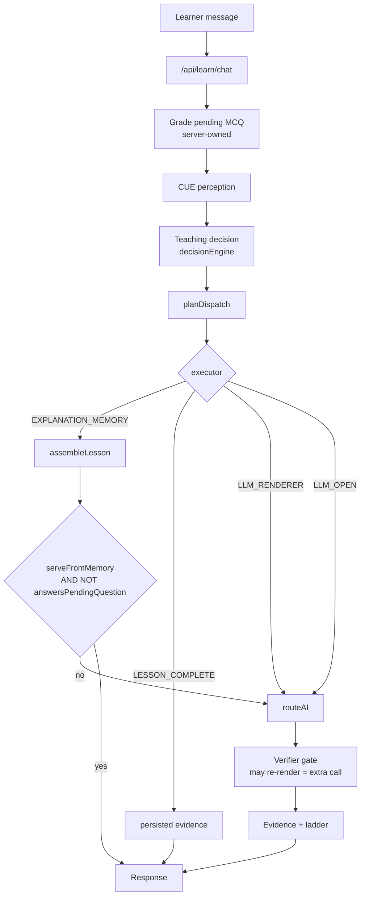
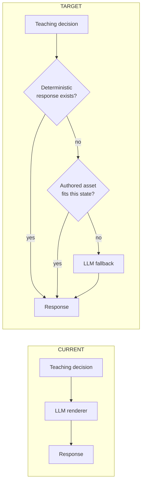
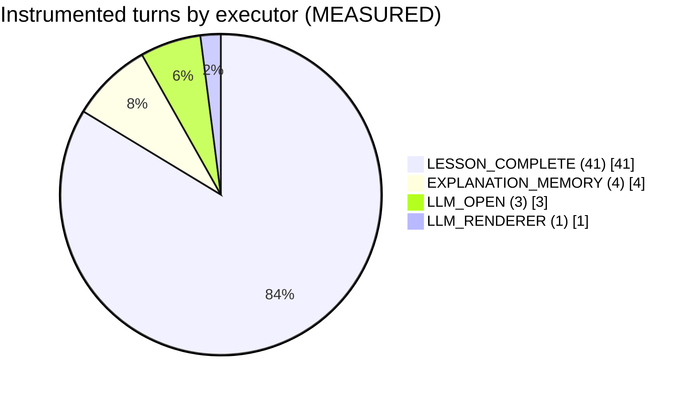
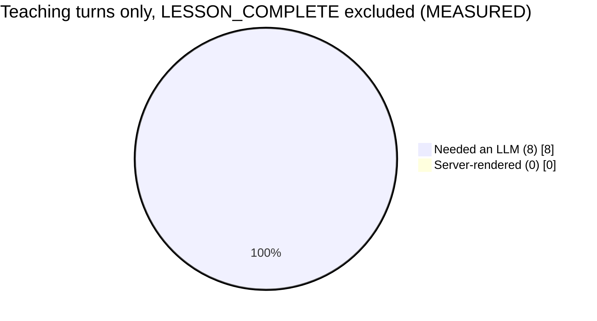
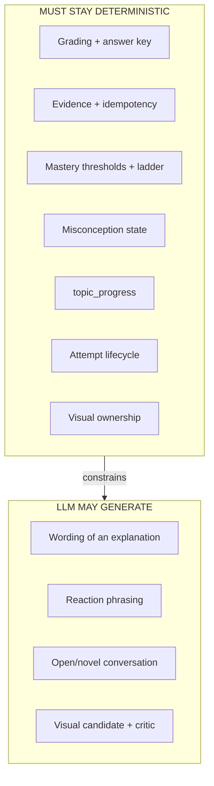
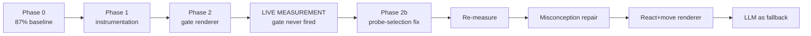
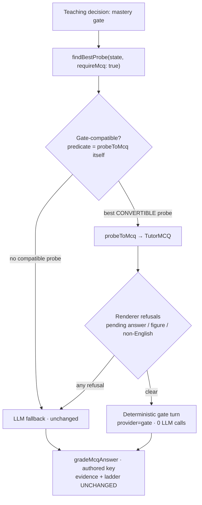
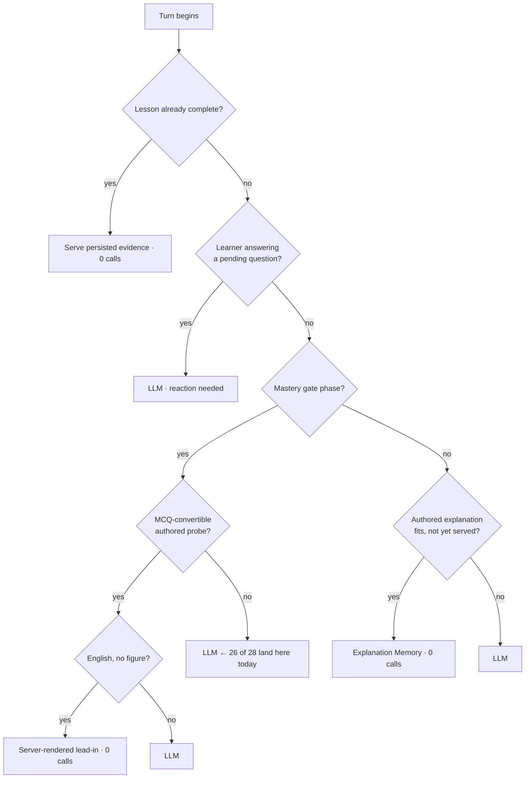
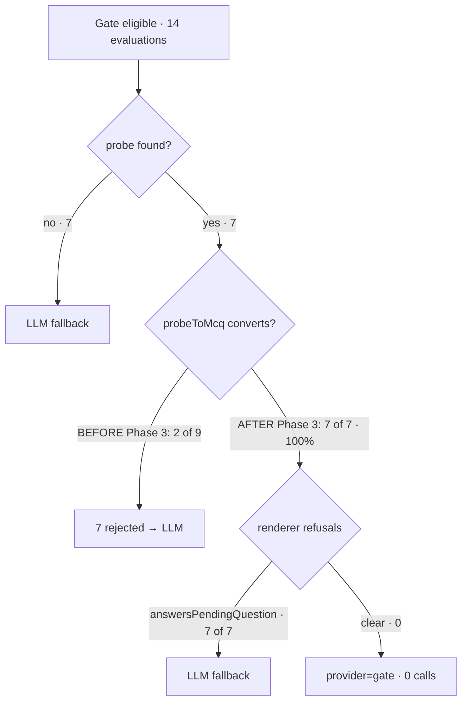

# MY TUTOR — LLM DEPENDENCY ELIMINATION
## Complete Technical Handover

Physics + Chemistry. Every number is labelled **MEASURED**, **ESTIMATE** or
**TARGET**, and they are never mixed. Where an earlier conclusion was wrong it
is preserved with its correction, because the wrong turns explain why some
approaches are closed.

---

## 1. Executive Summary

The investigation set out to reduce how often My Tutor needs an LLM. It found
that the deterministic teaching engine already decides most of what should
happen, and the LLM is largely rendering a decision that was already made:

```
deterministic teaching decision  →  LLM_RENDERER  →  learner-visible wording
```

Two phases shipped. Phase 1 (instrumentation) is working. Phase 2 (a
deterministic gate-assessment renderer) is deployed and **has never fired in a
real lesson** — the live run explains exactly why, and the reason is not the
renderer.

The single most important result of the live run is that the gate path is
blocked upstream of the renderer: of 28 gate evaluations, 19 found no probe at
all and 7 found a probe that cannot be converted to an MCQ. Only 2 produced a
usable question, and both were refused by the renderer's pending-answer rule.

---

## 2. Original Baseline

**MEASURED**, n = 484 assistant turns, window 2026-08-12 → 2026-08-17 07:36
(the "gemini-only era"), from `messages`:

| | turns | share |
|---|---|---|
| LLM-served (gemini/groq/yandex) | 421 | **87.0%** |
| memory-served | 59 | 12.2% |
| degraded (outage template) | 4 | 0.8% |

Average ~1.00 provider calls/turn, 0 retries/failovers.

This 87% figure is **not superseded** by the live run below. The live sample is
49 turns from one account and is not a population measurement.

---

## 3. Investigation Timeline

1. **87% baseline established** (n=484). Measured, not estimated.
2. **Hypothesis: more authored coverage would cut calls.** REJECTED — physics
   is 238/238 and chemistry 186/186 for gradeable probes, yet the LLM still
   served 87% of turns. Concept coverage was never the constraint.
3. **Prompt-size / caching investigation.** CLOSED, see §4.
4. **Architecture dependency audit.** The dispatcher has 12 decision types and
   only 2 have non-LLM executors; 9 route to `LLM_RENDERER`, and 8 of those 9
   carry a note saying the injected blocks "direct the renderer".
5. **Phase 1 instrumentation** shipped, §7.
6. **Phase 2 gate renderer** shipped, §8, plus 3 integration defects found
   while wiring it.
7. **Live production run**, §9 — the first real measurement.

### Corrections made along the way (preserved deliberately)

- **"Vercel is blocked."** WRONG. A wrong team ID was passed
  (`team_explorewithpappu`, which does not exist). The real one is
  `team_ZHSoYXkAEang6oq1I9hAPn45`. Vercel was always reachable.
- **S8 root cause "a slug-scheme migration re-seeded only 196 of 238".** WRONG.
  The database records the real cause in its own `deprecationReason`: a
  deliberate 2026-08-12 audit deprecated ACTIVE PROBE identities that had **no
  `probe_assets` row** — hollow rows occupying a serving slot they could never
  fill. Correct action, but it could not supply missing content.
- **Gate assessment estimated at ~10-15% of LLM turns.** Now known to be
  optimistic in the direction that matters: it can *become eligible* often, but
  it almost never yields a servable question (§9).

---

## 4. Prompt-Cost Investigation — CLOSED, DO NOT REOPEN

**MEASURED:** contiguous invariant prompt prefix ≈ **2,058 tokens**; Gemini 3.x
implicit-cache minimum ≈ **4,096 tokens**; `cachedContentTokenCount` absent/zero
across six consecutive turns.

Cause is structural: `route.ts` seeds `systemPrompt` from
`buildTutorSystemPrompt` and appends everything after, so the static material is
scattered rather than forming a cacheable prefix. Caching matches a *prefix*,
not a sum.

Explicit caching NOT implemented (redundant with a default-on mechanism, adds
storage cost, and cannot be created from a sub-minimum prefix). Prompt
reordering is behaviour-sensitive and was not attempted.

**Conclusion: caching is not the lever. Token reduction ≠ call reduction.**

---

## 5. Architecture Dependency Map

`src/lib/understanding/dispatcher.ts`, `ENGINE_ROUTES` — 12 decisions, 4
executors, only 2 of which need no provider:

| decision | executor | provider needed |
|---|---|---|
| SERVE_EXPLANATION_MEMORY | EXPLANATION_MEMORY | **no** |
| SERVE_LESSON_COMPLETE | LESSON_COMPLETE | **no** |
| ASK_DIAGNOSTIC_QUESTION | LLM_RENDERER | yes |
| DETECT_MISCONCEPTION | LLM_RENDERER | yes |
| REVIEW_PREREQUISITE | LLM_RENDERER | yes |
| TEACH_DIRECTLY | LLM_RENDERER | yes |
| PRACTICE | LLM_RENDERER | yes |
| VISUALIZATION | LLM_RENDERER | yes |
| CONTINUE_LESSON | LLM_RENDERER | yes |
| ADVANCE_DIFFICULTY | LLM_RENDERER | yes |
| ESCALATE_TO_LLM | LLM_OPEN | yes |

The executor name is the finding: the decision is already made; the model
renders it.

---

## 6. Existing Deterministic Infrastructure (already built, under-used)

**MEASURED** ACTIVE assets, physics + chemistry:

| family | kind | rows | concepts |
|---|---|---|---|
| PROBE | mcq | 689 | 422 |
| PROBE | short_answer | 405 | 136 |
| PROBE | misconception_probe | 234 | 215 |
| PROBE | true_false | 54 | 53 |
| EXPLANATION | core_explanation | 438 | 424 |
| EXPLANATION | **misconception_repair** | **415** | **413** |
| EXPLANATION | worked_example | 10 | 10 |
| EXPLANATION | real_world_example | 2 | 2 |

Server-owned already: probe selection, `probeToMcq` refusal rules, the answer
key, `gradeMcqAnswer`, evidence writes, the mastery ladder, the misconception
engine, recovery, attempt lifecycle.

---

## 7. Phase 1 — Instrumentation (deployed, working)

Four additive nullable columns on `messages`, written on the same row as
`provider`: `teachingDecision`, `dispatchExecutor`, `memoryFallbackReason`,
`llmCallCount`.

`llmCallCount` is a **count**, not a boolean, deliberately — `provider` records
which driver answered but not how many calls the turn spent. **The live run
proved this decision correct**: 2 turns recorded `provider='memory'` *and*
`llmCallCount=1`. A boolean, or deriving from `provider`, would have reported
those turns as costing nothing. See §11.

Commits `5220c2a` (columns) and `4245596` (wiring guard).

---

## 8. Phase 2 — Deterministic Gate Renderer (deployed, never fired)

`src/lib/teaching/gateAssessmentRenderer.ts`. When the server has already
selected the assessment, it writes the lead-in itself and skips the provider
call. The MCQ is attached by the same line the model path uses, so question,
choices, order, `correctIndex`, grading, evidence and ladder transition are
shared code.

It refuses — returning null so the LLM path serves unchanged — when:
1. an answer is waiting to be reacted to,
2. a figure is attached,
3. the lesson is not in English.

### Three integration defects found while wiring (each would have shipped)

- **Output verification would have run on server-authored text**, and its
  remedy is `rerender`, which calls a provider — spending the very call the
  path saves and possibly overwriting the framing.
- **Asset capture would have decomposed the fixed template into a DRAFT
  `core_explanation`** (a gate turn always has a `memoryState`). Approving one
  would have made boilerplate the ACTIVE asset served to every matching learner
  forever — the exact defect that path's own comment describes.
- **The client would have mounted `AiBadge`**, telling the learner "AI
  Generated / Reason: AI fallback used" about a turn no model touched.

Commits `e6a3f9b` (impl), `e890897` (25 tests).

---

## 9. Live Production Measurement (2026-08-17)

Driven through the real HTTP API as an authenticated weak-beginner learner. No
database manipulation, no internal API calls, no manufactured state.

**Session A — physics.** Re-entered `phys.mech.displacement`, which was already
complete. 23 turns, all `SERVE_LESSON_COMPLETE`. Not a teaching measurement;
retained because it shows the completed-lesson path costs ~0 calls.

**Session B — chemistry.** Genuinely fresh (`chem.atomic.subatomic-particles`,
lesson 1, 0 completed). Turns 1-8 were a real lesson: MCQs offered, answers
graded, lesson completed at turn 8. Turns 9-26 fell into the completed-lesson
path.

Two `504 FUNCTION_INVOCATION_TIMEOUT` responses occurred during session A.

### Gate-assessment eligibility — the key result

**MEASURED**, from 28 `[gate-assessment]` log lines:

| outcome | count | meaning |
|---|---|---|
| `probeFound:false` (phase PRACTICE) | 17 | no probe available at all |
| `probeFound:true, converted:false` | 7 | probe found, `probeToMcq` refused it |
| `probeFound:false` (phase CHECK) | 2 | no probe available |
| `probeFound:true, converted:true` | **2** | a usable question was produced |

The 7 refusals are all one asset, `c0213b4f-69db-44d9-aab1-08910b6e8d9b`:
`familyKind = short_answer`, `choices = null`. It is not an MCQ and can never
convert, yet `findBestProbe` selected it seven times.

On both `converted:true` turns the response was `provider=gemini` and
`[affirm-guard-entry]` ran — i.e. the renderer refused and the model served.
Both were CHECK-phase turns following a learner answer, so **refusal rule 1
(pending answer) fired**, exactly as flagged when Phase 2 shipped.

---

## 9b. Phase 3 — Gate Probe Selection Fix (deployed 2026-08-17)

### Root cause

`findBestProbe` queries **every** ACTIVE PROBE for the concept regardless of
`familyKind`, filters only on (probeAsset exists / author scaffolding /
already-asked), and ranks on quality, grade-band proximity and difficulty.
Nothing in selection knew the caller required an MCQ, so a probe that the next
**mandatory** layer (`probeToMcq`) must reject could win on score.

### Fix

`MatchOptions.requireMcq`, applied in `findBestProbe` **before** `pickBest`, so
the winner is the best *convertible* probe. Filtering after ranking would still
lose the turn whenever an unconvertible probe outscored a usable one — which is
precisely what production did 7 times out of 9.

The predicate is `probeToMcq` itself, not a `familyKind` allowlist. An
allowlist would be a second, drifting definition of "gradeable"; using the real
converter means selection and conversion can never disagree, including on
refusals unrelated to kind (no choices, zero or multiple correct answers,
duplicate option text, more than four options).

**Scoped, and that is load-bearing.** `assembleLesson` also calls
`findBestProbe` and *deliberately* accepts a non-MCQ probe, rendering it via
`formatProbeAsFollowUp`. A global MCQ-only retrieval would have silently
deleted short-answer practice from that path. Exactly one call site sets the
flag — the mastery gate, which has no prose fallback.

### Corpus-wide effect (MEASURED, read-only, phys + chem)

| | value |
|---|---|
| concepts | 424 |
| ACTIVE probes | 1,383 |
| unconvertible probes now excluded at the gate | **405 (29.3% of the pool)** |
| concepts where the fix changes selection | **136** |
| **concepts left with no gate probe by the fix** | **0** |

That last row is the safety proof: every concept holding any probe holds at
least one convertible one, so the filter cannot strand a concept.

For the concept that caused the defect, `phys.mech.displacement`: 4 ACTIVE
probes — 2 MCQ (both convertible) and **2 short_answer (0 convertible)**. The
gate pool goes 4 → 2, and both survivors are servable.
`chem.atomic.subatomic-particles` has 2 probes, both already convertible, so
the fix changes nothing there — consistent with the run, where both
`converted:true` evaluations were chemistry.

### Status

Committed `6af66c5`, deployed. Production is serving `4ddb090` (deployment
`dpl_6DDby2MQp7F6Ninfa7pTVTDcC4Jw`, READY), which contains the Phase 3 code.

**Live before/after still NOT measured** — see §17.

Post-deploy traffic to date (**MEASURED**): exactly **1** assistant turn, at
2026-08-17 11:42:45 on `phys.meas.vector-addition` —
`ESCALATE_TO_LLM` / `LLM_OPEN`, `memoryFallbackReason=confidence_failed`,
`llmCallCount=1`, a figure on screen. It is an open-escalation turn, not a
mastery gate, so it exercises none of the Phase 2/3 pipeline.

**`provider='gate'` turns in production, all time: 0.** Phase 2 has still never
fired, and Phase 3's effect on the gate remains unproven in production.

---

## 10. Measured Call Distribution

**MEASURED**, n = 49 instrumented assistant turns:

| executor | decision | fallbackReason | provider | turns | calls | calls/turn |
|---|---|---|---|---|---|---|
| LESSON_COMPLETE | SERVE_LESSON_COMPLETE | lesson_complete | memory | 41 | 2 | 0.05 |
| EXPLANATION_MEMORY | SERVE_EXPLANATION_MEMORY | brain_decision | gemini | 4 | 4 | 1.00 |
| LLM_OPEN | ESCALATE_TO_LLM | confidence_failed | gemini | 2 | 2 | 1.00 |
| LLM_RENDERER | PRACTICE | confidence_failed | gemini | 1 | 1 | 1.00 |
| LLM_OPEN | ESCALATE_TO_LLM | brain_decision | gemini | 1 | 1 | 1.00 |

Aggregates (**MEASURED**):

- total turns **49**; total provider calls **10**
- 0 calls **39** (79.6%) · 1 call **10** (20.4%) · 2 calls **0** · 3+ **0**
- turns needing ≥1 LLM **20.4%**; average **0.204**; maximum **1**
- provider: memory 41, gemini 8 … plus 2 memory turns that also spent a call
- executor: LESSON_COMPLETE 41, EXPLANATION_MEMORY 4, LLM_OPEN 3, LLM_RENDERER 1
- fallbackReason: lesson_complete 41, brain_decision 5, confidence_failed 3
- `provider='gate'` turns: **0**

### The honest reading — do not quote 20.4% as progress

41 of 49 turns are post-completion idling that a real learner would not
generate. Excluding `LESSON_COMPLETE`:

**Teaching turns: 8. Provider calls: 8. Turns needing ≥1 LLM: 100.0%.**

So in the only genuine teaching sequence measured, the LLM served **every**
turn. Phase 2 eliminated **zero** calls. The 87% baseline stands.

### Top 3 LLM consumers (by calls, measured)

1. `SERVE_EXPLANATION_MEMORY` → served by gemini anyway — **4 calls**
2. `ESCALATE_TO_LLM` / `LLM_OPEN` — **3 calls**
3. `SERVE_LESSON_COMPLETE` (2) and `PRACTICE` (1) — **3 calls**

Consumer 1 deserves emphasis: the dispatcher chose the *deterministic*
executor and a model was called anyway, because `serveFromMemory` additionally
requires `!answersPendingQuestion`. The learner answering a question is what
forces the model.

---

## 11. Remaining LLM Dependencies + defects surfaced

1. **`answersPendingQuestion` is the dominant forcing condition.** It defeated
   both the memory path (4 turns) and the gate renderer (2 turns) in one short
   lesson.
2. **`findBestProbe` does not filter to MCQ-convertible probes.** It returned a
   `short_answer` probe with no choices 7 times at a gate. Measured content/
   selection defect, not a renderer defect.
3. **`provider` under-reports cost.** 2 turns recorded `provider='memory'` with
   `llmCallCount=1`.
4. **Two 504 FUNCTION_INVOCATION_TIMEOUTs** during normal use.
5. **`eb_evidence_event` has 0 rows since 2026-08-12** (noted, not investigated).
6. The tutor addresses the learner as "Claude" (profile-name artefact on the
   test account; cosmetic, not investigated).

---

## 12. Conservative / Practical / Aggressive Targets

Baseline **MEASURED 87%**. All three targets remain **ESTIMATES** — the live
sample is too small and too skewed to move them.

| scenario | LLM-dependent | requires |
|---|---|---|
| CONSERVATIVE | ~73-78% | gate path actually reaching a servable probe |
| PRACTICAL | ~45-55% | + targeted misconception repair, re-serve |
| AGGRESSIVE | ~25-35% | + composed react+move rendering |

**Nothing measured yet supports moving off 87%.**

---

## 13. CTO Recommendation

**Fix the probe-selection defect before building any new renderer.**

Phase 2's renderer is correct and deployed, but it sits behind a gate that
produced a usable question twice in 28 evaluations. Building another renderer
now would add a second component behind the same blocked pipe.

Ranked by `calls eliminated × safety × frequency ÷ (cost × Moat risk)`:

1. **Make `findBestProbe` prefer MCQ-convertible probes at a gate.** Measured
   7/9 wasted selections. Small, contained, no teaching-behaviour change, no
   Moat surface — it changes which authored probe is picked, never the key or
   the grading.
2. **Re-measure.** With 1 fixed, the gate path's real share becomes knowable.
3. **Then** decide between misconception repair (415 authored assets) and the
   react+move renderer, on evidence.

**Do not start the react+move renderer.** It is the one that would relax
`answersPendingQuestion`, which the data now shows is load-bearing.

---

## 14. Implementation Roadmap

```
Phase 0  baseline 87%                          DONE (measured)
Phase 1  instrumentation                       DONE (deployed, working)
Phase 2  deterministic gate renderer           DONE (deployed, never fired)
Phase 2b probe-selection fix at the gate       ← NEXT, not authorized yet
Phase 2c re-measure with real traffic
Phase 3  targeted misconception repair         evidence-gated
Phase 4  lesson-opening skeleton               low priority
Phase 5  explanation re-serve                  content-gated
Phase 6  react + move renderer                 highest risk, last
```

---

## 15. Moat Safety Constraints (must remain deterministic)

Server-owned grading · mastery thresholds · evidence semantics ·
answerable-turn guard · prose-MCQ guard · `topic_progress` writer + idempotency ·
misconception detection · recovery · mastery ladder · attempt lifecycle ·
budget extension · visual ownership · S10 invariants.

LLM generation is allowed only for learner-visible *wording*, and only where a
deterministic response would be worse.

---

## 16. Rejected Approaches (and why)

- **Prompt caching** — measured dead end (§4).
- **More authored concept coverage** — coverage was already 100%; not the
  constraint.
- **A smaller/cheaper classifier** — classification is already deterministic;
  adding one would add a model call, not remove one.
- **Keyword matching on learner answers** — brittle; explicitly prohibited.
- **Optimising visual generation** — already ~85% cached; 19 paid generations
  vs 421 chat LLM turns.
- **Serving an authored repair because the concept matches** — must match the
  diagnosed misconception, not the concept.

---

## 17. Known Limitations

- Live sample is **49 turns, one account, two sessions**, 41 of them
  post-completion. It is a code-path measurement, not a population estimate.
- Physics contributed **no** teaching turns (its lesson was already complete).
- The renderer's refusal reason is inferred from phase + ordering, not from a
  dedicated log line — there is no `[gate-lead-in] refused reason=…` log.
- No misconception-repair, recovery, excursion or visual turn occurred
  naturally, so those paths remain unmeasured.
- **Phase 3 has no live before/after.** The instruction for that run barred the
  only account available to this session and no dedicated test-account
  credentials were supplied, so no production gate turn has been observed since
  the fix. The corpus-wide numbers in §9b are read-only projections of what the
  selector will now choose — they are NOT proof that a turn reached the
  deterministic renderer.

---

## 18. Open Decisions

1. Authorize the probe-selection fix (Phase 2b)?
2. Add a refusal-reason log line to the renderer so future runs attribute
   refusals directly?
3. Investigate the two 504s?
4. `eb_evidence_event` writing nothing since 2026-08-12 — in scope or not?
5. Should `provider` be corrected so a turn that spent a call is never labelled
   `memory`?

---

## 19. Diagrams

### Diagram 1 — Current LLM request flow



### Diagram 2 — Current vs target



### Diagram 3 — Measured distribution (n=49 turns, 10 calls)





### Diagram 4 — Moat safety boundaries



### Diagram 5 — Optimization roadmap



### Diagram 5b — Gate assessment after the Phase 3 fix



Before Phase 3 the filter node did not exist: an unconvertible probe could win
selection, `probeToMcq` rejected it, and every such turn fell to the model.
**Measured 7 of 9 gate evaluations that found a probe.**

### Diagram 6 — LLM-free decision tree



---

## 20. Git / Deployment State

| commit | what |
|---|---|
| `5220c2a` | Phase 1 instrumentation columns + migration |
| `4245596` | Phase 1 wiring guard tests |
| `e6a3f9b` | Phase 2 deterministic gate renderer |
| `e890897` | Phase 2 regression suite (25 tests) |

Branch `main`. Production deployment `dpl_CeFpSFkMd6tHs3AXg6gpRX6y8LWx` @
`e890897`, READY. Migration `20260817120000_message_llm_dependency_instrumentation`
applied and registered (`finished_at` set, `rolled_back_at` null).
Suite at last run: 350 files / 7,479 passed / 9 skipped; tsc clean; build clean.

---

## 21. Reproduction Queries / Commands

```sql
-- primary distribution
SELECT "dispatchExecutor","teachingDecision","memoryFallbackReason","provider",
       COUNT(*) turns, SUM("llmCallCount") calls, ROUND(AVG("llmCallCount"),2) per_turn
FROM messages WHERE role='ASSISTANT' AND "llmCallCount" IS NOT NULL
GROUP BY 1,2,3,4 ORDER BY turns DESC;

-- teaching turns only (exclude completed-lesson idling)
SELECT COUNT(*) turns, SUM("llmCallCount") calls,
       ROUND(100.0*COUNT(*) FILTER (WHERE "llmCallCount">=1)/COUNT(*),1) pct_llm,
       COUNT(*) FILTER (WHERE provider='gate') gate_rendered
FROM messages WHERE role='ASSISTANT' AND "llmCallCount" IS NOT NULL
  AND "dispatchExecutor" <> 'LESSON_COMPLETE';

-- turns that spent a call but are not labelled as an LLM provider
SELECT "createdAt", provider, "llmCallCount", "lessonKey"
FROM messages WHERE role='ASSISTANT' AND "llmCallCount" > 0 AND provider NOT IN
  ('gemini','groq','yandex');
```

Gate eligibility, from Vercel production runtime logs:
`query="gate-assessment"`, then group by the `probeFound`/`converted` pair.

```
npm install && npx prisma generate && npx prisma migrate deploy
npm run build · npx tsc --noEmit
npx vitest run src/tests/gateAssessmentRenderer.test.ts
npx vitest run src/tests/llmDependencyInstrumentation.test.ts
```

---

## 22. Handover Notes for Next Engineer

- Trust `llmCallCount` over `provider`. `provider` is the driver label and has
  been observed reading `memory` on a turn that spent a call.
- Exclude `dispatchExecutor='LESSON_COMPLETE'` from any dependency percentage.
  It is cheap by design and will flatter any number that includes it.
- The gate renderer is **not** the bottleneck. `findBestProbe` is.
- `answersPendingQuestion` is load-bearing. Anything that relaxes it changes
  teaching behaviour and belongs in the react+move workstream, with its own
  authorization.
- Driving live traffic requires the real HTTP API and an authenticated session.
  Rate limit is 30 requests / 60 s; pace ~2.6 s per turn.

---

## CURRENT STOP POINT

**Proven**
- The dispatcher decides before the LLM renders; only 2 of 12 executors are
  provider-free.
- Prompt caching is a dead end (prefix 2,058 vs 4,096 minimum).
- Phase 1 instrumentation records correctly, and `llmCallCount`-as-a-count
  caught cost that `provider` hid.
- Phase 2's renderer, verification skip, capture skip and badge handling all
  behave as designed under test.

**Measured**
- Baseline 87.0% LLM-dependent (n=484).
- Live: 49 turns, 10 calls, 20.4% overall — but 8 teaching turns at **100%**.
- Gate eligibility 28×: 19 no probe, 7 unconvertible, 2 usable, 0 rendered.
- `provider='gate'` turns in production: **0**.

**Still estimated**
- Every per-path share and all three scenario targets.
- The true frequency of misconception-repair, recovery, excursion and visual
  turns — none occurred naturally.

**Implemented** — Phase 1 instrumentation; Phase 2 gate renderer + 3 integration
fixes; 32 new tests.

**NOT implemented** — Phase 3; any probe-selection change; any relaxation of
`answersPendingQuestion`; anything touching Educational Brain, KG, curriculum,
mastery, evidence or grading.

**Phase 3 (done, `6af66c5`)** — `findBestProbe` now prefers MCQ-convertible
probes at a mastery gate. 405 unconvertible probes (29.3% of the pool) are
excluded at the gate across 424 concepts; 136 concepts change selection; **0**
are left without a gate probe.

**Single highest-value next action** — measure Phase 2 + 3 together with a live
lesson on a DEDICATED test account, then decide the next optimization on
evidence. The recorded next candidate is the memory path: 4 turns chose
`SERVE_EXPLANATION_MEMORY` and still spent a provider call because
`answersPendingQuestion` blocked deterministic serving. Do NOT relax that
condition without its own authorization — it is load-bearing, and it is the
reaction the learner earned by answering.


---

# LIVE VERIFICATION + VISUAL/PROVENANCE AUDIT (2026-08-17, post-Phase-3)

Run on the owner's account by explicit instruction after the dedicated test
account was requested twice and not supplied. Recorded because it writes real
learner state: the run completed `phys.meas.vector-addition` and added ~60
turns of history.

## A. Phase 3 IS VERIFIED EFFECTIVE (MEASURED)

Gate evaluations, from production logs on the serving deployment:

| | before Phase 3 | after Phase 3 |
|---|---|---|
| evaluations | 28 | 14 |
| probe found | 9 | 7 |
| **converted to MCQ** | **2 (22%)** | **7 (100%)** |
| `converted:false` (the defect) | **7** | **0** |
| deterministic gate turns (`provider='gate'`) | 0 | **0** |

**The defect class is eliminated.** Every probe the gate selected post-fix was
convertible; the `short_answer`-with-no-choices selection cannot recur.

`phys.meas.vector-addition` was a fair test: 8 ACTIVE probes — 6 convertible
(4 mcq + 2 misconception_probe) and **2 short_answer with 0 convertible**, i.e.
exactly the shape that produced the original defect.

## B. Phase 2 STILL NEVER FIRES — the blocker moved one stage

```
gate eligible → probe found → probeToMcq OK → renderer → provider=gate
                    ▲              ▲             ▲
              7 of 14 fail    FIXED (100%)   ALL 7 refused
```

All 7 convertible probes were refused by the renderer. Every one arrived on a
turn where the learner had just answered an MCQ, so refusal rule 1
(`answersPendingQuestion`) fired — as predicted when Phase 2 shipped.

**This is now the single blocking condition, and it is a teaching-quality
decision, not a bug.** The learner earned a reaction by answering; a lead-in
alone would drop it.

## C. Measured turn distribution (post-Phase-3 window)

| executor | decision | fallback | provider | turns | calls |
|---|---|---|---|---|---|
| LESSON_COMPLETE | SERVE_LESSON_COMPLETE | lesson_complete | memory | 38 | 2 |
| LLM_OPEN | ESCALATE_TO_LLM | brain_decision | gemini | 2 | 2 |
| LLM_OPEN | ESCALATE_TO_LLM | confidence_failed | gemini | 1 | 1 |
| LLM_RENDERER | DETECT_MISCONCEPTION | brain_decision | gemini | 1 | 1 |
| LLM_RENDERER | PRACTICE | confidence_failed | gemini | 1 | 1 |

Raw: 43 turns, 7 calls (16.3%).
**Genuine teaching turns (LESSON_COMPLETE excluded): 5 turns, 5 calls, 100% LLM.**
`provider='gate'`: 0. Calls eliminated by Phase 2: **0**. By Phase 3: **0**
(it unblocked conversion, which cannot save a call until the renderer fires).

## D. Visual audit — `phys.meas.vector-addition`

Traced the real turn (11:42:45, `visualSession` = renderer `scene`,
representation `vector`, conceptId bound).

Provenance, established from production, not assumed:
- ACTIVE VISUAL assets for the concept: **0**
- `visual_generation_outcome` rows: **0**
- `visualization_cache` rows: **0**
- Registry binding EXISTS: `visualRegistry.ts:146` →
  `three_vector_visualization`, `sceneGenerator: 'vector'`

**Classification: B — deterministic visual.** Not AI-generated, not
AI-selected, not cached, not an approved asset. A curated registry binding
rendered by a pure function.

**Physics correctness: PASS.** `computeGeometry` in
`sceneGenerators/vectorAddition.ts` is a pure function computing
`ax=|A|cos θ, ay=|A|sin θ`, `r = a + b` componentwise, `|R| = hypot(rx,ry)`,
direction `atan2(ry,rx)`, tip-to-tail drawn from A's tip to R's tip, with a
single uniform scale so relative magnitudes and all directions are preserved.
For A=3@0°, B=4@90° → R=(3,4), |R|=5, 53.13°. Labels carry magnitude AND
angle (`A (3 at 0°)`), a deliberate fix for a measured 2026-08-14 defect where
the tutor narrated the vectors swapped.

**Display: the reported "too small" is a REAL and SEPARATE defect —
CORRECT CONTENT / DISPLAY DEFECT.**

Container (`ThreeDVisual.tsx`): `width:100%`, `aspectRatio 4/3`,
`minHeight 260`, `maxHeight min(520px, 60vh)` — reasonable.
Camera: `cameraDistance = VISUAL_MAX * 2.5 = 45`, `fov 50°`.

Visible frame height at that distance ≈ `2 × 45 × tan(25°) ≈ 42` world units,
while the scene scales its LARGEST vector to `VISUAL_MAX = 18`. For the 3-4-5
case the drawn content spans about `10.8 × 14.4` units and sits entirely in the
**+x+y quadrant**, because every vector starts at the origin and the origin is
the centre of the view.

So the figure occupies roughly **a third of the frame height, pushed into one
quadrant, with the opposite three-quarters empty**. That is the "too small"
the learner saw. It is camera framing, not container size, and not physics.

FIX NOT IMPLEMENTED (audit only). The correct change is to frame the camera on
the scene's actual bounding box rather than a fixed multiple of `VISUAL_MAX` —
`cameraDistance` should follow content extent, and the content should be
centred on its bounds.

## E. AI / Brain provenance audit

| execution path | provider | badge shown | correct? |
|---|---|---|---|
| LLM generated the turn | gemini/groq/yandex | AiBadge "AI Generated" | ✅ |
| Explanation Memory served | memory | MemoryBadge (Brain) | ✅ |
| Lesson-complete from evidence | memory | MemoryBadge (Brain) | ⚠️ see below |
| Deterministic gate render | gate | MemoryBadge (Brain) | ✅ (Phase 2) |

**DEFECT CONFIRMED, previously reported and still present:** `provider='memory'`
is recorded on turns that DID spend a provider call — 2 such turns in the
earlier run, 2 more in this one. Those learners saw the Brain badge on a turn
an LLM generated. The badge is driven by `provider`, and `provider` is not a
faithful record of the execution path.

`llmCallCount` is the trustworthy field and already proves the mismatch. The
correct rule is **badge from `llmCallCount === 0`, not from `provider`** — a
turn that spent a call is an AI turn regardless of which label the serving
branch wrote. NOT CHANGED in this audit.

## F. Diagram — gate pipeline, post-Phase-3 (MEASURED)



---

# PHASE 4 (2026-08-17) — PROVENANCE FIX + MISCONCEPTION-REPAIR ANALYSIS

## Track A — provenance defect: ROOT CAUSE FOUND AND FIXED (`4766b61`)

**MEASURED:** 4 production turns carried `provider='memory'` with
`llmCallCount=1`. All 4 were `dispatchExecutor='LESSON_COMPLETE'`,
`memoryFallbackReason='lesson_complete'`, and their stored text was model
prose — not the close `buildLessonCloseText` produces.

**Root cause (not merely a label bug).** `servedFromMemory` is defined
`!serveLessonComplete && …`, so a completed-lesson turn is FALSE for it and ran
the output verifier. The verifier's remedy is `rerender()`, which calls a
provider. It spent a call AND replaced server-authored text, while the serve
branch had already stamped `provider='memory'`. Learners saw the Brain badge on
an LLM-written turn.

**Fix, two parts:**
1. Lesson-complete joins the verification exclusion alongside memory and gate —
   all three produce server-authored text. This also stops the call.
2. The badge derives from `llmCallCount` (what the turn SPENT), not `provider`
   (which branch served). `llmCallCount` now ships in the chat response and is
   selected by `/api/sessions/history`, so a restored transcript re-badges
   instead of keeping the wrong label forever. Legacy rows (column undefined)
   keep the provider rule and never lose their badge.

A frontend-only change was impossible: `llmCallCount` was persisted but absent
from both the API response and the history `select`.

Tests: `src/tests/turnProvenance.test.ts` (15), full suite 352 files / 7,510
passed, tsc + build clean.

## Track B — misconception repair: DO NOT IMPLEMENT (analysis only)

**Authored coverage (MEASURED, phys+chem):**

| | count |
|---|---|
| misconceptions detectable by ACTIVE probes | 837 |
| misconceptions with an authored repair | 710 |
| **exact (concept + misconception) matches** | **538 = 64.3%** |
| detectable with NO exact repair | 299 = 35.7% |

Every one of the 415 repair assets targets ≥1 misconception (avg 1.71), so the
corpus is better keyed than expected. Coverage alone would support a hybrid.

**But coverage is not the blocker — the intervention shape is.**
`MISCONCEPTION_REPAIR` in `teachingStrategy.ts` is a MULTI-STAGE protocol:

1. address the misconception early
2. **"Ask the student to explain their reasoning BEFORE correcting"**
3. contrast the wrong model with the correct one side by side
4. **confirm with a follow-up question** before moving on
5. frame it without implying carelessness

Step 2 requires reading THIS learner's reasoning; step 3 must contrast against
what they actually said; step 4 needs a question. Serving one authored asset as
one message would skip the elicit, contrast against a generic wrong model
rather than the learner's words, and may drop the re-probe. That is a genuine
teaching regression, not a stylistic one — and it matches the Educational
Brain's own elicit→commit→collide→replace→contrast→apply→re-probe sequence.

**Conclusion: the LLM here is doing adaptive work, not verbalizing a decision.**
Designs A (direct serve) and B (asset + deterministic framing) both collapse the
elicit step and are REJECTED. Design C is viable only in a form that does NOT
eliminate the call — authored repair grounding the contrast while the model
still runs elicit and re-probe. That is a quality improvement, not a saving.

This corrects the earlier ranking, which listed misconception repair as the
next-best call-elimination target on asset count alone.

---

# PHASE 5 (2026-08-17)

## Track A — vector camera framing: SHIPPED (`e07ef96`)

Root cause: vectors are drawn FROM the origin, so the figure occupies one
quadrant, while the camera sat at a fixed `VISUAL_MAX * 2.5` **looking at the
origin — the corner of its own content**. Live 3-4-5 case: frame ~42 world
units, drawing ~14.

Fix (presentation only, scoped to `vectorAddition.ts`): aim the camera at the
content bounding-box centre and pull back only as far as that box needs, using
the renderer's real terms (fov 50 vertical, 4/3 aspect) + 1.45 margin for
labels, which render outside the arrow tips.

**The geometry was deliberately NOT translated.** `checkVectorConsistency`
validates against ABSOLUTE tip positions (`R == A + B`, magnitude from origin);
centring by moving the scene would have broken the safety net that proves the
figure correct. The camera moved instead.

`cameraTarget` is a new OPTIONAL `SceneSpec` field forwarded through
`SceneSpecRenderer` → `ThreeDVisual`, defaulting to the origin, so the other
30 generators sharing that renderer are unchanged.

**MEASURED** over 4 cases (incl. near-cancelling and negative quadrants):
frame fill **34% → 69%** on the live case, **0 clipped points**, and
`checkVectorConsistency` passes on every case.

## Track B — lesson opening: AUDITED, NOT IMPLEMENTED

**Frequency (MEASURED, since 2026-08-12):** 42 lesson starts against 682
assistant turns ≈ **6.2% of turns**, 1 provider call each.

**Instrumentation gap found:** `lesson-init` persists only
`{sessionId, role, content}` — it does NOT write `llmCallCount`,
`dispatchExecutor` or `teachingDecision`. **Lesson-opening calls are therefore
invisible to the Phase 1 instrumentation**, and 106 of 682 assistant turns in
the window carry no instrumentation at all. Any future "% LLM-dependent" figure
computed from `messages` UNDER-COUNTS by roughly the lesson-start rate.

**Classification: E — HYBRID, and the LLM half is the valuable half.**

The opening is not protocol-shaped. Observed live, the physics opening produced
a concrete analogy — *"imagine you walk 3 steps forward, then 4 steps to the
right… looking at your footprint path from a helicopter"* — which is genuine
teaching content, not orientation boilerplate. The protocol shell (greeting,
concept naming, mode framing) is deterministic; the analogy is not.

**Two blockers found, either of which alone justifies stopping:**

1. **Mode divergence.** `buildInstruction` has four modes and `review`
   explicitly requests "key concepts AND practice exercises" — a different
   artefact from a first-teaching opening. One authored `core_explanation`
   does not satisfy all four.
2. **Collision with the already-served rule.** `lesson-init` deliberately
   bypasses Explanation Memory ("intentionally minimal"). If it began serving
   the authored `core_explanation`, it would not record it through
   `hasServedExplanation`, so the FIRST chat turn could serve the same text
   again — repetition — or, if wired to record it, would push that turn onto
   the LLM instead. **The call would move, not disappear.**

**Verdict: not a safe call-elimination target as it stands.** Making it one is
a design task about who owns the first explanation, not a small fix. Estimated
saving if solved: ~6% of turns — real, but below the risk it currently carries.
