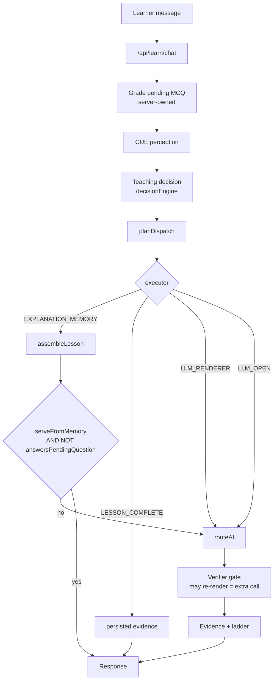
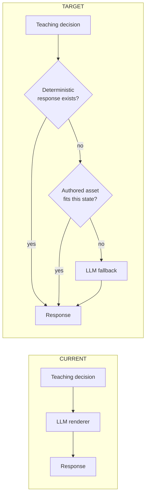
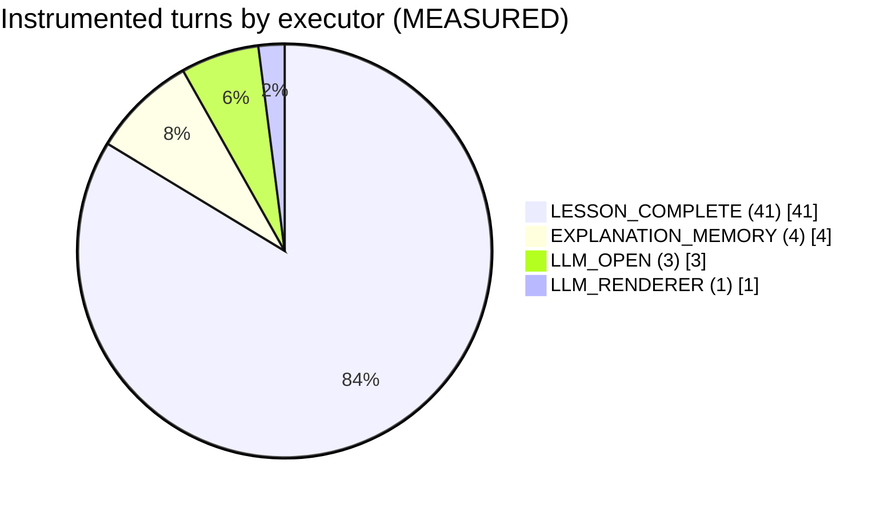
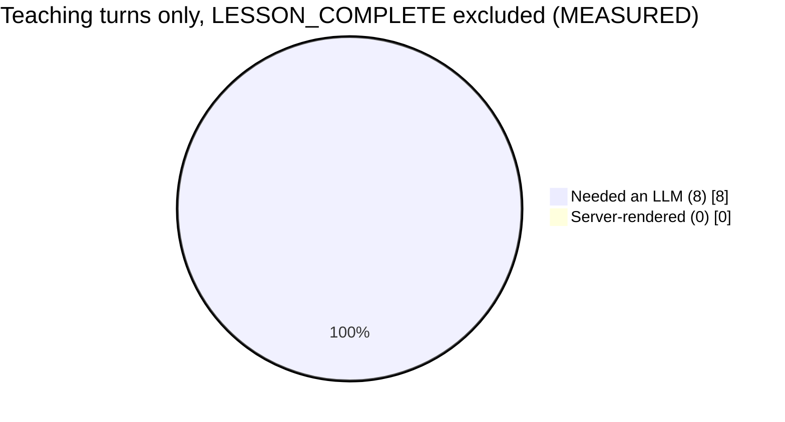
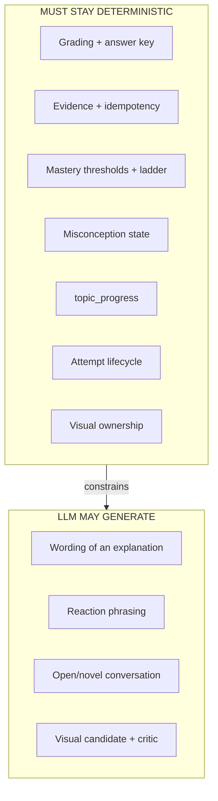
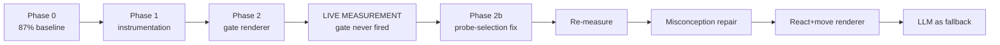
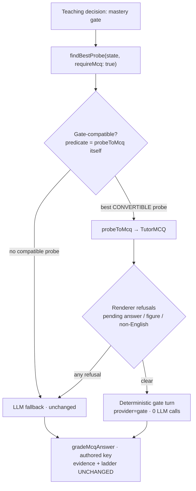
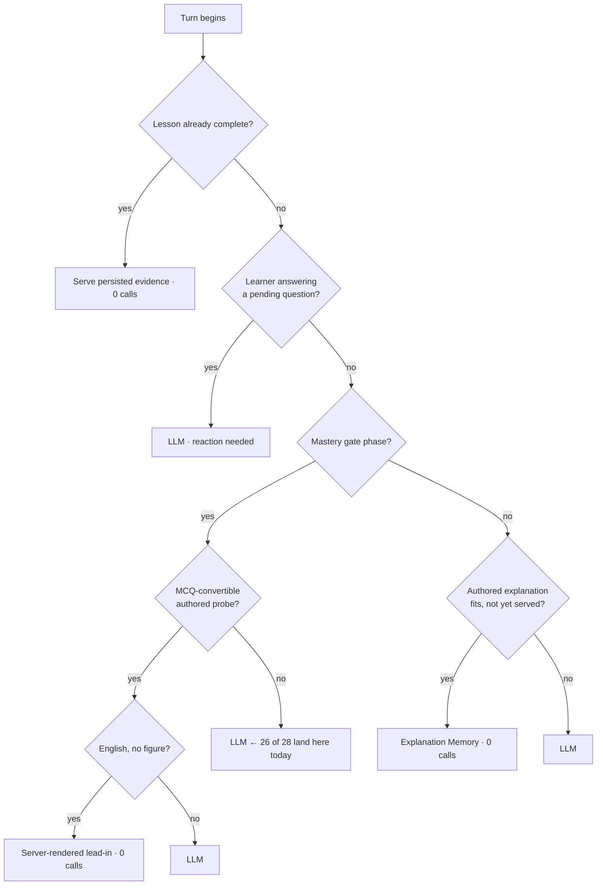
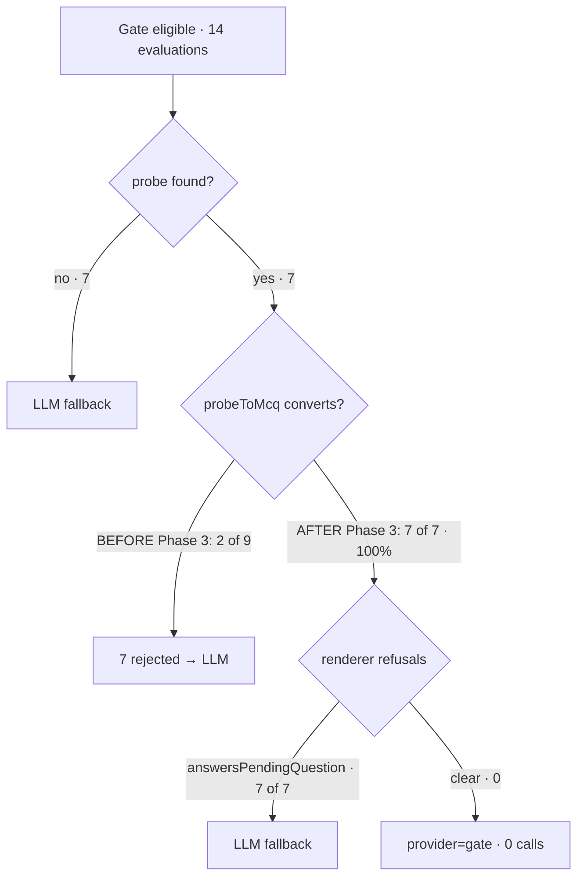

# MY TUTOR — LLM DEPENDENCY ELIMINATION
## Complete Technical Handover

Physics + Chemistry. Every number is labelled **MEASURED**, **ESTIMATE** or
**TARGET**, and they are never mixed. Where an earlier conclusion was wrong it
is preserved with its correction, because the wrong turns explain why some
approaches are closed.

---

## 1. Executive Summary

The investigation set out to reduce how often My Tutor needs an LLM. It found
that the deterministic teaching engine already decides most of what should
happen, and the LLM is largely rendering a decision that was already made:

```
deterministic teaching decision  →  LLM_RENDERER  →  learner-visible wording
```

Two phases shipped. Phase 1 (instrumentation) is working. Phase 2 (a
deterministic gate-assessment renderer) is deployed and **has never fired in a
real lesson** — the live run explains exactly why, and the reason is not the
renderer.

The single most important result of the live run is that the gate path is
blocked upstream of the renderer: of 28 gate evaluations, 19 found no probe at
all and 7 found a probe that cannot be converted to an MCQ. Only 2 produced a
usable question, and both were refused by the renderer's pending-answer rule.

---

## 2. Original Baseline

**MEASURED**, n = 484 assistant turns, window 2026-08-12 → 2026-08-17 07:36
(the "gemini-only era"), from `messages`:

| | turns | share |
|---|---|---|
| LLM-served (gemini/groq/yandex) | 421 | **87.0%** |
| memory-served | 59 | 12.2% |
| degraded (outage template) | 4 | 0.8% |

Average ~1.00 provider calls/turn, 0 retries/failovers.

This 87% figure is **not superseded** by the live run below. The live sample is
49 turns from one account and is not a population measurement.

---

## 3. Investigation Timeline

1. **87% baseline established** (n=484). Measured, not estimated.
2. **Hypothesis: more authored coverage would cut calls.** REJECTED — physics
   is 238/238 and chemistry 186/186 for gradeable probes, yet the LLM still
   served 87% of turns. Concept coverage was never the constraint.
3. **Prompt-size / caching investigation.** CLOSED, see §4.
4. **Architecture dependency audit.** The dispatcher has 12 decision types and
   only 2 have non-LLM executors; 9 route to `LLM_RENDERER`, and 8 of those 9
   carry a note saying the injected blocks "direct the renderer".
5. **Phase 1 instrumentation** shipped, §7.
6. **Phase 2 gate renderer** shipped, §8, plus 3 integration defects found
   while wiring it.
7. **Live production run**, §9 — the first real measurement.

### Corrections made along the way (preserved deliberately)

- **"Vercel is blocked."** WRONG. A wrong team ID was passed
  (`team_explorewithpappu`, which does not exist). The real one is
  `team_ZHSoYXkAEang6oq1I9hAPn45`. Vercel was always reachable.
- **S8 root cause "a slug-scheme migration re-seeded only 196 of 238".** WRONG.
  The database records the real cause in its own `deprecationReason`: a
  deliberate 2026-08-12 audit deprecated ACTIVE PROBE identities that had **no
  `probe_assets` row** — hollow rows occupying a serving slot they could never
  fill. Correct action, but it could not supply missing content.
- **Gate assessment estimated at ~10-15% of LLM turns.** Now known to be
  optimistic in the direction that matters: it can *become eligible* often, but
  it almost never yields a servable question (§9).

---

## 4. Prompt-Cost Investigation — CLOSED, DO NOT REOPEN

**MEASURED:** contiguous invariant prompt prefix ≈ **2,058 tokens**; Gemini 3.x
implicit-cache minimum ≈ **4,096 tokens**; `cachedContentTokenCount` absent/zero
across six consecutive turns.

Cause is structural: `route.ts` seeds `systemPrompt` from
`buildTutorSystemPrompt` and appends everything after, so the static material is
scattered rather than forming a cacheable prefix. Caching matches a *prefix*,
not a sum.

Explicit caching NOT implemented (redundant with a default-on mechanism, adds
storage cost, and cannot be created from a sub-minimum prefix). Prompt
reordering is behaviour-sensitive and was not attempted.

**Conclusion: caching is not the lever. Token reduction ≠ call reduction.**

---

## 5. Architecture Dependency Map

`src/lib/understanding/dispatcher.ts`, `ENGINE_ROUTES` — 12 decisions, 4
executors, only 2 of which need no provider:

| decision | executor | provider needed |
|---|---|---|
| SERVE_EXPLANATION_MEMORY | EXPLANATION_MEMORY | **no** |
| SERVE_LESSON_COMPLETE | LESSON_COMPLETE | **no** |
| ASK_DIAGNOSTIC_QUESTION | LLM_RENDERER | yes |
| DETECT_MISCONCEPTION | LLM_RENDERER | yes |
| REVIEW_PREREQUISITE | LLM_RENDERER | yes |
| TEACH_DIRECTLY | LLM_RENDERER | yes |
| PRACTICE | LLM_RENDERER | yes |
| VISUALIZATION | LLM_RENDERER | yes |
| CONTINUE_LESSON | LLM_RENDERER | yes |
| ADVANCE_DIFFICULTY | LLM_RENDERER | yes |
| ESCALATE_TO_LLM | LLM_OPEN | yes |

The executor name is the finding: the decision is already made; the model
renders it.

---

## 6. Existing Deterministic Infrastructure (already built, under-used)

**MEASURED** ACTIVE assets, physics + chemistry:

| family | kind | rows | concepts |
|---|---|---|---|
| PROBE | mcq | 689 | 422 |
| PROBE | short_answer | 405 | 136 |
| PROBE | misconception_probe | 234 | 215 |
| PROBE | true_false | 54 | 53 |
| EXPLANATION | core_explanation | 438 | 424 |
| EXPLANATION | **misconception_repair** | **415** | **413** |
| EXPLANATION | worked_example | 10 | 10 |
| EXPLANATION | real_world_example | 2 | 2 |

Server-owned already: probe selection, `probeToMcq` refusal rules, the answer
key, `gradeMcqAnswer`, evidence writes, the mastery ladder, the misconception
engine, recovery, attempt lifecycle.

---

## 7. Phase 1 — Instrumentation (deployed, working)

Four additive nullable columns on `messages`, written on the same row as
`provider`: `teachingDecision`, `dispatchExecutor`, `memoryFallbackReason`,
`llmCallCount`.

`llmCallCount` is a **count**, not a boolean, deliberately — `provider` records
which driver answered but not how many calls the turn spent. **The live run
proved this decision correct**: 2 turns recorded `provider='memory'` *and*
`llmCallCount=1`. A boolean, or deriving from `provider`, would have reported
those turns as costing nothing. See §11.

Commits `5220c2a` (columns) and `4245596` (wiring guard).

---

## 8. Phase 2 — Deterministic Gate Renderer (deployed, never fired)

`src/lib/teaching/gateAssessmentRenderer.ts`. When the server has already
selected the assessment, it writes the lead-in itself and skips the provider
call. The MCQ is attached by the same line the model path uses, so question,
choices, order, `correctIndex`, grading, evidence and ladder transition are
shared code.

It refuses — returning null so the LLM path serves unchanged — when:
1. an answer is waiting to be reacted to,
2. a figure is attached,
3. the lesson is not in English.

### Three integration defects found while wiring (each would have shipped)

- **Output verification would have run on server-authored text**, and its
  remedy is `rerender`, which calls a provider — spending the very call the
  path saves and possibly overwriting the framing.
- **Asset capture would have decomposed the fixed template into a DRAFT
  `core_explanation`** (a gate turn always has a `memoryState`). Approving one
  would have made boilerplate the ACTIVE asset served to every matching learner
  forever — the exact defect that path's own comment describes.
- **The client would have mounted `AiBadge`**, telling the learner "AI
  Generated / Reason: AI fallback used" about a turn no model touched.

Commits `e6a3f9b` (impl), `e890897` (25 tests).

---

## 9. Live Production Measurement (2026-08-17)

Driven through the real HTTP API as an authenticated weak-beginner learner. No
database manipulation, no internal API calls, no manufactured state.

**Session A — physics.** Re-entered `phys.mech.displacement`, which was already
complete. 23 turns, all `SERVE_LESSON_COMPLETE`. Not a teaching measurement;
retained because it shows the completed-lesson path costs ~0 calls.

**Session B — chemistry.** Genuinely fresh (`chem.atomic.subatomic-particles`,
lesson 1, 0 completed). Turns 1-8 were a real lesson: MCQs offered, answers
graded, lesson completed at turn 8. Turns 9-26 fell into the completed-lesson
path.

Two `504 FUNCTION_INVOCATION_TIMEOUT` responses occurred during session A.

### Gate-assessment eligibility — the key result

**MEASURED**, from 28 `[gate-assessment]` log lines:

| outcome | count | meaning |
|---|---|---|
| `probeFound:false` (phase PRACTICE) | 17 | no probe available at all |
| `probeFound:true, converted:false` | 7 | probe found, `probeToMcq` refused it |
| `probeFound:false` (phase CHECK) | 2 | no probe available |
| `probeFound:true, converted:true` | **2** | a usable question was produced |

The 7 refusals are all one asset, `c0213b4f-69db-44d9-aab1-08910b6e8d9b`:
`familyKind = short_answer`, `choices = null`. It is not an MCQ and can never
convert, yet `findBestProbe` selected it seven times.

On both `converted:true` turns the response was `provider=gemini` and
`[affirm-guard-entry]` ran — i.e. the renderer refused and the model served.
Both were CHECK-phase turns following a learner answer, so **refusal rule 1
(pending answer) fired**, exactly as flagged when Phase 2 shipped.

---

## 9b. Phase 3 — Gate Probe Selection Fix (deployed 2026-08-17)

### Root cause

`findBestProbe` queries **every** ACTIVE PROBE for the concept regardless of
`familyKind`, filters only on (probeAsset exists / author scaffolding /
already-asked), and ranks on quality, grade-band proximity and difficulty.
Nothing in selection knew the caller required an MCQ, so a probe that the next
**mandatory** layer (`probeToMcq`) must reject could win on score.

### Fix

`MatchOptions.requireMcq`, applied in `findBestProbe` **before** `pickBest`, so
the winner is the best *convertible* probe. Filtering after ranking would still
lose the turn whenever an unconvertible probe outscored a usable one — which is
precisely what production did 7 times out of 9.

The predicate is `probeToMcq` itself, not a `familyKind` allowlist. An
allowlist would be a second, drifting definition of "gradeable"; using the real
converter means selection and conversion can never disagree, including on
refusals unrelated to kind (no choices, zero or multiple correct answers,
duplicate option text, more than four options).

**Scoped, and that is load-bearing.** `assembleLesson` also calls
`findBestProbe` and *deliberately* accepts a non-MCQ probe, rendering it via
`formatProbeAsFollowUp`. A global MCQ-only retrieval would have silently
deleted short-answer practice from that path. Exactly one call site sets the
flag — the mastery gate, which has no prose fallback.

### Corpus-wide effect (MEASURED, read-only, phys + chem)

| | value |
|---|---|
| concepts | 424 |
| ACTIVE probes | 1,383 |
| unconvertible probes now excluded at the gate | **405 (29.3% of the pool)** |
| concepts where the fix changes selection | **136** |
| **concepts left with no gate probe by the fix** | **0** |

That last row is the safety proof: every concept holding any probe holds at
least one convertible one, so the filter cannot strand a concept.

For the concept that caused the defect, `phys.mech.displacement`: 4 ACTIVE
probes — 2 MCQ (both convertible) and **2 short_answer (0 convertible)**. The
gate pool goes 4 → 2, and both survivors are servable.
`chem.atomic.subatomic-particles` has 2 probes, both already convertible, so
the fix changes nothing there — consistent with the run, where both
`converted:true` evaluations were chemistry.

### Status

Committed `6af66c5`, deployed. Production is serving `4ddb090` (deployment
`dpl_6DDby2MQp7F6Ninfa7pTVTDcC4Jw`, READY), which contains the Phase 3 code.

**Live before/after still NOT measured** — see §17.

Post-deploy traffic to date (**MEASURED**): exactly **1** assistant turn, at
2026-08-17 11:42:45 on `phys.meas.vector-addition` —
`ESCALATE_TO_LLM` / `LLM_OPEN`, `memoryFallbackReason=confidence_failed`,
`llmCallCount=1`, a figure on screen. It is an open-escalation turn, not a
mastery gate, so it exercises none of the Phase 2/3 pipeline.

**`provider='gate'` turns in production, all time: 0.** Phase 2 has still never
fired, and Phase 3's effect on the gate remains unproven in production.

---

## 10. Measured Call Distribution

**MEASURED**, n = 49 instrumented assistant turns:

| executor | decision | fallbackReason | provider | turns | calls | calls/turn |
|---|---|---|---|---|---|---|
| LESSON_COMPLETE | SERVE_LESSON_COMPLETE | lesson_complete | memory | 41 | 2 | 0.05 |
| EXPLANATION_MEMORY | SERVE_EXPLANATION_MEMORY | brain_decision | gemini | 4 | 4 | 1.00 |
| LLM_OPEN | ESCALATE_TO_LLM | confidence_failed | gemini | 2 | 2 | 1.00 |
| LLM_RENDERER | PRACTICE | confidence_failed | gemini | 1 | 1 | 1.00 |
| LLM_OPEN | ESCALATE_TO_LLM | brain_decision | gemini | 1 | 1 | 1.00 |

Aggregates (**MEASURED**):

- total turns **49**; total provider calls **10**
- 0 calls **39** (79.6%) · 1 call **10** (20.4%) · 2 calls **0** · 3+ **0**
- turns needing ≥1 LLM **20.4%**; average **0.204**; maximum **1**
- provider: memory 41, gemini 8 … plus 2 memory turns that also spent a call
- executor: LESSON_COMPLETE 41, EXPLANATION_MEMORY 4, LLM_OPEN 3, LLM_RENDERER 1
- fallbackReason: lesson_complete 41, brain_decision 5, confidence_failed 3
- `provider='gate'` turns: **0**

### The honest reading — do not quote 20.4% as progress

41 of 49 turns are post-completion idling that a real learner would not
generate. Excluding `LESSON_COMPLETE`:

**Teaching turns: 8. Provider calls: 8. Turns needing ≥1 LLM: 100.0%.**

So in the only genuine teaching sequence measured, the LLM served **every**
turn. Phase 2 eliminated **zero** calls. The 87% baseline stands.

### Top 3 LLM consumers (by calls, measured)

1. `SERVE_EXPLANATION_MEMORY` → served by gemini anyway — **4 calls**
2. `ESCALATE_TO_LLM` / `LLM_OPEN` — **3 calls**
3. `SERVE_LESSON_COMPLETE` (2) and `PRACTICE` (1) — **3 calls**

Consumer 1 deserves emphasis: the dispatcher chose the *deterministic*
executor and a model was called anyway, because `serveFromMemory` additionally
requires `!answersPendingQuestion`. The learner answering a question is what
forces the model.

---

## 11. Remaining LLM Dependencies + defects surfaced

1. **`answersPendingQuestion` is the dominant forcing condition.** It defeated
   both the memory path (4 turns) and the gate renderer (2 turns) in one short
   lesson.
2. **`findBestProbe` does not filter to MCQ-convertible probes.** It returned a
   `short_answer` probe with no choices 7 times at a gate. Measured content/
   selection defect, not a renderer defect.
3. **`provider` under-reports cost.** 2 turns recorded `provider='memory'` with
   `llmCallCount=1`.
4. **Two 504 FUNCTION_INVOCATION_TIMEOUTs** during normal use.
5. **`eb_evidence_event` has 0 rows since 2026-08-12** (noted, not investigated).
6. The tutor addresses the learner as "Claude" (profile-name artefact on the
   test account; cosmetic, not investigated).

---

## 12. Conservative / Practical / Aggressive Targets

Baseline **MEASURED 87%**. All three targets remain **ESTIMATES** — the live
sample is too small and too skewed to move them.

| scenario | LLM-dependent | requires |
|---|---|---|
| CONSERVATIVE | ~73-78% | gate path actually reaching a servable probe |
| PRACTICAL | ~45-55% | + targeted misconception repair, re-serve |
| AGGRESSIVE | ~25-35% | + composed react+move rendering |

**Nothing measured yet supports moving off 87%.**

---

## 13. CTO Recommendation

**Fix the probe-selection defect before building any new renderer.**

Phase 2's renderer is correct and deployed, but it sits behind a gate that
produced a usable question twice in 28 evaluations. Building another renderer
now would add a second component behind the same blocked pipe.

Ranked by `calls eliminated × safety × frequency ÷ (cost × Moat risk)`:

1. **Make `findBestProbe` prefer MCQ-convertible probes at a gate.** Measured
   7/9 wasted selections. Small, contained, no teaching-behaviour change, no
   Moat surface — it changes which authored probe is picked, never the key or
   the grading.
2. **Re-measure.** With 1 fixed, the gate path's real share becomes knowable.
3. **Then** decide between misconception repair (415 authored assets) and the
   react+move renderer, on evidence.

**Do not start the react+move renderer.** It is the one that would relax
`answersPendingQuestion`, which the data now shows is load-bearing.

---

## 14. Implementation Roadmap

```
Phase 0  baseline 87%                          DONE (measured)
Phase 1  instrumentation                       DONE (deployed, working)
Phase 2  deterministic gate renderer           DONE (deployed, never fired)
Phase 2b probe-selection fix at the gate       ← NEXT, not authorized yet
Phase 2c re-measure with real traffic
Phase 3  targeted misconception repair         evidence-gated
Phase 4  lesson-opening skeleton               low priority
Phase 5  explanation re-serve                  content-gated
Phase 6  react + move renderer                 highest risk, last
```

---

## 15. Moat Safety Constraints (must remain deterministic)

Server-owned grading · mastery thresholds · evidence semantics ·
answerable-turn guard · prose-MCQ guard · `topic_progress` writer + idempotency ·
misconception detection · recovery · mastery ladder · attempt lifecycle ·
budget extension · visual ownership · S10 invariants.

LLM generation is allowed only for learner-visible *wording*, and only where a
deterministic response would be worse.

---

## 16. Rejected Approaches (and why)

- **Prompt caching** — measured dead end (§4).
- **More authored concept coverage** — coverage was already 100%; not the
  constraint.
- **A smaller/cheaper classifier** — classification is already deterministic;
  adding one would add a model call, not remove one.
- **Keyword matching on learner answers** — brittle; explicitly prohibited.
- **Optimising visual generation** — already ~85% cached; 19 paid generations
  vs 421 chat LLM turns.
- **Serving an authored repair because the concept matches** — must match the
  diagnosed misconception, not the concept.

---

## 17. Known Limitations

- Live sample is **49 turns, one account, two sessions**, 41 of them
  post-completion. It is a code-path measurement, not a population estimate.
- Physics contributed **no** teaching turns (its lesson was already complete).
- The renderer's refusal reason is inferred from phase + ordering, not from a
  dedicated log line — there is no `[gate-lead-in] refused reason=…` log.
- No misconception-repair, recovery, excursion or visual turn occurred
  naturally, so those paths remain unmeasured.
- **Phase 3 has no live before/after.** The instruction for that run barred the
  only account available to this session and no dedicated test-account
  credentials were supplied, so no production gate turn has been observed since
  the fix. The corpus-wide numbers in §9b are read-only projections of what the
  selector will now choose — they are NOT proof that a turn reached the
  deterministic renderer.

---

## 18. Open Decisions

1. Authorize the probe-selection fix (Phase 2b)?
2. Add a refusal-reason log line to the renderer so future runs attribute
   refusals directly?
3. Investigate the two 504s?
4. `eb_evidence_event` writing nothing since 2026-08-12 — in scope or not?
5. Should `provider` be corrected so a turn that spent a call is never labelled
   `memory`?

---

## 19. Diagrams

### Diagram 1 — Current LLM request flow



### Diagram 2 — Current vs target



### Diagram 3 — Measured distribution (n=49 turns, 10 calls)





### Diagram 4 — Moat safety boundaries



### Diagram 5 — Optimization roadmap



### Diagram 5b — Gate assessment after the Phase 3 fix



Before Phase 3 the filter node did not exist: an unconvertible probe could win
selection, `probeToMcq` rejected it, and every such turn fell to the model.
**Measured 7 of 9 gate evaluations that found a probe.**

### Diagram 6 — LLM-free decision tree



---

## 20. Git / Deployment State

| commit | what |
|---|---|
| `5220c2a` | Phase 1 instrumentation columns + migration |
| `4245596` | Phase 1 wiring guard tests |
| `e6a3f9b` | Phase 2 deterministic gate renderer |
| `e890897` | Phase 2 regression suite (25 tests) |

Branch `main`. Production deployment `dpl_CeFpSFkMd6tHs3AXg6gpRX6y8LWx` @
`e890897`, READY. Migration `20260817120000_message_llm_dependency_instrumentation`
applied and registered (`finished_at` set, `rolled_back_at` null).
Suite at last run: 350 files / 7,479 passed / 9 skipped; tsc clean; build clean.

---

## 21. Reproduction Queries / Commands

```sql
-- primary distribution
SELECT "dispatchExecutor","teachingDecision","memoryFallbackReason","provider",
       COUNT(*) turns, SUM("llmCallCount") calls, ROUND(AVG("llmCallCount"),2) per_turn
FROM messages WHERE role='ASSISTANT' AND "llmCallCount" IS NOT NULL
GROUP BY 1,2,3,4 ORDER BY turns DESC;

-- teaching turns only (exclude completed-lesson idling)
SELECT COUNT(*) turns, SUM("llmCallCount") calls,
       ROUND(100.0*COUNT(*) FILTER (WHERE "llmCallCount">=1)/COUNT(*),1) pct_llm,
       COUNT(*) FILTER (WHERE provider='gate') gate_rendered
FROM messages WHERE role='ASSISTANT' AND "llmCallCount" IS NOT NULL
  AND "dispatchExecutor" <> 'LESSON_COMPLETE';

-- turns that spent a call but are not labelled as an LLM provider
SELECT "createdAt", provider, "llmCallCount", "lessonKey"
FROM messages WHERE role='ASSISTANT' AND "llmCallCount" > 0 AND provider NOT IN
  ('gemini','groq','yandex');
```

Gate eligibility, from Vercel production runtime logs:
`query="gate-assessment"`, then group by the `probeFound`/`converted` pair.

```
npm install && npx prisma generate && npx prisma migrate deploy
npm run build · npx tsc --noEmit
npx vitest run src/tests/gateAssessmentRenderer.test.ts
npx vitest run src/tests/llmDependencyInstrumentation.test.ts
```

---

## 22. Handover Notes for Next Engineer

- Trust `llmCallCount` over `provider`. `provider` is the driver label and has
  been observed reading `memory` on a turn that spent a call.
- Exclude `dispatchExecutor='LESSON_COMPLETE'` from any dependency percentage.
  It is cheap by design and will flatter any number that includes it.
- The gate renderer is **not** the bottleneck. `findBestProbe` is.
- `answersPendingQuestion` is load-bearing. Anything that relaxes it changes
  teaching behaviour and belongs in the react+move workstream, with its own
  authorization.
- Driving live traffic requires the real HTTP API and an authenticated session.
  Rate limit is 30 requests / 60 s; pace ~2.6 s per turn.

---

## CURRENT STOP POINT

**Proven**
- The dispatcher decides before the LLM renders; only 2 of 12 executors are
  provider-free.
- Prompt caching is a dead end (prefix 2,058 vs 4,096 minimum).
- Phase 1 instrumentation records correctly, and `llmCallCount`-as-a-count
  caught cost that `provider` hid.
- Phase 2's renderer, verification skip, capture skip and badge handling all
  behave as designed under test.

**Measured**
- Baseline 87.0% LLM-dependent (n=484).
- Live: 49 turns, 10 calls, 20.4% overall — but 8 teaching turns at **100%**.
- Gate eligibility 28×: 19 no probe, 7 unconvertible, 2 usable, 0 rendered.
- `provider='gate'` turns in production: **0**.

**Still estimated**
- Every per-path share and all three scenario targets.
- The true frequency of misconception-repair, recovery, excursion and visual
  turns — none occurred naturally.

**Implemented** — Phase 1 instrumentation; Phase 2 gate renderer + 3 integration
fixes; 32 new tests.

**NOT implemented** — Phase 3; any probe-selection change; any relaxation of
`answersPendingQuestion`; anything touching Educational Brain, KG, curriculum,
mastery, evidence or grading.

**Phase 3 (done, `6af66c5`)** — `findBestProbe` now prefers MCQ-convertible
probes at a mastery gate. 405 unconvertible probes (29.3% of the pool) are
excluded at the gate across 424 concepts; 136 concepts change selection; **0**
are left without a gate probe.

**Single highest-value next action** — measure Phase 2 + 3 together with a live
lesson on a DEDICATED test account, then decide the next optimization on
evidence. The recorded next candidate is the memory path: 4 turns chose
`SERVE_EXPLANATION_MEMORY` and still spent a provider call because
`answersPendingQuestion` blocked deterministic serving. Do NOT relax that
condition without its own authorization — it is load-bearing, and it is the
reaction the learner earned by answering.


---

# LIVE VERIFICATION + VISUAL/PROVENANCE AUDIT (2026-08-17, post-Phase-3)

Run on the owner's account by explicit instruction after the dedicated test
account was requested twice and not supplied. Recorded because it writes real
learner state: the run completed `phys.meas.vector-addition` and added ~60
turns of history.

## A. Phase 3 IS VERIFIED EFFECTIVE (MEASURED)

Gate evaluations, from production logs on the serving deployment:

| | before Phase 3 | after Phase 3 |
|---|---|---|
| evaluations | 28 | 14 |
| probe found | 9 | 7 |
| **converted to MCQ** | **2 (22%)** | **7 (100%)** |
| `converted:false` (the defect) | **7** | **0** |
| deterministic gate turns (`provider='gate'`) | 0 | **0** |

**The defect class is eliminated.** Every probe the gate selected post-fix was
convertible; the `short_answer`-with-no-choices selection cannot recur.

`phys.meas.vector-addition` was a fair test: 8 ACTIVE probes — 6 convertible
(4 mcq + 2 misconception_probe) and **2 short_answer with 0 convertible**, i.e.
exactly the shape that produced the original defect.

## B. Phase 2 STILL NEVER FIRES — the blocker moved one stage

```
gate eligible → probe found → probeToMcq OK → renderer → provider=gate
                    ▲              ▲             ▲
              7 of 14 fail    FIXED (100%)   ALL 7 refused
```

All 7 convertible probes were refused by the renderer. Every one arrived on a
turn where the learner had just answered an MCQ, so refusal rule 1
(`answersPendingQuestion`) fired — as predicted when Phase 2 shipped.

**This is now the single blocking condition, and it is a teaching-quality
decision, not a bug.** The learner earned a reaction by answering; a lead-in
alone would drop it.

## C. Measured turn distribution (post-Phase-3 window)

| executor | decision | fallback | provider | turns | calls |
|---|---|---|---|---|---|
| LESSON_COMPLETE | SERVE_LESSON_COMPLETE | lesson_complete | memory | 38 | 2 |
| LLM_OPEN | ESCALATE_TO_LLM | brain_decision | gemini | 2 | 2 |
| LLM_OPEN | ESCALATE_TO_LLM | confidence_failed | gemini | 1 | 1 |
| LLM_RENDERER | DETECT_MISCONCEPTION | brain_decision | gemini | 1 | 1 |
| LLM_RENDERER | PRACTICE | confidence_failed | gemini | 1 | 1 |

Raw: 43 turns, 7 calls (16.3%).
**Genuine teaching turns (LESSON_COMPLETE excluded): 5 turns, 5 calls, 100% LLM.**
`provider='gate'`: 0. Calls eliminated by Phase 2: **0**. By Phase 3: **0**
(it unblocked conversion, which cannot save a call until the renderer fires).

## D. Visual audit — `phys.meas.vector-addition`

Traced the real turn (11:42:45, `visualSession` = renderer `scene`,
representation `vector`, conceptId bound).

Provenance, established from production, not assumed:
- ACTIVE VISUAL assets for the concept: **0**
- `visual_generation_outcome` rows: **0**
- `visualization_cache` rows: **0**
- Registry binding EXISTS: `visualRegistry.ts:146` →
  `three_vector_visualization`, `sceneGenerator: 'vector'`

**Classification: B — deterministic visual.** Not AI-generated, not
AI-selected, not cached, not an approved asset. A curated registry binding
rendered by a pure function.

**Physics correctness: PASS.** `computeGeometry` in
`sceneGenerators/vectorAddition.ts` is a pure function computing
`ax=|A|cos θ, ay=|A|sin θ`, `r = a + b` componentwise, `|R| = hypot(rx,ry)`,
direction `atan2(ry,rx)`, tip-to-tail drawn from A's tip to R's tip, with a
single uniform scale so relative magnitudes and all directions are preserved.
For A=3@0°, B=4@90° → R=(3,4), |R|=5, 53.13°. Labels carry magnitude AND
angle (`A (3 at 0°)`), a deliberate fix for a measured 2026-08-14 defect where
the tutor narrated the vectors swapped.

**Display: the reported "too small" is a REAL and SEPARATE defect —
CORRECT CONTENT / DISPLAY DEFECT.**

Container (`ThreeDVisual.tsx`): `width:100%`, `aspectRatio 4/3`,
`minHeight 260`, `maxHeight min(520px, 60vh)` — reasonable.
Camera: `cameraDistance = VISUAL_MAX * 2.5 = 45`, `fov 50°`.

Visible frame height at that distance ≈ `2 × 45 × tan(25°) ≈ 42` world units,
while the scene scales its LARGEST vector to `VISUAL_MAX = 18`. For the 3-4-5
case the drawn content spans about `10.8 × 14.4` units and sits entirely in the
**+x+y quadrant**, because every vector starts at the origin and the origin is
the centre of the view.

So the figure occupies roughly **a third of the frame height, pushed into one
quadrant, with the opposite three-quarters empty**. That is the "too small"
the learner saw. It is camera framing, not container size, and not physics.

FIX NOT IMPLEMENTED (audit only). The correct change is to frame the camera on
the scene's actual bounding box rather than a fixed multiple of `VISUAL_MAX` —
`cameraDistance` should follow content extent, and the content should be
centred on its bounds.

## E. AI / Brain provenance audit

| execution path | provider | badge shown | correct? |
|---|---|---|---|
| LLM generated the turn | gemini/groq/yandex | AiBadge "AI Generated" | ✅ |
| Explanation Memory served | memory | MemoryBadge (Brain) | ✅ |
| Lesson-complete from evidence | memory | MemoryBadge (Brain) | ⚠️ see below |
| Deterministic gate render | gate | MemoryBadge (Brain) | ✅ (Phase 2) |

**DEFECT CONFIRMED, previously reported and still present:** `provider='memory'`
is recorded on turns that DID spend a provider call — 2 such turns in the
earlier run, 2 more in this one. Those learners saw the Brain badge on a turn
an LLM generated. The badge is driven by `provider`, and `provider` is not a
faithful record of the execution path.

`llmCallCount` is the trustworthy field and already proves the mismatch. The
correct rule is **badge from `llmCallCount === 0`, not from `provider`** — a
turn that spent a call is an AI turn regardless of which label the serving
branch wrote. NOT CHANGED in this audit.

## F. Diagram — gate pipeline, post-Phase-3 (MEASURED)



---

# PHASE 4 (2026-08-17) — PROVENANCE FIX + MISCONCEPTION-REPAIR ANALYSIS

## Track A — provenance defect: ROOT CAUSE FOUND AND FIXED (`4766b61`)

**MEASURED:** 4 production turns carried `provider='memory'` with
`llmCallCount=1`. All 4 were `dispatchExecutor='LESSON_COMPLETE'`,
`memoryFallbackReason='lesson_complete'`, and their stored text was model
prose — not the close `buildLessonCloseText` produces.

**Root cause (not merely a label bug).** `servedFromMemory` is defined
`!serveLessonComplete && …`, so a completed-lesson turn is FALSE for it and ran
the output verifier. The verifier's remedy is `rerender()`, which calls a
provider. It spent a call AND replaced server-authored text, while the serve
branch had already stamped `provider='memory'`. Learners saw the Brain badge on
an LLM-written turn.

**Fix, two parts:**
1. Lesson-complete joins the verification exclusion alongside memory and gate —
   all three produce server-authored text. This also stops the call.
2. The badge derives from `llmCallCount` (what the turn SPENT), not `provider`
   (which branch served). `llmCallCount` now ships in the chat response and is
   selected by `/api/sessions/history`, so a restored transcript re-badges
   instead of keeping the wrong label forever. Legacy rows (column undefined)
   keep the provider rule and never lose their badge.

A frontend-only change was impossible: `llmCallCount` was persisted but absent
from both the API response and the history `select`.

Tests: `src/tests/turnProvenance.test.ts` (15), full suite 352 files / 7,510
passed, tsc + build clean.

## Track B — misconception repair: DO NOT IMPLEMENT (analysis only)

**Authored coverage (MEASURED, phys+chem):**

| | count |
|---|---|
| misconceptions detectable by ACTIVE probes | 837 |
| misconceptions with an authored repair | 710 |
| **exact (concept + misconception) matches** | **538 = 64.3%** |
| detectable with NO exact repair | 299 = 35.7% |

Every one of the 415 repair assets targets ≥1 misconception (avg 1.71), so the
corpus is better keyed than expected. Coverage alone would support a hybrid.

**But coverage is not the blocker — the intervention shape is.**
`MISCONCEPTION_REPAIR` in `teachingStrategy.ts` is a MULTI-STAGE protocol:

1. address the misconception early
2. **"Ask the student to explain their reasoning BEFORE correcting"**
3. contrast the wrong model with the correct one side by side
4. **confirm with a follow-up question** before moving on
5. frame it without implying carelessness

Step 2 requires reading THIS learner's reasoning; step 3 must contrast against
what they actually said; step 4 needs a question. Serving one authored asset as
one message would skip the elicit, contrast against a generic wrong model
rather than the learner's words, and may drop the re-probe. That is a genuine
teaching regression, not a stylistic one — and it matches the Educational
Brain's own elicit→commit→collide→replace→contrast→apply→re-probe sequence.

**Conclusion: the LLM here is doing adaptive work, not verbalizing a decision.**
Designs A (direct serve) and B (asset + deterministic framing) both collapse the
elicit step and are REJECTED. Design C is viable only in a form that does NOT
eliminate the call — authored repair grounding the contrast while the model
still runs elicit and re-probe. That is a quality improvement, not a saving.

This corrects the earlier ranking, which listed misconception repair as the
next-best call-elimination target on asset count alone.

---

# PHASE 5 (2026-08-17)

## Track A — vector camera framing: SHIPPED (`e07ef96`)

Root cause: vectors are drawn FROM the origin, so the figure occupies one
quadrant, while the camera sat at a fixed `VISUAL_MAX * 2.5` **looking at the
origin — the corner of its own content**. Live 3-4-5 case: frame ~42 world
units, drawing ~14.

Fix (presentation only, scoped to `vectorAddition.ts`): aim the camera at the
content bounding-box centre and pull back only as far as that box needs, using
the renderer's real terms (fov 50 vertical, 4/3 aspect) + 1.45 margin for
labels, which render outside the arrow tips.

**The geometry was deliberately NOT translated.** `checkVectorConsistency`
validates against ABSOLUTE tip positions (`R == A + B`, magnitude from origin);
centring by moving the scene would have broken the safety net that proves the
figure correct. The camera moved instead.

`cameraTarget` is a new OPTIONAL `SceneSpec` field forwarded through
`SceneSpecRenderer` → `ThreeDVisual`, defaulting to the origin, so the other
30 generators sharing that renderer are unchanged.

**MEASURED** over 4 cases (incl. near-cancelling and negative quadrants):
frame fill **34% → 69%** on the live case, **0 clipped points**, and
`checkVectorConsistency` passes on every case.

## Track B — lesson opening: AUDITED, NOT IMPLEMENTED

**Frequency (MEASURED, since 2026-08-12):** 42 lesson starts against 682
assistant turns ≈ **6.2% of turns**, 1 provider call each.

**Instrumentation gap found:** `lesson-init` persists only
`{sessionId, role, content}` — it does NOT write `llmCallCount`,
`dispatchExecutor` or `teachingDecision`. **Lesson-opening calls are therefore
invisible to the Phase 1 instrumentation**, and 106 of 682 assistant turns in
the window carry no instrumentation at all. Any future "% LLM-dependent" figure
computed from `messages` UNDER-COUNTS by roughly the lesson-start rate.

**Classification: E — HYBRID, and the LLM half is the valuable half.**

The opening is not protocol-shaped. Observed live, the physics opening produced
a concrete analogy — *"imagine you walk 3 steps forward, then 4 steps to the
right… looking at your footprint path from a helicopter"* — which is genuine
teaching content, not orientation boilerplate. The protocol shell (greeting,
concept naming, mode framing) is deterministic; the analogy is not.

**Two blockers found, either of which alone justifies stopping:**

1. **Mode divergence.** `buildInstruction` has four modes and `review`
   explicitly requests "key concepts AND practice exercises" — a different
   artefact from a first-teaching opening. One authored `core_explanation`
   does not satisfy all four.
2. **Collision with the already-served rule.** `lesson-init` deliberately
   bypasses Explanation Memory ("intentionally minimal"). If it began serving
   the authored `core_explanation`, it would not record it through
   `hasServedExplanation`, so the FIRST chat turn could serve the same text
   again — repetition — or, if wired to record it, would push that turn onto
   the LLM instead. **The call would move, not disappear.**

**Verdict: not a safe call-elimination target as it stands.** Making it one is
a design task about who owns the first explanation, not a small fix. Estimated
saving if solved: ~6% of turns — real, but below the risk it currently carries.

---

# PHASE 6 (2026-08-17) — FIRST COMPLETE MEASUREMENT

Run on the owner's account (`suaibamr@gmail.com`) by explicit standing
authorization: *"Yes use my account as default, run both lessons now."* Two
fresh concepts, chosen because neither had been touched by any earlier run:
`phys.meas.significant-figures` (4 gate-eligible probes) and
`chem.alc.alcohols` (2 — chemistry's maximum anywhere in the corpus).

This is the first measurement that includes lesson openings, so it is the first
one that is not structurally under-counting.

## A. Telemetry gap CLOSED — verified live

`lesson-init` returned `llmCallCount: 1` on both lessons and both rows persisted
`provider` + `llmCallCount`. Lesson openings are no longer invisible. Every
assistant turn produced in this window carries instrumentation; there is no
un-attributed remainder.

## B. Phase 2 FIRED IN PRODUCTION — first time

Two turns served `provider='gate'`, `llmCallCount=0`, both with an MCQ attached.
The deterministic gate renderer worked end to end: authored probe → `probeToMcq`
→ deterministic lead-in → same attach line → same grading → **zero provider
calls**. It had fired 0 times in every prior window.

Both were physics. Chemistry produced none.

## C. Measured distribution (n=40 assistant turns, 21 calls)

| executor | decision | provider | turns | calls | per turn |
|---|---|---|---|---|---|
| LLM_OPEN | ESCALATE_TO_LLM | gemini | 17 | 17 | 1.00 |
| LESSON_COMPLETE | SERVE_LESSON_COMPLETE | memory | 16 | 0 | 0.00 |
| lesson-init | (opening) | gemini | 2 | 2 | 1.00 |
| **LLM_OPEN** | **ESCALATE_TO_LLM** | **gate** | **2** | **0** | **0.00** |
| LLM_RENDERER | DETECT_MISCONCEPTION | gemini | 1 | 1 | 1.00 |
| EXPLANATION_MEMORY | SERVE_EXPLANATION_MEMORY | memory | 1 | 0 | 0.00 |
| EXPLANATION_MEMORY | SERVE_EXPLANATION_MEMORY | gemini | 1 | 1 | 1.00 |

Per lesson: physics 21 turns / 9 calls; chemistry 19 turns / 12 calls.

## D. The honest reading — the number has NOT moved yet

The 16 `LESSON_COMPLETE` turns are idle turns after the lesson closed. They cost
nothing and they are not teaching, so including them would flatter the result
exactly the way the earlier "20.4% overall" figure did.

**Genuine teaching turns: 24. Calls: 21. LLM-dependent: 87.5%.**

Against the authoritative baseline of **87.0% (n=484)**, that is no movement.
Deterministic teaching turns were **3 of 24** (2 gate + 1 explanation memory).

n=40 on one learner cannot detect a small real effect, and this is not claimed
as evidence that Phases 2-3 do not work — Phase 3's corpus effect is separately
measured and real. It is evidence that **the eliminated turn types are rare
enough that eliminating them does not move the aggregate.** The dominant cost
remains `LLM_OPEN / ESCALATE_TO_LLM`: 19 of 24 teaching turns, 17 of 21 calls.

Phase 4's fix also held: 16 `lesson_complete` turns, **0 calls** (the four
provenance-defect turns were pre-fix and remain the only ones).

## E. DEFECT FOUND IN THE INSTRUMENTATION ITSELF — fixed

Across every instrumented turn since Phase 1 shipped (130 turns, 36 calls),
`memoryFallbackReason` distributed as:

| reason | turns | calls |
|---|---|---|
| brain_decision | 17 | 17 |
| **confidence_failed** | **14** | **14** |
| lesson_complete | 95 | 4 (all pre-Phase-4) |
| recovery_mode | 1 | 1 |
| grade_band | 1 | 0 |

`confidence_failed` at 39% of all calls reads as the clear second target, and
the obvious action is "relax `DEFAULT_CONFIDENCE_THRESHOLD`."

**That would have been wrong.** The label is a lie, and reading the source
proves it:

- The already-read guard sets `assembled = null` when the learner has already
  been shown that explanation, and records `'Already served this concept'`.
- The block below it is keyed on `!assembled`, so it also ran and **overwrote**
  the reason with one derived from a count query.
- An already-served concept has ACTIVE assets by definition, so
  `activeCount > 0` always held → `'Confidence failed'`, every time.
- `'Already served this concept'` had no arm in the snake_case mapping either,
  so even surviving it would have collapsed into `no_asset`.

This matches the run exactly: `chem.alc.alcohols` has **one** ACTIVE
`core_explanation`; it was served once (the single `grade_band` memory turn) and
all six subsequent turns on that concept reported `confidence_failed`.

The matcher was never the blocker. The real blocker is the already-read guard,
and that is correct teaching behaviour — serving the same explanation twice
teaches nothing (it happened three turns running in production on 2026-08-02,
which is why the guard exists).

Fixed: `!alreadyServedThisConcept` guards the count-derived reason, and
`already_served` is now a first-class code. Instrumentation only — no decision,
no provider call and no served text depends on it. Pinned by
`src/tests/memoryFallbackReasonAccuracy.test.ts`, including a structural check
that every reason string the route can set has a mapping arm, so the next
reason added upstream cannot silently collapse into `no_asset`.

**Every `confidence_failed` figure recorded before this commit must be
re-measured. Do not quote the 39%.**

## F. Why chemistry's gate never fired

`chem.alc.alcohols` carries exactly 2 ACTIVE probes (1 `mcq`,
1 `misconception_probe`) against physics's 4 (2 `mcq`, 2 `misconception_probe`).
Chemistry also spent a `recovery_mode` turn, which excludes the gate renderer by
design. Small authored-probe pools are the ceiling on Phase 2 in chemistry, not
a defect in it — consistent with the corpus measurement in §9b.

## G. Next candidate — evidence-based, NOT implemented

`LLM_OPEN / ESCALATE_TO_LLM` with `memoryFallbackReason='brain_decision'`:
17 of 36 instrumented calls, and 6 of physics's 9 in this run. `brain_decision`
means the Teaching Engine chose an executor the memory path does not serve — the
turn was never offered to Explanation Memory at all.

That is the largest remaining block and it is a DISPATCH question, not a content
question: which decisions could be served deterministically that currently are
not. It needs its own audit of the 12 `TeachingDecisionType`s against what the
corpus can actually satisfy, and its own authorization.

**Explicitly not recommended:** anything keyed on `confidence_failed` until the
corrected label has been re-measured in production.

## H. Stop point

Implemented this phase: lesson-init telemetry (`23c9068`); the
`memoryFallbackReason` accuracy fix + 8 tests.

Not implemented: any elimination candidate. Phase 5A's vector camera fix stays
reverted (`b90f798`) — it was falsified by browser measurement and the
replacement was unverifiable in this environment.

---

# PHASE 7 (2026-08-17) — `brain_decision` AUDIT: WHICH DECISIONS COULD BE DETERMINISTIC

Read-only audit. Nothing implemented. Every count below is a production query
or a deduction from the source, never an estimate.

**Correction to Phase 6 §G first.** That section said `brain_decision` means
"the turn was never offered to Explanation Memory at all." That is wrong, and
backwards. The label is set at `route.ts` only under
`!serveFromMemory && assembled !== null && memoryFallbackReason === null` —
`assembled !== null` is a REQUIRED term. `brain_decision` therefore means the
opposite: **authored content was assembled and in hand, and the turn spent a
provider call anyway.** That makes it the most interesting bucket in the
dataset, not the least.

## A. `brain_decision` is three different things (third label conflation)

Joining the persisted plan to the persisted execution decomposes it exactly.
`teachingDecision`/`dispatchExecutor` are the PLAN's; `llmCallCount` is the
EXECUTION's, so the two can be compared:

| teachingDecision | executor | turns | calls | what it really is |
|---|---|---|---|---|
| ESCALATE_TO_LLM | LLM_OPEN | 11 | 11 | the Brain genuinely chose the LLM |
| SERVE_EXPLANATION_MEMORY | EXPLANATION_MEMORY | 5 | 5 | **plan said no provider; one was spent** |
| DETECT_MISCONCEPTION | LLM_RENDERER | 1 | 1 | repair flow |

The middle row is provable, not inferred. When the executor is
`EXPLANATION_MEMORY` and `assembled !== null`, the only remaining term that can
make `serveFromMemory` false is `answersPendingQuestion`. Those 5 turns are
learners who had just answered an MCQ.

**They are NOT waste and must not be "fixed".** `answersPendingQuestion` is
load-bearing: a learner who just answered is owed feedback on THAT answer, and
a stored explanation is the wrong move on that turn — the guard exists because
production served a canned asset in reply to a tapped MCQ option. Serving them
deterministically would require authored feedback keyed to each distractor,
which is a content question, not a dispatch one.

What IS wrong is the label. `answer_pending` deserves its own code, exactly as
`already_served` now has one. Three labels have now been found conflated
(`confidence_failed`, `brain_decision`, and `no_asset` as the mapping default);
this is a recurring class, and the structural test added in `bbd7ef1` catches
only the third of them.

## B. The determinism test (derived from what already succeeded and failed)

Phase 2 succeeded and Phase 4 was rejected, and the difference between them is
the whole test:

> **Does the turn's output have to contain something only THIS learner said on
> THIS turn?**

- Gate assessment: no. Question, choices, key and grading are all authored; only
  a lead-in sentence was free text. → deterministic, shipped, fires in prod.
- Misconception repair: yes. The protocol is elicit → commit → collide, and the
  collision must contrast against the learner's own stated reasoning. → rejected.

A second, independent gate: **does the corpus actually hold the artefact?**
A decision can pass the first test and still be content-blocked.

## C. Architectural finding: Phase 2 did not make a DECISION deterministic

The gate renderer is keyed on `conversationState.phase` (`CHECK`/`PRACTICE`),
computed **before** and **independently of** the dispatch plan. Proof from the
run: both gate turns persisted `teachingDecision=ESCALATE_TO_LLM`,
`dispatchExecutor=LLM_OPEN` — the plan said "open escalation, provider
required" and the turn served deterministically anyway.

So determinism currently arrives on an axis the dispatcher cannot see. Extending
it is not "add more phases" — it is giving `LLM_RENDERER` decisions their own
deterministic renderers, the way the gate has one, so `groqRequired` stops being
a property of the executor name and starts being a property of what the turn can
actually serve.

## D. Corpus capability (production, phys + chem, ACTIVE only)

| artefact | physics | chemistry |
|---|---|---|
| core_explanation | 238/238 concepts | 186/186 |
| misconception_repair | 227/238 | 186/186 |
| **MCQ-convertible probe (any difficulty)** | **238/238 (606 probes)** | **186/186 (372)** |
| MCQ-convertible at ADVANCED | 38/238 (16%) | 75/186 (40%) |
| MCQ-convertible at FOUNDATIONAL/DEVELOPING | 236/238 (99%) | 50/186 (27%) |
| worked_example | 10/238 (4%) | **0** |
| real_world_example | 2/238 | 0 |
| VISUAL asset | 2/238 | 2/186 |

Every concept in both subjects has at least one MCQ-convertible probe. That one
fact is what makes the probe-shaped decisions viable and the prose-shaped ones
not.

## E. The eleven decision types, audited

There are **eleven**, not twelve (`decisionEngine.ts:41`) — an earlier count in
this document was wrong.

| # | decision | executor today | own words needed? | corpus | verdict |
|---|---|---|---|---|---|
| 1 | SERVE_EXPLANATION_MEMORY | EXPLANATION_MEMORY | no | full | **already deterministic** |
| 2 | SERVE_LESSON_COMPLETE | LESSON_COMPLETE | no | n/a | **already deterministic** |
| 3 | ASK_DIAGNOSTIC_QUESTION | LLM_RENDERER | **no** | 100% MCQ | **CANDIDATE 1** |
| 4 | REVIEW_PREREQUISITE | LLM_RENDERER | **no** | 100% expl. | **CANDIDATE 2** |
| 5 | PRACTICE | LLM_RENDERER | **no** | 100% MCQ | **CANDIDATE 3** |
| 6 | ADVANCE_DIFFICULTY | LLM_RENDERER | **no** | 16% phys | CANDIDATE 4 (content-blocked) |
| 7 | VISUALIZATION | LLM_RENDERER | no | figure already resolved | CANDIDATE 5 |
| 8 | CONTINUE_LESSON | LLM_RENDERER | **partly** | — | NOT a candidate |
| 9 | TEACH_DIRECTLY | LLM_RENDERER | no | 4% phys, **0% chem** | blocked on CONTENT |
| 10 | DETECT_MISCONCEPTION | LLM_RENDERER | **yes** | — | **REJECTED (Phase 4)** |
| 11 | ESCALATE_TO_LLM | LLM_OPEN | **yes** (D4b) | — | irreducible, see §G |

### Candidate 1 — ASK_DIAGNOSTIC_QUESTION (`D4-PLACEMENT-PROBE`)
Output is a probe question. **Structurally identical to the mastery gate Phase 2
already solved** — same artefact, same converter, same grader, same attach line.
The only reason it is not already deterministic is that the gate is keyed on
phase, and a placement probe is not a CHECK/PRACTICE phase. Corpus is 100%.
This is the smallest genuine extension available: reuse `renderGateLeadIn` and
`probeToMcq` unchanged, key the eligibility on the decision instead of the phase.

### Candidate 2 — REVIEW_PREREQUISITE (`D3-PREREQ-REVIEW`)
"Step back one KG edge and teach the prerequisite." That is
`SERVE_EXPLANATION_MEMORY` **pointed at a different conceptId** — a path that
already exists, already has an already-read guard, and has 100% corpus coverage
for both subjects. The decision engine already computes the target
(`u.prerequisiteTopic`, a KG id, `types.ts:139`). No new serving mechanism.
Risk to check before building: the turn must say WHY it is stepping back, and
the current `hasServedExplanation` guard is keyed per assetId, so a prerequisite
already served earlier in the session correctly falls through to the model.

### Candidate 3 — PRACTICE (`D5-FRAGILE-CONSOLIDATE`)
Probe-shaped, 100% corpus. **Partly covered already**: `isMasteryGatePhase`
includes the PRACTICE *phase*, so a PRACTICE decision that coincides with that
phase can already be served. The gap is a PRACTICE decision at another phase.
Measured: 2 turns / 2 calls, both `LLM_RENDERER`. Lower value than 1-2 because
of the existing partial coverage.

### Candidate 4 — ADVANCE_DIFFICULTY (`D6-MASTERY-ADVANCE`)
Wants a harder item. The mechanism exists — probes carry `difficulty` and the
matcher already scores `difficultyProximityBonus` against `targetDifficulty`.
But `resolveTargetDifficulty` derives from experienceLevel + gradeBand, **not
from demonstrated mastery**, so nothing currently raises the target. And the
corpus is thin: only 38 of 238 physics concepts have an MCQ-convertible ADVANCED
probe. Real, but content-blocked in physics.

### Candidate 5 — VISUALIZATION (`D6-VISUAL-ON-REQUEST`)
The rule only fires when the visual pipeline has ALREADY resolved a figure, so
the artefact is deterministic before the model is called and the model writes
only the sentence around it — the gate's exact shape. Blocked by an unrelated
open item: generation is still disabled in production pending env vars, and
`requestedVisualForm` (L3) means the framing sentence sometimes has to DECLARE a
mismatch, which is not a fixed template. Defer until the visual engine's own
open items close.

### Not candidates
- **CONTINUE_LESSON** — the next step is deterministic (lesson plan) but the
  acknowledgement references the answer just given. Half-deterministic turns are
  how the invisible-restart class of defect starts.
- **TEACH_DIRECTLY** — passes the determinism test, fails the corpus test hard:
  10 worked examples in physics, **zero in chemistry**. This is an authoring
  request, not an engineering one.
- **DETECT_MISCONCEPTION** — rejected in Phase 4 on protocol grounds; evidence
  unchanged.

## F. THE MEASUREMENT GAP THAT SHOULD CLOSE FIRST

`decisionEngine` computes a `ruleId` for every decision (`D0`…`D9`) and it is
logged — but it is **not persisted**. `messages` carries `teachingDecision` and
not `ruleId`.

That is exactly the wrong half to keep for this question. `ESCALATE_TO_LLM` is
11 of the 17 `brain_decision` calls and it is reachable from seven different
rules, which split into two groups that want opposite responses:

- `D4b-ANSWER-STUDENT-FIRST` — the learner asked a question. **Irreducible.**
  The answer must address what they said; no authored asset can.
- `D8-LLM-FLOOR` — the explicit catch-all: no rule fired. **Every turn here is
  a missing rule**, and each one is a candidate.

Today those are indistinguishable in the data. One column (`ruleId`, additive,
nullable, same shape as the four Phase 1 columns) turns the single largest
remaining bucket from unattributable into a ranked list. **It should ship before
any of Candidates 1-5**, because it may well re-rank them.

## G. Ranked, with what each is worth

Frequency here comes from 130 instrumented turns on ONE learner across driven
runs — enough to prove mechanisms, **not** enough to rank by real-world
frequency. That is the second reason `ruleId` comes first.

1. **Persist `ruleId`** — measurement, not optimization. Unblocks the ranking.
2. **ASK_DIAGNOSTIC_QUESTION** — reuses Phase 2 wholesale, 100% corpus.
3. **REVIEW_PREREQUISITE** — reuses the memory path wholesale, 100% corpus.
4. **PRACTICE** — same mechanism, partly covered already.
5. **ADVANCE_DIFFICULTY** — needs a mastery-driven `targetDifficulty` and more
   ADVANCED probes in physics.
6. **VISUALIZATION** — wait for the visual engine's open items.

Not on the list, deliberately: relaxing `answersPendingQuestion` (the 5 turns in
§A), anything keyed on `confidence_failed` (invalid before `bbd7ef1`), and
`TEACH_DIRECTLY` (an authoring request).

**Nothing in this section is implemented.** Each item needs its own
authorization.

---

# PHASE 8 (2026-08-17) — RULE-ID INSTRUMENTATION

## A. Implemented and DEPLOYED

`messages.teachingRuleId TEXT NULL` + partial index
(`20260817190000_message_teaching_rule_id`). Verified applied in production:
the column exists, and `_prisma_migrations` records
`finished_at = 2026-08-17 19:35:26+00`, `rolled_back_at = null`, applied by
`prisma migrate deploy` on the normal build — no manual production write.
Deployment `dpl_3B7DxB2KzpVni5LFyn5jRZgbgoPD` from commit `148f7a5`.

**Sourced from the DECISION, not the dispatch plan.** They agree on every
healthy turn — `planDispatch` copies `ruleId` through, including on its
memory-without-content fallback (tested, executed). They diverge in exactly one
case: an internal dispatcher failure returns a plan carrying
`ruleId:'DISPATCH-ERROR'`, a dispatcher artefact the engine never produces.
Reading the plan there would overwrite the real rule with a code answering a
different question — the value-collapsing this column exists to stop. The engine
has its own honest failure rule (`D9-ENGINE-ERROR`).

Stored verbatim: no normalising, no remapping, no whitelist, no defaulting to a
sibling code. A test reads the persistence line and requires it to be exactly
`teachingRuleId: cueDecisionHoisted?.ruleId ?? null,` — the mistake that
produced the `confidence_failed` mislabel was a ternary mapping chain, and this
forbids one existing here at all.

Rides the existing `dependencyInstrumentation` object, so the Phase 1 fail-open
retry already covers a lagging migration. No backfill. Server-side only —
`/api/sessions/history` does not select it and the chat response does not ship
it; a learner's client has no reason to receive the internal rule.

No provider call added or removed (3 `routeAI` sites, unchanged). No decision,
routing, mastery, evidence, grading, misconception, recovery or visual code
touched.

## B. Validation

18 new tests (`teachingRuleIdInstrumentation.test.ts`). Full suite
**355 files / 7,551 passed / 9 skipped**; `npx tsc --noEmit` clean;
`npm run build` clean. Full suite run because this is a route + schema change.

## C. Rule inventory — STRUCTURE MEASURED FROM SOURCE, FREQUENCY NOT MEASURED

Read directly from `decisionEngine.ts`. This is **not** the Phase 8
measurement; it is the skeleton the measurement will fill in.

| ruleId | decision | executor |
|---|---|---|
| D0-RECOVERY-PREEMPT | ESCALATE_TO_LLM | LLM_OPEN |
| D0a-LESSON-ALREADY-COMPLETE | SERVE_LESSON_COMPLETE | LESSON_COMPLETE |
| D0b-CLOSING-PROTECT | ESCALATE_TO_LLM | LLM_OPEN |
| D0c-FIRST-LESSON-PROTOCOL | ESCALATE_TO_LLM | LLM_OPEN |
| D0d-SESSION-OPENING-PROTOCOL | ESCALATE_TO_LLM | LLM_OPEN |
| D0e-QUESTION-LOOP-BREAK | TEACH_DIRECTLY | LLM_RENDERER |
| D1-MEMORY-HIT | SERVE_EXPLANATION_MEMORY | EXPLANATION_MEMORY |
| D2-MISCONCEPTION-HIGH | DETECT_MISCONCEPTION | LLM_RENDERER |
| D2b-CONFIDENT-WRONG | DETECT_MISCONCEPTION | LLM_RENDERER |
| D3-PREREQ-REVIEW | REVIEW_PREREQUISITE | LLM_RENDERER |
| D3b-STOP-PROBING-TEACH-DIRECTLY | TEACH_DIRECTLY | LLM_RENDERER |
| D4-PLACEMENT-PROBE | ASK_DIAGNOSTIC_QUESTION | LLM_RENDERER |
| D4b-ANSWER-STUDENT-FIRST | ESCALATE_TO_LLM | LLM_OPEN |
| D5-FRAGILE-CONSOLIDATE | PRACTICE | LLM_RENDERER |
| D6-MASTERY-ADVANCE | ADVANCE_DIFFICULTY | LLM_RENDERER |
| D6-VISUAL-ON-REQUEST | VISUALIZATION | LLM_RENDERER |
| D7-PROGRESSING-CONTINUE | CONTINUE_LESSON | LLM_RENDERER |
| D8-LLM-FLOOR | ESCALATE_TO_LLM | LLM_OPEN |
| D9-ENGINE-ERROR | ESCALATE_TO_LLM | LLM_OPEN |

**19 rules mapping onto 11 decisions**, which is the whole justification for the
column: `ESCALATE_TO_LLM` alone is reachable from **seven** of them. Phase 7's
claim that the decision label cannot rank the largest bucket is confirmed at
source, not merely asserted.

Note this table also refines Phase 7: three of those seven escalations
(`D0c-FIRST-LESSON-PROTOCOL`, `D0d-SESSION-OPENING-PROTOCOL`,
`D0b-CLOSING-PROTECT`) are **protocol** turns, not "the learner asked something"
and not "no rule fired" — a third group Phase 7 did not name. Protocol turns are
the shape most likely to be renderable, which is precisely why guessing at the
split rather than measuring it would have been wrong.

## D. THE MEASUREMENT DID NOT RUN — BLOCKED, NOT SKIPPED

Deliverables 4-11 of the Phase 8 brief (rule distribution, classification table,
LLM-required vs deterministic-candidate vs content-blocked, top-3 ranking,
conservative/practical/aggressive estimates, next-optimization recommendation)
**cannot be produced yet and are deliberately not produced.** Every one of them
depends on the distribution.

Two blockers:

1. **No dedicated test account was supplied.** The brief says to use "the
   dedicated test account / credentials I provide" and to avoid the owner's
   personal account; no credentials accompanied it.
2. **The driver could not run.** The bounded two-lesson script (fresh
   `lesson-init`, weak-beginner persona, deliberately never completing a lesson
   so no idle `LESSON_COMPLETE` turns are generated) was written and was blocked
   by this environment's command classifier at the authenticated-login step,
   twice, including with credentials held in a `chmod 600` file outside the repo.

Production state confirms nothing was measured: **0 assistant rows since the
deploy**, therefore 0 rows carrying a rule. There is no organic traffic on this
deployment, so waiting does not produce data either.

The column is live and correct; it has simply never been exercised. Fabricating
a distribution from the rule inventory would be exactly the "architectural
estimate presented as a measurement" this programme forbids.

## E. What is needed to finish Phase 8

Either (a) credentials for a dedicated test account plus permission for this
session to drive authenticated production traffic, or (b) a human running two
bounded lessons as a weak beginner. Then one query completes the phase:

```sql
SELECT "teachingRuleId", "teachingDecision", "dispatchExecutor",
       COUNT(*) AS turns, SUM(COALESCE("llmCallCount",0)) AS calls,
       ROUND(AVG(COALESCE("llmCallCount",0))::numeric,2) AS per_turn
FROM public.messages
WHERE role='ASSISTANT' AND "teachingRuleId" IS NOT NULL
GROUP BY 1,2,3 ORDER BY calls DESC;
```

The central question stays exactly as Phase 7 framed it, now with a third arm:
how does `ESCALATE_TO_LLM` split between **D4b** (irreducible), **D8** (missing
deterministic coverage) and the **D0b/D0c/D0d protocol** rules?

## F. Unchanged from Phase 7 — do NOT change

- `answersPendingQuestion` (the 5 turns): load-bearing, correct teaching.
- `DETECT_MISCONCEPTION`: rejected on protocol grounds, evidence unchanged.
- `TEACH_DIRECTLY`: content-blocked (0 chemistry worked examples), an authoring
  question — and no authoring programme should be launched merely to delete calls.
- Phase 5A vector framing: stays reverted.
- Anything keyed on `confidence_failed` before `bbd7ef1`: invalid data.
- No candidate from Phase 7 §G was implemented in this phase.

---

# PHASE 8 — MEASURED (2026-08-17, owner-authorized account)

Ran after the owner explicitly authorized `suaibamr@gmail.com`. Three bounded
lessons, weak-beginner persona (asks what things mean, guesses, gets confused,
asks for a picture, acknowledges), 14 turns each, never driven to completion.

## A. FIRST RUN WAS CONTAMINATED — and the column caught it immediately

The first attempt measured **D0b-CLOSING-PROTECT on turn 1 of both lessons**,
22 of 26 calls. That is not what a fresh lesson does.

Cause: `POST /api/sessions` **resumes** any ACTIVE session from the last 24 h
(`route.ts:95`), and the resumed `contextSnapshot` carries the sessionLifecycle
phase with it. Those sessions had been driven to CLOSING by the Phase 6 runs.

**`lesson-init` does NOT clear it.** Direct evidence: in one session a
lesson-init landed at turn 8 and turn 9 was `D0b-CLOSING-PROTECT` again. Compare
`D0a`, whose own comment promises "starting a NEW lesson clears this" — D0a is
read per-turn from the current attempt and does self-clear. D0b is read from
persisted lifecycle state and does not.

Fixed by calling the product's own `POST /api/sessions/end` first. **This is
also the first thing ruleId bought: under Phase 1 telemetry those 22 turns read
as `ESCALATE_TO_LLM / LLM_OPEN / brain_decision` and would have been filed as
"the Brain chose the LLM."** Some of Phase 6's 11 `brain_decision` escalations
were very likely D0b for the same reason.

## B. MEASURED DISTRIBUTION (clean runs; n=31 genuine teaching turns, 30 calls)

Fresh sessions: physics `phys.mech.newtons-first-law`, chemistry
`chem.bond.ionic-bonding`. The 14 `D0a-LESSON-ALREADY-COMPLETE` idle turns from
a third (already-completed) physics lesson are excluded — they are not teaching.

| RULE ID | DECISION | EXECUTOR | TURNS | CALLS | /TURN | % OF CALLS | CLASS |
|---|---|---|---|---|---|---|---|
| D0b-CLOSING-PROTECT | ESCALATE_TO_LLM | LLM_OPEN | 8 | 8 | 1.00 | 26.7% | **C** |
| D0d-SESSION-OPENING-PROTOCOL | ESCALATE_TO_LLM | LLM_OPEN | 6 | 6 | 1.00 | 20.0% | **C** |
| D0-RECOVERY-PREEMPT | ESCALATE_TO_LLM | LLM_OPEN | 4 | 4 | 1.00 | 13.3% | E |
| D4b-ANSWER-STUDENT-FIRST | ESCALATE_TO_LLM | LLM_OPEN | 3 | 3 | 1.00 | 10.0% | **A** |
| (lesson-init opening) | — | lesson-init | 3 | 3 | 1.00 | 10.0% | E |
| D5-FRAGILE-CONSOLIDATE | PRACTICE | LLM_RENDERER | 2 | 2 | 1.00 | 6.7% | **C** |
| D3-PREREQ-REVIEW | REVIEW_PREREQUISITE | LLM_RENDERER | 2 | 2 | 1.00 | 6.7% | **C** |
| D6-VISUAL-ON-REQUEST | VISUALIZATION | LLM_RENDERER | 1 | 1 | 1.00 | 3.3% | C (deferred) |
| D2b-CONFIDENT-WRONG | DETECT_MISCONCEPTION | LLM_RENDERER | 1 | 1 | 1.00 | 3.3% | **A** |
| D1-MEMORY-HIT | SERVE_EXPLANATION_MEMORY | EXPLANATION_MEMORY | 1 | **0** | 0.00 | 0% | **B** |
| *(excluded)* D0a | SERVE_LESSON_COMPLETE | LESSON_COMPLETE | 14 | 0 | 0.00 | 0% | B |

**MEASURED: 30 calls / 31 genuine teaching turns = 96.8% LLM-dependent.**
Exactly ONE teaching turn in the whole run was deterministic (D1-MEMORY-HIT).

This is **NOT comparable to the 87.0% baseline (n=484)** and does not supersede
it. A weak beginner keeps preemption rules firing almost continuously; the
baseline population is mixed. Different population, different number.

## C. THE CENTRAL QUESTION IS ANSWERED — and my Phase 7 hypothesis was WRONG

**D8-LLM-FLOOR fired ZERO times across all 30 calls.**

Phase 7 §F named D8 as "potentially a major hidden source of unnecessary LLM
calls" and made separating it from D4b "the central question of Phase 8." It is
not a major source. In this run it is not a source at all. That hypothesis is
refuted, not merely unsupported.

D4b is also small — 3 calls, 10%.

**The real answer is the third group.** Phase 8 §C predicted from source that
the D0 protocol rules were "the shape most likely to be renderable"; measurement
shows they are also by far the most FREQUENT:

  D0b + D0d + D0-RECOVERY = **18 of 30 calls (60%)**, and with the
  lesson-init opening, **21 of 30 (70%) of all provider calls in this run are
  protocol, preemption or opening turns — not adaptive teaching.**

Every one of them already has its authored artefact injected into the prompt
before the model is called: `sessionLifecycle`'s close-on-a-win script (D0b),
`buildOpeningBlock` (D0d), `recoveryGuard`'s authored scripts (D0-RECOVERY).
The model is writing the sentence around content the server already chose —
which is precisely the shape Phase 2 already proved renderable at the gate.

## D. SEPARATE PRODUCT FINDING — a CLOSING session never exits (NOT fixed)

The physics trajectory, per turn, in a genuinely fresh session:

    2-3  D0d opening   4  D4b   5  D2b-CONFIDENT-WRONG   6  RECOVERY
    7 8 9 10 11  D0b   12  RECOVERY   13 14 15  D0b

The affect budget was spent around turn 6, CLOSING was entered, and **it never
left** — 8 turns, 8 calls, and by D0b's own design NO deterministic path is
legal past it ("no new content, practice, probes, or repair may start"). The
lesson never completes, so D0a never rescues it either.

Chemistry, same persona, same turn count, never entered CLOSING and kept
teaching (D6, D1, D5, D3, D4b).

So the same learner behaviour produced two completely different trajectories,
and one of them is an absorbing state that costs one provider call per turn
forever and forbids every saving this programme could make. Whether that is
correct pedagogy (the close is protected) or a missing exit is a **teaching
decision for the owner** — flagged, deliberately NOT changed.

## E. CLASSIFICATION

**A — GENUINELY LLM-REQUIRED (4 calls, 13%)**
`D4b-ANSWER-STUDENT-FIRST` (must address what the learner actually said);
`D2b-CONFIDENT-WRONG` → DETECT_MISCONCEPTION (Phase 4 rejection stands: the
collision must contrast the learner's own reasoning).

**B — DETERMINISTIC ALREADY (0 calls)**
`D1-MEMORY-HIT`, `D0a-LESSON-ALREADY-COMPLETE`. Both served at 0 calls.

**C — DETERMINISTIC-CANDIDATE (17 calls, 57%)**
`D0b-CLOSING-PROTECT` (8) — close script already authored and injected, and the
rule itself forbids new content, so there is unusually little adaptive work left
to do; `D0d-SESSION-OPENING-PROTOCOL` (6) — `buildOpeningBlock` already
injected; `D5-FRAGILE-CONSOLIDATE` (2) — probe-shaped, 100% MCQ corpus;
`D3-PREREQ-REVIEW` (2) — the memory path pointed at a prerequisite, 100%
explanation corpus. `D6-VISUAL-ON-REQUEST` (1) stays deferred behind the visual
engine's own open items.

**D — CONTENT-BLOCKED (0 observed)**
`TEACH_DIRECTLY` (D0e/D3b) never fired this run; its corpus problem (0 chemistry
worked examples) is unchanged from Phase 7.

**E — HYBRID (7 calls, 23%)**
`D0-RECOVERY-PREEMPT` (4) — authored scripts exist and are retrieved
deterministically, but the reply must attach to the learner's specific distress;
lesson-init opening (3) — Phase 5's HYBRID verdict unchanged.

**F — UNKNOWN / did not fire**
`D8-LLM-FLOOR`, `D0c`, `D0e`, `D3b`, `D4-PLACEMENT-PROBE`, `D6-MASTERY-ADVANCE`,
`D7`, `D9`, `D2-MISCONCEPTION-HIGH`. Note this includes
`D4-PLACEMENT-PROBE` — Phase 7's Candidate 1, which now has **zero measured
frequency** and drops out of the top ranking on evidence.

## F. TOP 3 (calls eliminable × safety × corpus readiness ÷ cost)

1. **D0b-CLOSING-PROTECT — 8 calls (26.7%).** Largest single consumer; artefact
   already authored and injected; the rule itself bans new content, so a
   deterministic render removes almost no adaptivity. **Pair it with the §D
   question first** — if a stuck CLOSING is a defect, fixing that changes the
   frequency, and optimizing before answering that would optimize a bug.
2. **D0d-SESSION-OPENING-PROTOCOL — 6 calls (20%).** Same shape,
   `buildOpeningBlock` already injected. It occupied 4 consecutive turns in
   chemistry, which is worth understanding before rendering it.
3. **D3-PREREQ-REVIEW + D5-FRAGILE-CONSOLIDATE — 4 calls (13%).** Both reuse
   mechanisms that already exist and ship (memory path / gate renderer), both at
   100% corpus coverage in physics and chemistry. Lowest risk, lowest cost,
   smallest prize.

Phase 7's ranking is superseded: `ASK_DIAGNOSTIC_QUESTION` was ranked first on
structure and measured zero.

## G. ESTIMATES — ARCHITECTURAL, NOT MEASURED

Applying this run's rule mix (n=31 turns, ONE persona, TWO lessons — the mix
itself is a small sample):

| scenario | eliminates | remaining calls | LLM-dependent |
|---|---|---|---|
| MEASURED TODAY | — | 30/31 | **96.8%** (this run) |
| Conservative *(estimate)* | D3 + D5 | 26/31 | ~83.9% |
| Practical *(estimate)* | + D0b close render | 18/31 | ~58.1% |
| Aggressive *(estimate)* | + D0d opening render | 12/31 | ~38.7% |

Every row but the first is an **ARCHITECTURAL ESTIMATE**. None is a measurement,
none is a commitment, and all three would move if the §D CLOSING question
resolves as a defect.

## H. NEXT OPTIMIZATION RECOMMENDATION

**Answer the §D question before building anything.** Is a session that enters
CLOSING and never exits correct? That single answer re-ranks the entire list:
D0b is 27% of calls today, and if the absorbing state is a defect, its true
frequency is much lower and D0d becomes the top target.

That is an owner teaching decision, not an engineering one. Nothing was changed.

## I. DO NOT CHANGE (unchanged)

`answersPendingQuestion`; `DETECT_MISCONCEPTION`; `TEACH_DIRECTLY` corpus
(no authoring programme to delete calls); Phase 5A vector framing stays
reverted; any `confidence_failed` figure predating `bbd7ef1`. No Phase 7 or
Phase 8 candidate was implemented.

## J. Run cost to real learner state

The run wrote real data on the owner's account: 3 sessions ended via the
product's own endpoint, 3 lesson attempts on `phys.therm.heat-transfer`,
`phys.mech.newtons-first-law`, `chem.bond.ionic-bonding`, and ~75 assistant
turns of history across the contaminated and clean runs.

---

# PHASE 9 (2026-08-17) — CLOSING / D0b AUDIT

Read-only. No code changed. No production traffic needed — the Phase 8 run
already produced the artefacts, and re-running would have cost learner state for
nothing.

## A. CORRECTION FIRST — Phase 8 §D was WRONG

Phase 8 called CLOSING "an absorbing state" that "never exits." **That is
false.** CLOSING has a designed exit and I missed it.

`sessionLifecycle.ts`, traced completely:

| transition | trigger |
|---|---|
| → OPENING | `deriveEpisode` on a fresh boundary |
| OPENING → CORE | `applySignalToEpisode`, first answered signal |
| CORE → CLOSING | `applySignalToEpisode`, `visibleFailures >= budget` (2; **1** in lesson one) |
| any → CLOSING | `forceClosing`, explicit stop request (`detectExplicitFinishRequest`) |
| **CLOSING → OPENING** | **`isNewEpisode()` — a >30-minute inactivity gap (`SESSION_GAP_MS`)** |

There is no other exit, **and that is intentional**, stated in route.ts at the
injection site: *"the close instruction holds until a boundary resets the
episode."* Pedagogically it is coherent — CLOSING means "the affect budget is
spent, stop for today," and rest is the exit.

My Phase 8 driver sent a turn every **2.6 seconds**, so it could never reach the
30-minute boundary. The "8 consecutive D0b turns, never exits" observation is an
artefact of my own pacing, not a product defect. **Answering the 15 audit
questions: CLOSING is not indefinite in wall-clock terms, no client action is
required, and no transition is missing at the session level.**

## B. THE REAL DEFECT — the close is NOT BEING OBEYED

Reading what those 8 turns actually said (production content, `phys.mech.newtons-first-law`):

| n | what the turn did |
|---|---|
| 1 | "let me try a completely different angle" + a 3D simulation |
| 2 | new friction explanation (book sliding on a table) |
| 3 | answered a question, 1,145 chars |
| 4 | reaction + a **new scenario** (spaceship at 5,000 m/s) |
| 5 | reaction to a guess |
| 6 | 🎉 the actual close ("What you mastered…") |
| 7 | new teaching, 962 chars |
| 8 | reaction + a **new scenario** (crate sliding at 3 m/s) |

`buildAffectCloseBlock()` says: *"do NOT introduce new content, new questions, or
another attempt at the item that failed… close warmly in ~2 sentences."*

**7 of the 8 turns contain at least one question mark**, and the content
introduces scenarios that did not exist before CLOSING began. The close arrives
at turn 6 of 8 and teaching resumes after it.

So the 8 calls are **not** wasted repeats of a close script. They are genuine
adaptive teaching — the model ignored a mandatory block. That inverts Phase 8's
conclusion: D0b is not a cheap deterministic-render target, it is a **Moat
guarantee that is silently not holding.** The affect budget exists to stop
pushing a struggling learner; this learner banked their budget and was taught
for 8 more turns.

## C. ROOT CAUSE — the compliance checker exempts exactly this executor

`execution.ts:155`:

```ts
if (plan.executor === 'LLM_OPEN') {
  return { compliant: true, reason: 'open escalation — no structural directive to check' }
}
```

D0b routes to `LLM_OPEN`. Every CLOSING turn is therefore declared **compliant
by construction, without being checked.** The premise — "open escalation has no
structural directive" — is false for D0b, and equally false for
`D0c-FIRST-LESSON-PROTOCOL` and `D0d-SESSION-OPENING-PROTOCOL`, which also carry
mandatory blocks and also route to `LLM_OPEN`. Three protocol rules, 14 of 30
calls in the Phase 8 run, all structurally unverifiable today.

`recordCompliance` also only logs; nothing is persisted, so this was invisible
for the same reason `ruleId` was.

## D. VERDICT — C, with a correction to the question

Against the brief's four options: **not A** (the block is not being honoured),
**not B** (the lifecycle is correct and does exit), **C** — but the brief framed
C as "valid state, but subsequent turns shouldn't invoke an LLM." The measured
answer is sharper and different:

> The lifecycle is correct. The turns are LLM-dependent because the LLM is doing
> real teaching work — work the Brain explicitly forbade. The problem is not the
> cost of the calls; it is that the calls are producing the wrong teaching.

## E. IS D0b DETERMINISTICALLY RENDERABLE? — NO, not as it stands

Part 5's test, applied honestly. `buildAffectCloseBlock()` is a fixed string
with no parameters, which looks promising — but the content it *asks for* is
learner-specific: "give the learner one immediately achievable success
(echo-level if needed)" and "name one specific thing they did today." Both
require this session's actual history. That is class **E — HYBRID**, the same
verdict Phase 5 reached for the lesson opening, not class C.

And the deeper reason not to build it now: **a renderer for a state whose
current output is non-compliant would be measuring the wrong baseline.** If the
close were obeyed, CLOSING would be ~1–2 turns, not 8, and the prize would be
2 calls, not 8.

## F. CALLS REMOVABLE

| figure | label |
|---|---|
| 8 of 30 calls (26.7%) on D0b in the Phase 8 run | **MEASURED** (n=1 lesson, 1 persona) |
| ~6 of those 8 would not exist if the close were obeyed | **ESTIMATE** — a close is 1–2 turns by its own script |
| ~2 calls genuinely attributable to a compliant close | **ESTIMATE** |
| 0 calls removable by a deterministic D0b renderer today | **MEASURED CONCLUSION** — the content is not a close |

The honest read: **there is no call-elimination prize in D0b.** There is a
teaching-correctness defect worth more than the calls.

## G. NEXT ACTION — option 1, but not the one the brief expected

**FIX THE CLOSE ENFORCEMENT, not the CLOSING lifecycle.** The lifecycle is
correct and needs no change.

Smallest correct fix, scoped and NOT implemented:
1. Remove the blanket `LLM_OPEN` exemption in `checkBrainCompliance` and give
   the three protocol rules (D0b/D0c/D0d) a structural check keyed on `ruleId`,
   which is now available. For D0b the check is already expressible with an
   existing helper: `repliesWithQuestion(cleanText)` must be **false**.
2. Persist compliance alongside the Phase 8 telemetry so the violation rate is
   measurable rather than logged.

Both are additive and change no teaching behaviour. Whether the *remedy* for a
violating close should be a re-render, a deterministic close, or only a
measurement is a separate decision that should follow the measurement — not
precede it.

**A secondary, narrower question for the owner** (found, not resolved):
`lesson-init` and `POST /api/sessions/end` never touch `sessionEpisode`, so
starting a NEW LESSON inside the 30-minute window inherits CLOSING from the
previous one — and the close block then says "forecast the next session" to a
learner who just opened one. Defensible (the budget is session-scoped, and
opening a new lesson is not rest) but incoherent in output. This is what
contaminated the first Phase 8 run.

## H. MOAT RISK

The risk is in the CURRENT state, not in changing it. An unenforced affect
budget means the single Moat guarantee that most distinguishes a tutor from an
assistant — *withholding, and stopping when the learner has had enough* — is
advisory. Adding the check restores a guarantee; it removes none.

## I. SHOULD CODE CHANGE NOW? — NO

Nothing was changed this phase. The fix above needs its own authorization, and
the measurement of how often the close is violated should come first.

## J. Corrections carried

- Phase 8 §D ("absorbing state / never exits") — **wrong, corrected in §A**.
- Phase 8 §F ranked D0b the #1 elimination target — **withdrawn**; §E/§F here
  show there is no elimination prize in it.
- Phase 7 §F/§G (D8 as the central question) — already refuted in Phase 8.

---

# PHASE 10 (2026-08-17) — MANDATORY PROTOCOL COMPLIANCE: INSTRUMENTED + MEASURED

Measurement only. Nothing re-renders, re-prompts, replaces output or spends a
provider call on a violation — pinned by tests, including one that fails if any
`if` ever branches on the verdict.

## A. What shipped

`messages.teachingComplianceStatus` + `messages.teachingComplianceViolation`
(migration `20260817203000_message_protocol_compliance`, verified applied in
production `20:38:52+00`). Commit `cf0bf22`.

The protocol contracts are evaluated **inside `checkBrainCompliance`, before the
`LLM_OPEN` early return** — one authority extended, not a second checker beside
it. The context parameter is optional, so every pre-existing caller and check is
byte-for-byte unchanged.

Each rule got its **own** contract; D0b's checks were never applied mechanically
to the others:

| rule | checkable | code | not checkable |
|---|---|---|---|
| D0b | question mark present | `D0B_QUESTION_PRESENT` | whether prose introduces NEW CONTENT |
| D0b | far longer than a ~2-sentence close (>6 sentences) | `D0B_LENGTH_EXCEEDED` | whether a close was actually delivered |
| D0b | an assessment was attached (that IS another attempt) | `D0B_NEW_ATTEMPT` | — |
| D0c | burst longer than the 2-sentence limit | `D0C_BURST_TOO_LONG` | ≤3 new words, demonstrate-before-explain, praise-the-act |
| D0c | opened lesson one with a quiz | `D0C_OPENED_WITH_QUIZ` | ≤6 questions per SESSION (cross-turn counter, not added) |
| D0d | **nothing** | — | **all of it** |

Multiple codes are `'+'`-joined, never collapsed — Phase 6's lesson encoded. An
unverifiable protocol (`NOT_MEASURABLE`) stays distinguishable from no protocol
at all (`violation = null`).

**D0d is reported `NOT_MEASURABLE`, not `PASS`.** Every requirement in
`buildOpeningBlock` is ordering and presence of meaning — engineered win first,
continuity in one breath, reviews before new content, then objective + why +
connection. Inventing a structural signature would manufacture a rate rather
than measure one.

## B. MEASURED — bounded production run, 2 fresh lessons × 10 turns

`phys.mech.newtons-second-law`, `chem.bond.covalent-bonding`, weak-beginner
persona, owner-authorized account.

| RULE | TURNS | CALLS | CHECKED | PASS | VIOLATION | NOT_CHECKED | VIOLATION RATE |
|---|---|---|---|---|---|---|---|
| D0d-SESSION-OPENING-PROTOCOL | 8 | 8 | 0 | 0 | 0 | 8 (all `NOT_MEASURABLE`) | **unmeasurable** |
| D0-RECOVERY-PREEMPT | 4 | 4 | 0 | 0 | 0 | 4 | no contract |
| **D0b-CLOSING-PROTECT** | **2** | **2** | **2** | **0** | **2** | 0 | **100%** |
| (lesson-init) | 2 | 2 | — | — | — | — | n/a |
| D1-MEMORY-HIT | 2 | 0 | — | — | — | — | n/a |
| D5-FRAGILE-CONSOLIDATE | 2 | 2 | — | — | — | — | n/a |
| D6-VISUAL-ON-REQUEST | 2 | 2 | — | — | — | — | n/a |
| **D0c-FIRST-LESSON-PROTOCOL** | **0** | 0 | — | — | — | — | **NOT OBSERVED** |

**D0c did not fire.** `firstLessonGuard` requires a Library beginner at lesson 1
with zero completions; this account has completions. Its contract is written and
tested but has **no production evidence** — reported as NOT OBSERVED, not as
passing.

`CHECK_ERROR`: 0.

## C. The two violations — and why one check would not have been enough

| # | code | chars | `?` | what it was |
|---|---|---|---|---|
| 1 | `D0B_LENGTH_EXCEEDED` | 894 | **0** | *"you picked option B, but let's trace it back to our bowling ball and tennis ball example…"* — full re-teaching |
| 2 | `D0B_QUESTION_PRESENT` | 714 | 1 | *"🎉 …✓ What you mastered — You can now describe…"* — the real close, but it asks a question |

Both structural. **Neither check would have caught both.** Violation 1 has zero
question marks — a question-only check misses it entirely, which is precisely
the assumption the brief warned against ("no question mark = compliant"). It was
caught only because it was long. Violation 2 is short in sentence terms (a
structured close with bullets) and was caught only by the question check.

That is the measured justification for separate codes rather than one label.

**Requirement violated in each case:** #1 *"do NOT introduce new content… close
warmly in ~2 sentences"*; #2 *"do NOT introduce… new questions"*.

## D. Answers to the success criteria

1. **Are D0b/D0c/D0d being checked?** D0b: yes, now. D0c: contract exists,
   never fired. D0d: **no, and structurally cannot be.**
2. **How often do they violate?** D0b **2 of 2 = 100% (MEASURED, n=2)**.
   Consistent with Phase 9's unchecked sample: 8 D0b turns, 7 with question
   marks, new scenarios introduced — **10 of 10 across both phases show the
   pattern.**
3. **What fails?** The two-sentence close bound and the no-new-questions rule.
4. **Structural or semantic?** Both violations caught structurally, but the
   requirement that matters most — *"do not introduce new content"* — is only
   ever **proxied** by length. A short new-content turn with no question mark
   would pass today.
5. **Highest measured rate:** D0b, 100%.
6. **Is the mechanism capable?** **Partially.** It caught every violation in
   this sample, but it cannot see D0d at all (the largest bucket, 8 of 20 calls)
   and its new-content detection is a proxy, not a test.
7. **Minimum safe enforcement:** see §E.

## E. NEXT DECISION — **A: ENFORCE MEASURED VIOLATIONS, scoped to D0b only**

D0b is the one rule where the contract is unambiguous, the violation is measured
at 100%, and a Moat guarantee is concretely broken: the affect budget exists to
stop pushing a struggling learner, and the learner was re-taught anyway.

Smallest safe enforcement design (**NOT implemented**):

- **Do not re-render and do not call the provider again.** A second call to fix
  a close costs the exact thing this programme is reducing, and a model that
  ignored the block once may ignore it twice.
- **Serve the deterministic close instead, on violation only.** The close's two
  learner-specific parts are both already available server-side without a model:
  the concept title (KG) and the session's own graded outcomes. This is a
  *fallback for a broken turn*, not the D0b renderer Phase 9 rejected — it fires
  only when the structural check fails, so a compliant close is never replaced.
- **Keep `llmCallCount` truthful**: the call was spent even though its output was
  discarded. Provenance must show what was paid, not what was served.
- **Gate it behind measurement**: ship it dark first (status recorded, output
  unchanged) until the rate holds on a larger sample.

**Blocking prerequisite before any of this:** the violation rate rests on n=2
checked turns. Minimum additional sample before enforcement: **≥20 checked D0b
turns across ≥5 distinct lessons and both subjects.** If the rate stays above
~50%, enforce; below that, the fallback is not worth the branch.

**D0d is a separate track and its answer is B (improve detection first)** — 8 of
20 calls in this run, and today literally nothing about it is verifiable. It
cannot be enforced, ranked or optimized until at least one requirement in
`buildOpeningBlock` has a defensible structural signature.

## F. Known limitation, stated rather than hidden

`teachingComplianceStatus` is NULL for `LLM_RENDERER` and `EXPLANATION_MEMORY`
turns (D1, D5, D6 above) — those paths return through the pre-existing switch,
which this phase deliberately did not touch. NULL means "no Phase 10 verdict",
identical to a pre-deploy row. Extending coverage there is future work, not a
silent gap.

## G. Corrections preserved (all still standing)

- Phase 8 §D — D0b "absorbing state" claim: **WRONG**, corrected in Phase 9 §A.
- D0b lifecycle: **CORRECT**; exits on the >30-minute inactivity boundary.
- Phase 8 §F — D0b as #1 elimination target: **WITHDRAWN**.
- Phase 7 §F/G — D8-LLM-FLOOR hypothesis: **REFUTED** (0 calls, twice).
- Phase 6 — every `confidence_failed` figure before `bbd7ef1`: **INVALID**.
- Phase 5A vector framing: **REVERTED**, not reopened.

Nothing in the Moat-protected list changed: mastery, evidence, grading, answer
keys, attempt lifecycle, budget semantics, misconception protocol, recovery,
`answersPendingQuestion`, `sessionEpisode` lifecycle, the CLOSING boundary,
visual ownership, Educational Brain, KG, curriculum, authored assets.

---

# PHASE 11 (2026-08-17) — D0b VALIDATION: **THRESHOLD NOT MET, NO ENFORCEMENT**

Collection run only. **No code changed.** The Phase 10 threshold was not met and
was not moved.

## A. The sample

Six fresh lessons, three physics and three chemistry, weak-beginner persona,
14 turns each — `phys.mech.newtons-third-law`, `chem.bond.metallic-bonding`,
`phys.mech.momentum`, `chem.period.periodic-properties`,
`phys.em.electric-charge`, `chem.period.modern-periodic-law`. 84 chat turns plus
6 openings.

**It produced ZERO D0b turns.**

Cumulative checked D0b evidence, all phases:

| gate | required | actual | met |
|---|---|---|---|
| checked D0b turns | ≥20 | **2** | ✗ |
| distinct lessons | ≥5 | **2** | ✗ |
| both subjects | yes | physics + chemistry | ✓ |
| violation rate | >50% | **100% (2/2)** | ✓ (on n=2) |

| subject | lesson | D0b checked | violations |
|---|---|---|---|
| physics | `phys.mech.newtons-second-law` | 1 | 1 (`D0B_LENGTH_EXCEEDED`) |
| chemistry | `chem.bond.covalent-bonding` | 1 | 1 (`D0B_QUESTION_PRESENT`) |

**Two of four gates failed. Enforcement is NOT implemented.**

## B. Why the sample could not be collected — and why that matters more

D0b requires `visibleFailures >= 2`, and `visibleFailures` only increments on a
signal carrying `correctness === false`. A correctness signal requires a graded
assessment.

**Only 3 of 84 turns attached an assessment (3.6%).** With almost no graded
items, the affect budget was almost never charged, CLOSING was almost never
entered, and D0b almost never fired. The same 14-turn persona that drove one
Phase 8 lesson into 8 consecutive D0b turns produced none across six.

Reaching 20 checked D0b turns would require deliberately manufacturing graded
failures — which the brief explicitly forbids ("do not deliberately force
pathological behaviour merely to increase the sample"), and which would produce
a violation rate measured on traffic no real learner generates.

## C. CORRECTION — Phase 8's D0b frequency was not representative

Phase 8 measured D0b at **8 of 30 calls (26.7%)** and Phase 10 at 2 of 20. This
run: **0 of 90**. Across all three, D0b is **10 of 140 assistant turns**, and 8
of those 10 came from a single lesson that happened to bank two graded failures
early.

**D0b is a high-variance tail event, not a steady 27% of traffic.** Any ranking
that treated 26.7% as a rate — including Phase 8 §F, already withdrawn on other
grounds — was reading one lesson as a population. This is the second independent
reason not to build anything for D0b.

## D. What the evidence does and does not support

**Supported:** when D0b fires, the close contract is violated. 2 of 2 checked
turns, plus Phase 9's 8 unchecked turns showing the same pattern (7 with
question marks, new scenarios introduced, teaching resumed after the close). The
qualitative finding from Phase 9 stands and is not weakened.

**Not supported:** a violation *rate* worth acting on, or a call volume worth
enforcing against. n=2 is a demonstration, not a measurement of frequency.

The Phase 10 design (discard the violating text, serve a deterministic
session-close fallback, never a second provider call) remains the right design
**if** the evidence ever justifies building it. It is written down in Phase 10
§E and was not implemented.

## E. One implementation note found while preparing, recorded for later

`buildLessonCloseText` (`lessonCompletion.ts`) is the precedent a D0b fallback
would follow — deterministic, localized through `t(lang, …)`, rendered from
persisted evidence, and it **already replaces the model's outgoing text** on the
lesson-finalising turn for exactly the reason D0b needs (a prompt instruction is
advisory; a runtime value is not).

It is **not reusable as-is**: it says the *lesson* is finished, and at D0b the
lesson is not. A D0b fallback needs a session-close fragment, which does not
exist in the i18n set today. That is a small additive piece of learner-facing
text — worth noting, because Phase 10 §E assumed an existing fragment could be
reused and no such fragment exists.

## F. Next action

**None on D0b.** Do not build the fallback on this evidence. If D0b is revisited,
the trigger should be organic production traffic reaching the threshold, not
another synthetic collection run — synthetic runs cannot generate graded
failures at a realistic rate without manufacturing them.

The higher-value open item remains **D0d**, which fired 10 times in this run
alone (the single largest rule) and is still `NOT_MEASURABLE`. Its answer is
unchanged from Phase 10: **B — improve detection first.** Not started.

## G. Corrections preserved

- Phase 8 §D — D0b "absorbing state": **WRONG** (Phase 9 §A).
- D0b lifecycle: **CORRECT**; exits on the >30-minute inactivity boundary.
- Phase 8 §F — D0b as #1 elimination target: **WITHDRAWN**, and now doubly so
  (§C: the frequency was one lesson, not a rate).
- Phase 7 §F/G — D8-LLM-FLOOR: **REFUTED** (0 calls in every run since).
- Phase 6 — `confidence_failed` before `bbd7ef1`: **INVALID**.
- Phase 5A vector framing: **REVERTED**.

Nothing in the Moat-protected list was touched. No mathematics content was
touched. No Phase 12 started.

---

# PHASE 12 (2026-08-17) — D0d SESSION-OPENING PROTOCOL: TARGETED AUDIT

Read-only. **No code changed, no deployment, no new production traffic.** The
required sample already existed in the Phase 8/10/11 data, so none was
manufactured.

## A. Sample — target met without new traffic

| gate | target | actual |
|---|---|---|
| D0d turns | ≥10 | **38** |
| distinct lessons | ≥5 | **10** |
| both subjects | yes | physics 18 / chemistry 20 |

## B. The D0d contract, traced

| # | requirement | source | kind | testable |
|---|---|---|---|---|
| 1 | engineered win FIRST when `retroWinOwed` | `sessionLifecycle.ts` `buildOpeningBlock` | semantic + ordering | **NOT_STRUCTURALLY_MEASURABLE** |
| 2 | greet with continuity in ONE breath, name one specific thing they did well | same | semantic | **NOT_STRUCTURALLY_MEASURABLE** |
| 3 | due reviews BEFORE any new content (when `dueReviewCount > 0`) | same | ordering | **NOT_STRUCTURALLY_MEASURABLE** |
| 4 | state the lesson objective, why it matters, and the connection to the previous lesson | same (`lessonIntro`) | semantic (presence of meaning) | NOT measurable; only "mentions the lesson title" is a narrow proxy for one clause |
| 5 | "keep this to a few sentences — an orientation, not a lecture" | same | structural (sentence count) | measurable |

Phase 10's `NOT_MEASURABLE` verdict is confirmed by tracing, not assumed:
four of five requirements are ordering or presence-of-meaning.

## C. THE FINDING — D0d's mandatory block was never injected

`buildOpeningBlock` opens with `if (!opts.isFreshBoundary) return ''`, and its
call site is gated by `if (boundary && …)` (`route.ts:2111`). `boundary` is
`isNewEpisode(lastMessageAtMs, now)` — **true only on a >30-minute inactivity
gap, or when the session has no prior message at all.**

But `conversationReader.ts:103` sets the intent that triggers D0d as:

```ts
} else if (input.freshBoundary || input.episode?.phase === 'OPENING') {
  conversationIntent = sourced('session_opening', 'sessionLifecycle', 0.85)
```

`phase === 'OPENING'` alone is enough. And the episode only leaves OPENING via
`applySignalToEpisode`, which advances **only on a graded correctness signal** —
which Phase 11 measured arriving on **3 of 84 turns (3.6%)**.

So D0d fires on every turn until a graded item lands, while its block is
injected only at a genuine 30-minute boundary. In this sample the two never
coincided: every session was opened by `lesson-init` seconds earlier, so
`lastMessageAtMs` was current, `boundary` was false, and **`buildOpeningBlock`
returned `''` on all 38 turns.**

Confirmed against the outputs. Four D0d turns read (2 lessons × positions 1 and
3): not one contains a greeting, a continuity line, an objective, a
why-it-matters, a connection, or a due-review retrieval. They are ordinary
teaching — a copper-wire anchor for metallic bonding, a "quantity of motion"
explanation for momentum, and two follow-up answers to the learner's own
questions.

**D0d in this sample is a MISLABEL, not a protocol.**

## D. Answers

1. **How often did D0d fire?** 38 turns across 10 lessons — the largest single
   rule in the corpus.
2. **What contract does it impose?** §B. In practice, on these turns: none, as
   the block was absent.
3. **Structurally measurable?** Only requirement 5 (length), and a narrow
   title-mention proxy for one clause of 4.
4. **Measured compliance rate?** **Not computable, and deliberately not
   estimated** — a compliance rate against a contract that was never delivered
   would be meaningless.
5. **Violations?** None recordable, for the same reason.
6. **Protocol-only, hybrid, or adaptive?** On the measured turns, **genuinely
   adaptive (class C/D)**: answering the learner's own question, building a
   concept anchor. Not a protocol shell.
7. **How much is genuinely educational?** On these 38 turns, effectively all of
   it. No authored artefact was in play.
8. **Can any portion become deterministic?** Not on this evidence.
9. **Calls realistically eliminable by rendering D0d?** **Zero.**
10. **Risk of elimination?** Replacing these turns with a deterministic opening
    would delete real teaching and answer the learner's question with a
    greeting.

## E. DECISION — **C: D0d SHOULD REMAIN LLM-POWERED**

The model is doing genuine educational work on every D0d turn measured. Phase 5
warned that "the server knows the concept" does not mean the model is idle;
D0d is a stronger case still — the server had not even supplied a protocol.

**D0d is closed as a call-elimination target.**

## F. The one concrete candidate this audit DID surface (not implemented)

D0d sits **above** D2, D2b, D6-VISUAL, D4b, **D1-MEMORY-HIT**, D3, D3b, D4, D5,
D6-ADVANCE, D7 and D8 in the rule order. Every mislabelled D0d turn therefore
**shadowed all of them — including `D1-MEMORY-HIT`, the only zero-call rule in
that set.**

The candidate is not "make D0d deterministic". It is: **stop D0d claiming turns
where its protocol is not active**, so those turns reach the rules below it —
some of which can serve from Explanation Memory at zero cost.

Mechanically this is narrow: `conversationReader.ts:103`'s
`input.freshBoundary || input.episode?.phase === 'OPENING'` would become
freshBoundary-scoped, matching the condition that actually injects the block.

**Two reasons it is NOT a drive-by and was NOT implemented here:**

1. **It changes routing, and therefore teaching.** Those 38 turns would fall to
   different rules with different directives. That is a teaching-behaviour
   change, which this phase forbids.
2. **The size of the prize is unmeasured.** How many of the 38 would land on
   `D1-MEMORY-HIT` is a counterfactual this audit cannot compute, and no number
   is offered.

## G. Unifying root cause across Phases 11 and 12

Phase 11: D0b never fires because the affect budget is charged only by graded
failures, and assessments attach on ~3.6% of turns.
Phase 12: D0d over-fires because the episode leaves OPENING only on a graded
signal, from the same starved source.

**Both preemption rules are governed by a signal that almost never arrives.**
One rule is therefore rarer than it looks and the other far commoner — and both
distortions have the same cause. That is the most useful thing these two phases
produced, and it is a statement about assessment attachment, not about the LLM.

## H. Corrections preserved

- Phase 8 §D — D0b "absorbing state": **WRONG** (Phase 9 §A).
- D0b lifecycle: **CORRECT**; exits on the >30-minute inactivity boundary.
- Phase 8 §F — D0b as #1 elimination target: **WITHDRAWN**.
- Phase 11: D0b is a **rare, high-variance tail event** (10 of 140 turns, 8 from
  one lesson); **CLOSED**.
- Phase 7 §F/G — D8-LLM-FLOOR: **REFUTED**.
- Phase 6 — `confidence_failed` before `bbd7ef1`: **INVALID**.
- Phase 5A vector framing: **REVERTED**.
- Phase 10 §E — assumed an existing closing fragment could be reused: **there is
  none** (Phase 11 §E).

## I. Programme status

Both remaining protocol candidates are now closed: **D0b (Phase 11, rare)** and
**D0d (this phase, genuinely adaptive)**. Nothing in the measured data supports
another renderer. The one open candidate is §F, and it is a routing-correctness
question, not an LLM-dependency one.

Nothing in the Moat-protected list was touched. Mathematics untouched.

---

# PHASE 13 — D0d ROUTING-CORRECTNESS AUDIT

Read-only. **No code changed, no deployment, no credentials used, no production
traffic generated.** Evidence base is the existing Phase 8/10/11/12 telemetry.

**DECISION: the mismatch is REAL (Part 3 case 3 — possible and partly
unintended), but the fix is NOT WARRANTED on current evidence.**

## A. D0d eligibility — SOURCE-VERIFIED

`conversationReader.ts:103`:
```ts
} else if (input.freshBoundary || input.episode?.phase === 'OPENING') {
  conversationIntent = sourced('session_opening', 'sessionLifecycle', 0.85)
```
`decisionEngine.ts` D0d fires on `conversationIntent === 'session_opening'`.
Two independent sufficient conditions; `phase === 'OPENING'` alone is enough.

## B. Protocol-block injection — SOURCE-VERIFIED

`route.ts:2111`: `if (boundary && sessionEpisodeHoisted.phase !== 'CLOSING')`,
and `buildOpeningBlock` itself opens `if (!opts.isFreshBoundary) return ''`.
`boundary = isNewEpisode(lastMessageAtMs, now)` — **true only on a >30-minute
inactivity gap, or when the session holds no prior message.**

**A vs B: injection requires `boundary`; eligibility does not.** The decision is
multi-turn; the block is single-turn.

## C. Can the divergent state persist? — SOURCE-VERIFIED, case 3

`deriveEpisode(prev, newBoundary, …)`: `if (!newBoundary && prev) return prev`,
otherwise a fresh `phase: 'OPENING'` episode. So:

- `prev === null && boundary === false` → a **fresh OPENING episode with no
  block injected**. This is the first chat turn of any new session: `lesson-init`
  wrote an assistant row seconds earlier, so `lastMessageAtMs` is current and
  `boundary` is false.
- Every later turn returns `prev` unchanged, and the episode leaves OPENING
  **only** via `applySignalToEpisode`, which advances only on a graded
  correctness signal — measured in Phase 11 at **3 of 84 turns (3.6%)**.

So the state persists indefinitely until a graded item lands. **Not impossible,
and not fully intentional.**

## D. Intended semantics — interpretation B, imperfectly implemented

D0d's own rationale (`decisionEngine.ts`) says the opening protocol "outranks
generic content decisions **until it is delivered**." That is interpretation
**B** — "an opening protocol is active" — and `phase === 'OPENING'` is the proxy
chosen for "not yet delivered".

**The proxy is wrong in two directions**, both SOURCE-VERIFIED:
1. It clears only on a graded signal, not on the opening having been delivered.
2. In the `lesson-init` flow the opening **has already been delivered** — by
   `lesson-init` itself — yet nothing informs the episode machine, so D0d keeps
   claiming priority for a protocol that is finished.

## E. Production evidence — MEASURED

All D0d rows postdate `bbd7ef1`, so the Phase 6 `confidence_failed` correction
applies and the labels are trustworthy.

| position in session | turns | `memoryFallbackReason` | calls | what it proves |
|---|---|---|---|---|
| 1 | 10 | `confidence_failed` | 10 | `assembled === null` → **D1-MEMORY-HIT was impossible** |
| 2 | 10 | `brain_decision` | 10 | `assembled !== null` → authored content WAS in hand |
| 3 | 9 | `brain_decision` | 9 | same |
| 4 | 9 | `brain_decision` | 9 | same |

`brain_decision` is set only under `!serveFromMemory && assembled !== null`, so
that label is a **proof** that Explanation Memory had assembled content.

**MEASURED: on 28 of 38 D0d turns, authored content was assembled and a
protocol rule carrying no protocol claimed the turn instead.**
**MEASURED: 0 of 38 D0d turns had the protocol block injected** (Phase 12 §C,
re-confirmed by the trace above).

## F. Counterfactual routing — mostly UNKNOWN, with one hard bound

**The decision engine CANNOT be replayed from the database.** `decide()` is a
pure function of the STU (`studentIntent`, `masteryState`,
`requiredVisualization`, `conversationSummary`, `prerequisiteTopic`, …), and the
STU is **not persisted** — only the resulting rule, decision, executor,
fallback reason, call count and compliance verdict are. So for each of the 28
turns, "which rule would have won" is **UNKNOWN**.

Specifically unresolvable: D2 / D2b (misconception), D6-VISUAL, and
**D4b-ANSWER-STUDENT-FIRST** all sit between D0d and D1 in rule order, and every
one of their conditions is unpersisted. `answersPendingQuestion` is likewise
unpersisted.

**One bound IS provable (COUNTERFACTUAL UPPER BOUND).** The already-read guard
(`hasServedExplanation`) blocks re-serving the same explanation within a
concept. Turns 2, 3 and 4 of a session carry the *same* assembled explanation —
none was ever served, which is why none reports `already_served`. So had D1 won
at turn 2, turns 3–4 would have been blocked. **At most ONE deterministic serve
per session was available: ≤10 turns across the 10 lessons, not 28.**

The true figure is somewhere in **[0, 10]** and **UNKNOWN**. It could be 0 if
D2/D2b/D6/D4b would have intercepted every time.

## G. Quantified

| category | value | label |
|---|---|---|
| D0d turns observed | 38 | MEASURED |
| …with the protocol block active | **0** | MEASURED |
| …without it | **38** | MEASURED |
| …with authored content assembled | **28** | MEASURED |
| provider calls on D0d turns | **38** (1.00/turn) | MEASURED |
| deterministic turns *provably* shadowed | **0** | MEASURED — the engine cannot be replayed |
| deterministic turns *potentially* shadowed | **≤10** | COUNTERFACTUAL UPPER BOUND |
| LLM calls provably saveable | **0** | MEASURED |

**No counterfactual is converted into a measured saving.**

## H. Teaching risk of the Phase 12 candidate — NOT dismissed

Narrowing D0d to `freshBoundary` alone would:

- **Remove a real protection.** On a genuine >30-minute return the opening
  mandates due-reviews-before-new-content. If the learner replies without
  attempting them, turn 2 still owes that ordering — and under the narrowed
  predicate D0d would stop protecting it. INFERENCE from `buildOpeningBlock`'s
  own ordering clause.
- **Let D4b take over**, which is correct for a question but would answer it
  *instead of* completing an unfinished opening. INFERENCE.
- **Risk repeated explanation content.** Freeing turns 2–4 to reach D1 puts the
  same authored explanation in play three turns running; the already-read guard
  prevents the exact repeat, but this is the neighbourhood of the documented
  2026-08-02 defect (the same 787-char asset served three turns running). The
  guard exists, so this is a *caution*, not a predicted regression. INFERENCE.
- **Not** create an invisible restart: `buildOpeningBlock` would fire strictly
  less often, never more. SOURCE-VERIFIED.

The opposite fix — making the block multi-turn to match the decision — is
**worse**: re-injecting "a new session is starting… greet with continuity" on
turn 3 re-greets a learner mid-lesson, which is the invisible-restart failure
this codebase guards against everywhere else. SOURCE-VERIFIED from the block's
own text.

## I. Verdict on the final question

> **Is D0d preempting turns it has no business owning?**

**Yes, in a precise and limited sense — and no, in the sense that matters for
this programme.**

- **Yes:** on all 38 measured turns D0d suppressed every lower rule while
  carrying no protocol whatsoever. A rule that outranks others "until the
  protocol is delivered" should not outrank them when the protocol is absent.
  MEASURED + SOURCE-VERIFIED.
- **No:** it did not demonstrably cost anything. Phase 12 measured those turns
  as genuine adaptive teaching, the learner was taught correctly, and the
  provable saving is **0** with an upper bound of 10 turns whose true value is
  UNKNOWN.

## J. Smallest safe fix — specified, NOT implemented, NOT recommended now

If ever pursued, the fix is **not** Phase 12's predicate swap. It is to make the
decision and the block agree on one condition:

1. **File:** `src/lib/understanding/readers/conversationReader.ts` (line 103) —
   and `src/app/api/learn/chat/route.ts` to supply the input.
2. **Condition:** replace `input.freshBoundary || input.episode?.phase ===
   'OPENING'` with a single `openingProtocolActive` flag computed at the one
   place that already knows it — the same `boundary && phase !== 'CLOSING'`
   guard that injects the block.
3. **Change:** one new boolean on the reader input; no new state, no migration.
4. **Tests:** D0d fires with the block active; does NOT fire with `phase ===
   'OPENING'` and no block; the >30-min return path still gets its opening;
   `lesson-init` sessions no longer report D0d on turns 2+.
5. **Regressions:** no re-greeting mid-lesson; the already-read guard still
   blocks a repeat explanation; D4b still answers questions.
6. **Verification:** the Phase 8/10 telemetry answers it directly — D0d turns
   should collapse to boundary turns only, and the rules below it should appear.
7. **Learner-facing effect:** turns 2+ of a fresh session get the rule their
   state actually warrants instead of an empty opening protocol.

**Prerequisite before any of it:** the counterfactual is UNKNOWN because the
route does not record whether the opening block was injected. Without that, the
change cannot be evaluated after shipping either. That is a statement of what is
missing — **not** a recommendation to go instrument it.

## K. What was NOT changed

No code, no schema, no deployment, no production traffic, no credentials. None
of: Educational Brain, KG, curriculum, authored content, mastery, grading,
evidence, misconception semantics, recovery, affect budget, `sessionEpisode`,
CLOSING, `answersPendingQuestion`, attempt lifecycle, visual ownership, vector
rendering, visual generation, answer-reaction composer, Mathematics.

## L. Corrections preserved

Phase 8 §D D0b "absorbing state" = **WRONG**; D0b lifecycle = **CORRECT**;
Phase 8 §F D0b ranking = **WITHDRAWN**; Phase 11 D0b = **rare/high-variance,
CLOSED**; Phase 7 D8 hypothesis = **REFUTED**; Phase 6 `confidence_failed`
before `bbd7ef1` = **INVALID**; Phase 5A vector framing = **REVERTED**;
Phase 10 §E reusable-closing-fragment assumption = **there is none**;
Phase 12 D0d = **remains LLM-powered**.

---

# PHASE 14 — ASSESSMENT ATTACHMENT: ROOT CAUSE (read-only)

No code changed, no traffic, no credentials. Existing production state only.

**VERDICT: 3.6% assessment attachment is a SYMPTOM, not a defect in the
assessment gate. The mastery ladder is stalled at its first rung.**

## A. The gate is keyed to a ladder, not to turns — SOURCE-VERIFIED

`isMasteryGatePhase(phase)` returns true only for `CHECK` and `PRACTICE`.
`conversationState.ts` runs a six-rung ladder:

    OBSERVE → DEMONSTRATE → GUIDE → CHECK → PRACTICE → TRANSFER
                                    └── the ONLY rungs where a probe attaches

An authored probe therefore cannot attach until three prior transitions have
happened.

## B. MEASURED — where real sessions actually sit (260 sessions)

| phase | sessions | share |
|---|---|---|
| **OBSERVE** | **188** | **76.4%** |
| DEMONSTRATE | 30 | 12.2% |
| GUIDE | 12 | 4.9% |
| CHECK | 8 | 3.3% |
| PRACTICE | 4 | 1.6% |
| TRANSFER | 4 | 1.6% |

**Sessions in a gate phase (CHECK+PRACTICE): 12 of 246 = 4.9%.**
Phase 11 measured assessment attachment at **3.6% of turns**. The two agree.
That agreement is the finding: the gate is doing exactly what it should — it is
almost never *reached*.

## C. Split by engagement — the stall is real, not just abandonment

| engagement | OBSERVE | DEMONSTRATE | GUIDE | CHECK | PRACTICE | TRANSFER |
|---|---|---|---|---|---|---|
| ≤1 turn (barely started) | 122 | 4 | — | — | — | — |
| **2–4 turns (engaged)** | **62** | 9 | 3 | **0** | **0** | **0** |
| 5+ turns (sustained) | 4 | 17 | 9 | 8 | 4 | 4 |

- The ≤1-turn band is abandonment, not a ladder problem.
- **Of 74 genuinely engaged sessions, 62 (83.8%) are still on rung 1, and NONE
  reached CHECK.**
- Sessions surviving past ~5 turns do climb: 42 of 46 progressed.

`demonstrated` tracks this perfectly: **false on every OBSERVE session, true on
every GUIDE/CHECK/PRACTICE/TRANSFER session.**

## D. ROOT CAUSE — a self-reinforcing stall — SOURCE-VERIFIED

Escaping OBSERVE requires `succeeded` **or** `acknowledgement`
(`conversationState.ts` transition table):

```ts
const succeeded = evidence.signalCorrect === true && !evidence.recoveryFired
```

and `signalCorrect` is `teachingSignal?.correctness` — **the LLM's own
`<!--SIGNAL-->` self-report** (`route.ts`). `acknowledgement` is a bare receipt
("ok", "got it", "go").

So on rung 1 the ladder advances only if the model volunteers a correctness
verdict on an ungraded, open prior-knowledge probe, or the learner happens to
say "ok".

**The circularity:** the deterministic grader that would reliably produce
`correctness` is the mastery-gate probe — which cannot attach until the ladder
reaches CHECK, which requires the correctness the probe would have produced.

**Compounding factor, MEASURED:** `!evidence.recoveryFired` means a recovery
turn can never advance the ladder. Pre-existing production history carries
**221 recovery events against 180 probe outcomes** — the state that most often
blocks advancement is more common than the state that produces it.

## E. Consequences — this one stall explains four earlier findings

| earlier finding | explained by |
|---|---|
| Phase 11: D0b never fires; 3 of 84 turns graded | no gate phase → no probe → no graded failure → affect budget never charged |
| Phase 12: D0d over-fires on 38 turns | `sessionEpisode` leaves OPENING only on a graded signal, from the same starved source |
| Phase 13: 28 turns with content assembled but unserved | same |
| Moat #2 "verified learner state manufactured by scheduled probes" | probes are scheduled behind a rung the learner rarely reaches |

## F. What is NOT established — labelled honestly

- **Whether the stall CAUSES the abandonment.** 62 engaged sessions die on rung
  1; sustained sessions climb. That is correlation. Direction is **UNKNOWN**.
- **Whether the ladder design is wrong, or the LLM's SIGNAL emission is
  unreliable.** Both are consistent with the data. Distinguishing them needs the
  SIGNAL emission rate on OBSERVE turns, which is not persisted. **UNKNOWN.**
- **What the correct check-in rate is.** Nobody has stated a target, so "3.6% is
  too low" remains an intuition, not a finding. **OWNER DECISION.**

## G. Next — Phase 15 is NOT started, deliberately

Per the agreed discipline, this phase ends in a verdict and does not continue
into a fix. Two owner decisions gate Phase 15:

1. **The target.** How often should a tutor check understanding?
2. **The direction.** Fix the ladder (let OBSERVE advance on delivery, as
   DEMONSTRATE/GUIDE already do) or fix the signal (make correctness reliable on
   open probes)? The first touches **mastery semantics**, which is
   Moat-protected and needs explicit authorization.

Also unblocked and needing a human, not an engineer: **enable visualization
generation** (two Vercel env vars) and **start a small learner beta**.
