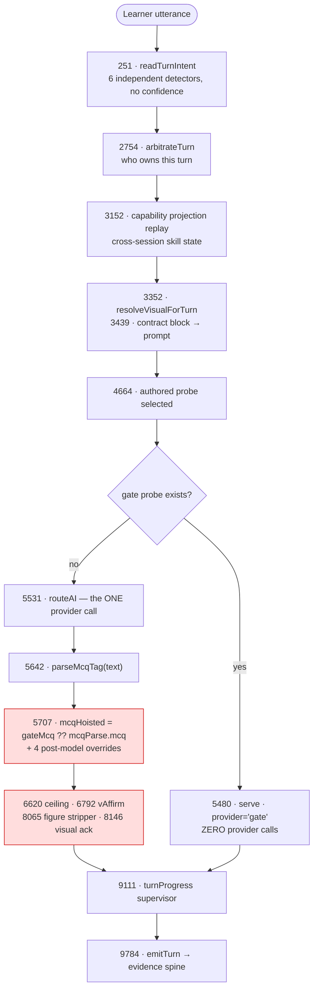
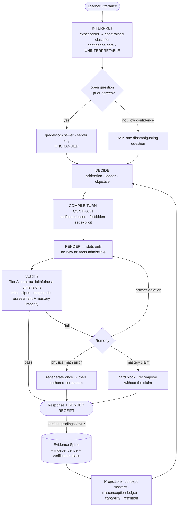
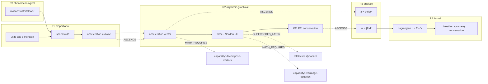
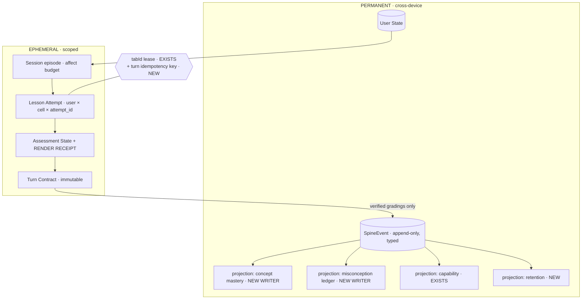
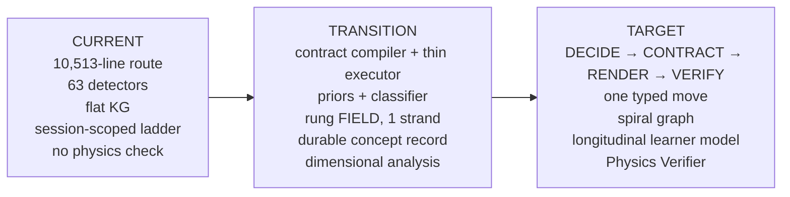

# Personal Physics Teacher — Migration Architecture (V2)

**Status: DESIGN PROPOSAL, AUDITED AGAINST THE REPOSITORY. Not adopted. Not an ADR. Nothing here is implemented.**

| Field | Value |
|---|---|
| Version | **V2 — supersedes V1 entirely** (`PHYSICS_TUTOR_ZERO_TO_RESEARCH_ARCHITECTURE.md`, 2026-09-12, same file, renamed) |
| Date | 2026-09-12 |
| Kind | Target architecture for a zero → research-readiness physics teacher, expressed as an **incremental migration from the measured My Tutor baseline** |
| Authority | **None.** Does not supersede, amend, or reopen `EDUCATIONAL_BRAIN_BIBLE.md` or any ADR |
| Governance | Every runtime/schema/route change implied here remains gated by the standing G1/G2 rule (Canonical KG v1 freeze + explicit per-item owner approval, `WAVE_0_APPROVAL_CHECKLIST.md`) |
| Scope of change in the commit that produced this | This file (renamed + rewritten) and the CLAUDE.md entry that named it. No runtime, schema, route, curriculum, KG, Blueprint, or Educational Brain content touched |

---

## 0. Why V2 exists, and what V1 got wrong

V1 was written as a first-principles exercise that deliberately did not assume the existing
architecture was correct. It was then audited line-by-line against `main`. **Four of its
load-bearing novelty claims were false**, and one of its central proposals is refuted by an
experiment this repository has already run.

V1 claim, as written | Verified state on `main` | Consequence for V2
---|---|---
"Authority separation / only verified grading may score" is a proposal | **Already implemented and enforced.** `conversationState.ts:1136` — `const verified = evidence.serverGraded === true`; `unauthoredKeyGrades` (`:1079`) counts a model-invented key without ever crediting it | Removed as a proposal. Recorded as a **KEEP**, and as better than V1's own nine-facet replacement
"Artifact-first probes" is a proposal | **Already true on the authored path.** The probe object exists at `route.ts:4664`, the provider call is at `:5531`, and the gate path serves a complete assessed turn with **zero provider calls** (`provider='gate'`, `:5480`) | Narrowed to the one seam where it is still false: `mcqHoisted = gateMcqHoisted ?? mcqParse.mcq` (`:5707`)
"Operation-typed Math Graph" is novel | **~70% already built.** `capabilityModel.ts`: 34 capabilities in 7 clusters, a `CAPABILITY_REQUIRES` prerequisite DAG, a 5-state ladder, cross-session persistence via `replayCapabilityProjection` (`route.ts:3152`), and it drives a decision (`classifyFailure` → `capability_missing`, `:3592`) | Demoted from "new subsystem" to "**author its inputs**" — only 9 concept→capability bindings exist; everything else falls back to 15 regexes over the concept id string
"Liveness invariant" and "turn arbitration" are proposals | **Both implemented and wired.** `turnProgress.ts` (3-rung escalation, `route.ts:9111-9241`); `turnArbitration.ts` `TURN_AUTHORITY_ORDER` (`route.ts:44`, `:2754`) | Removed. KEEP both
"An 11-check composed verifier" | **Refuted by this repo's own experiment.** `kernel/verifier/rules.ts` has 22 rules and a real 2-attempt rerender loop, and it is **OFF by default** (`route.ts:6635`). The reason is recorded at `route.ts:6780`: `V-Q2` rejects any TEACH/SHOW/RECOVER/CLOSE draft ending in a question — "a 'permissive' context is not actually reachable" | **Dropped.** V2 adds only total, deterministic checks and keeps the single content-grounded floor (`vAffirm`, `route.ts:6792`)

**What survived the audit is smaller and sharper**, and it is the whole of §4–§6 below.

The one architectural reading that survived intact is the diagnosis of *shape*. Fourteen weeks of
commit history say the same sentence in different words — *"the server owns the mastery-gate
assessment, not the model"* (2026-08-12), *"one deterministic authority owns the turn"*
(2026-08-23), *"the model may not ask the graded question"* (2026-09-01). My Tutor is not on a
different road from V1's design. **It is on the same road, roughly 60% along, carrying luggage** —
`route.ts` grew 120 → 10,513 lines across 434 commits, and August ran 256 fixes against 139
features. V2's job is to name the remaining 40% and nothing else.

---

## 1. The measured baseline

Every row verified on `main` @ `68c4584` by reading the module and its call site, not the docs.
`serving:` state (production DB rows) was **not** reachable from the audit session and is not
claimed anywhere in this document.

### 1.1 Implemented and wired — KEEP, do not redesign

Capability | Evidence
---|---
Deterministic server grading | `mcq.ts:1297` `gradeMcqAnswer` reads `correctIndex` and nothing else; called `route.ts:2379`
Verified vs plain mastery counters | `conversationState.ts:1136`; only `serverGraded` increments `verifiedCorrectAtCheck/Practice`
Invented key counted, never credited | `conversationState.ts:1079`; read by `masteryGate.ts:77`, `:1079`
Mastery invariant proven | `masteryCounterInvariant.test.ts` drives the real fold over **49,152 states**
Authored probe decided before the model call | `route.ts:4664` (probe) precedes `:5531` (provider)
Zero-provider-call assessed turn | `route.ts:5480`, `provider='gate'`
Invented-probe guard | `inventedProbeGuard.ts` `decideModelProbe`, `route.ts:5674-5710`
Turn arbitration | `turnArbitration.ts`: `KNOWLEDGE_GAP > RECOVERY > LEARNER_REQUEST > CLOSE > COMPLETE > (gap) > TEACH`, per-capability suppression
Liveness | `turnProgress.ts` — `classifyTurn`, `foldStagnation`, `probeHeldTurns`, 3-rung escalation
Excursion + knowledge gap | `excursion.ts`, `knowledgeGap.ts`; bounded at `MAX_EXCURSION_TURNS = 6`
Visual decision before the model, contract into the prompt | `resolveVisualForTurn` `route.ts:3352`; `buildVisualContractBlock` `:3439`
Visual tiers + critic + budget + grounding + verdict cache | `resolveVisual.ts` CURATED/APPROVED/GENERATED; `figureCritic.ts`; `generationBudget.ts`; `topicIdentity.ts`; `verdictCache.ts`
Capability prerequisite DAG, durable | `capabilityModel.ts` + `evidence-spine/replay.ts`
Typed append-only event log | `evidence-spine/{types,fold,replay,writer,turnEmitter}.ts`; `emitTurn` `route.ts:9784`
Session/tab ownership | `tabId` in `/api/sessions:43` and `/api/learn/chat:95`; `sessionTabOwnerDelta`
Asset contract | `assetContract.ts` — ≥1 explanation, ≥3 closed-choice probes per served band
Content corpus (physics) | KG 238 · Blueprints 238/238 · Educational Brain 238/238 (`scripts/physics/state.ts`)
QA estate | 640 test files · 116 QA drivers · `scripts/certification/` · 2 CI workflows

### 1.2 Partial — the seams V2 works on

Capability | State
---|---
Artifact-first for assessment | True for authored probes; **false** on the fallback `?? mcqParse.mcq` (`route.ts:5707`, parsed from generated prose at `:5642`), contained by `unauthoredKeyGrades` but still live
Turn contract | **No typed object.** ~40 `…Hoisted` locals in a 10,513-line function, plus ~20 post-hoc overrides — four of which are consecutive `mcqHoisted = null` statements at `:5710`, `:5734`, `:5751` and the CLOSING branch
Render receipt | `pendingQuestion.ts` persists post-arbitration and `mcqForClient` strips the key, but there is **no client acknowledgement**. The 2026-08-30 "seventh defect" (server believes a probe is on screen, client renders none) is exactly this gap
Output verification | 22 rules built, **flag-gated OFF**; only `vAffirm` runs unconditionally
Math dependency | Engine is good; its input is **9 authored bindings** (`CONCEPT_CAPABILITIES`) plus `ID_SEGMENT_CAPABILITIES`, 15 regexes over the concept id
Learner model | Rich ladder lives in `LearnSession.contextSnapshot` (per-session JSON). Durable layer is coarse
Concurrency | `writeSnapshotDelta` merge-deltas + `snapshotRederivers`; read-check-write with retry, **not commutative** — its own history records a rederiver re-applying 5 of 7 accumulative fields

### 1.3 Absent

Capability | Evidence
---|---
Representational level (rung) | `KGNode` (`knowledgeGraph.ts:64`) exposes `id, slug, title, description, prerequisites, estimatedHours, difficulty`. `cross_links`, `mastery_threshold`, `bloom`, `unlocks` are in the JSON and **not exposed at runtime**. A concept appears exactly once
Physics correctness verification | No dimensional, limiting-case, sign or magnitude check anywhere in `src/`. `mathjs` is in `package.json:46` and imported by **zero** files in `src/`. All 22 verifier rules are lexical/structural
Durable per-concept learner record | `prisma.conceptMasteryRecord.*` write sites outside tests: **0**. `prisma.activeMisconception.*`: **0**. `EvidenceRecord` has 2 writers, both the visual path, and the schema comment says those rows are "always written with weight 0"
Retention / decay / spaced review (Library) | `spacedRevision.ts`'s Library call sites were **removed** (`route.ts:687`, `:1056`, `:2808`)
Closed-taxonomy learner-move interpreter | `turnIntent.ts` `readTurnIntent` is a **hoisting aggregator over six independent detectors**, with no confidence, no `UNINTERPRETABLE` class, and no clarification path; `ambiguous` is read at exactly one site. Measured surface: **63 detector-shaped exported predicates, 60 regex constants** in `src/lib/teaching/*.ts`
Transfer instruments | `TRANSFER` is a phase in the ladder with no transfer-specific items and no separate threshold
Chat-turn idempotency key | Only `/api/practice/submit` has one

### 1.4 Documentation/implementation conflicts found (scored on implementation)

1. `figureReference.ts`'s header states *"whether a figure is attached is decided AFTER the text is
   generated."* **False on `main`** — the decision runs 1,179 lines before the provider call.
   `visualContract.ts`'s header is the correct one. The stripper still has a real residual job (a
   figure decided pre-model can fail to *fire*, `route.ts:7990-8083`), but its stated rationale
   describes a pre-V2-resolver world.
2. ADR 10's memory stores are described as designed; the tables exist in schema with zero writers.
3. `src/lib/cekr/*` exists and is not referenced anywhere in the chat route.

---

## 2. The one thesis that survived: Artifact-First

> Nothing the learner is graded on, and nothing drawn as a figure, may originate in free prose.
> Every assessable and every visual object exists as a typed artifact **before** any language is
> generated; prose is rendered around those objects and may not introduce new ones; verification
> then checks *faithfulness of the rendering to the decision* — a closed, checkable question —
> instead of classifying unbounded free text.

The reason this is a *shape* argument and not a preference, stated once:

1. **Repair-after-generation is an open-ended exclusion problem.** Any guard whose default answer
   is "yes, unless one of N exclusions fires" meets its N+1th counterexample. Measured in this
   repo: I1 shipped three exclusions → I4 added two → ENG-D02 measured **nine phrasings escaping
   all five**, for two structural reasons (`detectLearnerQuestion` requires `?`;
   `isBareAcknowledgement` matches the whole message).
2. **It cannot restore information the generator never produced.** A missing MCQ stem cannot be
   stripped into existence.
3. **It composes into absorbing states.** The GUIDE deadlock, the excursion gate, the pending-probe
   latch — each a pair of individually-correct refusals.

### 2.1 Where the shape already holds, and where it does not

Subsystem | Ordering on `main` today
---|---
Mastery / state | **DECIDE only.** The model has no write path at all. This is finished
Assessment (authored path) | **DECIDE → ARTIFACT → RENDER → VERIFY.** Finished
Assessment (fallback path) | **GENERATE → DETECT → REPAIR.** `?? mcqParse.mcq` plus four post-model overrides. Open
Visual | **DECIDE → CONTRACT → RENDER → REPAIR-RESIDUAL.** Mostly done; prose is not slot-bound to the figure
Prose / teaching content | **GENERATE → DETECT → REPAIR**, unambiguously — stance enforcement, affirmation floor, don't-know ceiling, filler repair, false-confirmation stripper, prose-option stripper, duplicate-explanation guard. Open

V2 closes rows 3 and 5 and tightens row 4. It does not touch rows 1 and 2.

---

## 3. Authority model (KEEP — restated so V2 is self-contained)

Three disjoint authorities. Shared authority over state is the same as no authority.

- **Knowledge authority** — curriculum structure, concept content, correct answers, figure
  semantics. Authored, versioned, verified. The LLM may *render* it and may *propose* additions
  offline; it may never originate it at serve time.
- **State authority** — learner model, evidence, mastery, progression, session lifecycle.
  Deterministic code. Writable only by a verified grading event or an explicit learner action.
- **Language & interpretation authority** — understanding, prose, analogy choice, register,
  empathy. The LLM. This is genuinely what models are for.

The bridge rule, already enforced in code:

> **Interpretation may steer. Only verified grading may score.**

An LLM's reading of *"I think it's B, but why does the sign flip?"* may change what we teach next
(steering — reversible, cheap to get wrong). It may never move a mastery counter (scoring —
irreversible, expensive to get wrong).

---

## 4. The four missing primitives

This is the actual proposal. Everything else in this document is either already built (§1.1) or
deliberately deferred (§7).

### 4.1 The Turn Contract — the highest-value missing primitive

**The problem, stated as a code fact.** The set of things a turn may contain is ~40 mutable locals;
the set it may *not* contain is implicit in ~20 post-hoc overrides. That is why four separate
`mcqHoisted = null` statements sit within 45 lines of each other — each is a clause of a contract
nobody wrote down, discovered one incident at a time.

**The object.** Compiled *before* generation; the only thing the renderer may realize.

```
TurnContract {
  turn_id, idempotency_key, session, lesson_attempt, client_lease
  cell, rung, objective_id
  phase              OBSERVE|DEMONSTRATE|GUIDE|CHECK|PRACTICE|TRANSFER|CLOSE
  authority          from turnArbitration (existing)
  act                exactly one

  inbound {
    learner_move            typed, with confidence (§4.3)
    resolved_question_ref   which open question this answers, or null
    grading                 keyed outcome or null — PRE-COMPUTED
  }

  artifacts {
    question?        { id, stem, options[], key, facet, band, assetId }
    figure?          { id, declared claims, render ref }
    explanation?     { assetId }
    equation_refs[]  from corpus, never free-form
  }

  expected_evidence      which facet(s) this turn can produce
  allowed_capabilities[] from turnArbitration (existing)
  forbidden_actions[]    explicit, checkable
  mastery_implications   what a correct/incorrect answer will write
  length_budget, register, language
}
```

**Why it is safe to introduce.** It is a refactor with **no behaviour change on the day it
ships**: the compiler emits what the hoisted locals already hold, and each existing override
becomes a clause of `forbidden_actions`. It is the primitive that makes §4.2 and §4.3 safe to add,
because both need one place to attach to.

**The invariants it makes assertable** (each maps to a defect class this repo has met):

# | Invariant | Closes
---|---|---
I1 | At most one open question per session | second assessment before the first resolves
I2 | A grading may only reference a question with a recorded **render receipt** | grading an unseen question; the "seventh defect"
I3 | Every graded artifact comes from the corpus by id with a stored key; prose may never introduce an option list or question | ungradeable prose questions, missing stems
I4 | `OPEN → ANSWERED / RELEASED / SUPERSEDED`; a released question is `SPENT` | stale questions, infinite re-offer
I5 | `cell(turn) ∈ {objective, excursion target, prerequisite target}` | topic drift
I6 | Mastery writes are a pure function of graded outcomes; praise is generated **from** the write | contradictory praise, premature mastery
I7 | A figure reference in prose must resolve to `figure.id` in this contract | phantom figures, prose/figure contradiction
I8 | A REQUEST is satisfied or explicitly declined with a reason | silently ignored requests
I9 | Liveness counter per open objective (**existing** `turnProgress`) | absorbing states
I10 | Idempotent on `idempotency_key` | double-grading on retry or second tab

I1, I4, I5, I6 and I9 are already true in behaviour; the contract makes them *checkable in one
place* instead of distributed across call sites. I2, I3, I7, I8 and I10 are the genuinely new ones.

### 4.2 The Physics Verifier — the largest capability gap

Every guard on `main` operates on text *shape*. `v = 20 m/s²` is shaped exactly like a correct
statement. The measured incident — the tutor agreeing that "apples" is a unit — is the mild
version, and `vAffirm` catches it only because the learner *floated a definition*, not because
anything checked the physics.

Physics is unusually machine-checkable, and this is the strongest argument for a physics-specific
tutor over a general one. Before any response leaves:

Check | What it enforces | Cost
---|---|---
**Dimensional** | every equation and numeric result is dimensionally consistent; units convert | free, deterministic, **ship this first**
**Numeric** | values recomputed independently; tolerance and significant figures | free
**Order of magnitude** | quantities inside plausible ranges (a 40 m/s human sprint is rejected) | free
**Sign / convention** | corpus declares the convention in force; signs checked against it | free, needs one corpus field
**Limiting cases** | the corpus stores what each equation must reduce to (θ→0, m→∞, v≪c, R→∞); a result violating a stored limit is rejected | needs authored limits per equation
**Symbolic** | stated algebraic steps verified against the corpus equation | needs a CAS — `mathjs` is already a dependency and currently unused

**Tiering, learned from the disabled K5 verifier.** These are **total, deterministic functions of
the draft** — they do not sample a distribution, they do not compose into the "no permissive
context is reachable" trap, and each one names its own violation. They belong in Tier A (block
absolutely). The lexical rules stay where the repo put them: off.

**Fallback, not hedging.** Because every published cell has authored content, a verification
failure falls back to **authored text**, not an apology. A correct, slightly less personalized turn
is a much better floor than a hedge — and it is only possible because the asset contract already
guarantees the content exists.

### 4.3 The learner-move interpreter — closing the exclusion problem

**The problem is structural, not a missing pattern.** 63 predicates and 60 regexes cannot be made
complete; the next detector *is* the defect. The history is a proof by induction and is recorded in
CLAUDE.md three times.

**The design:** one classifier with a closed output space, and a confidence gate.

`ANSWER_ATTEMPT` (+ extracted answer, + form) · `QUESTION_ABOUT_TOPIC` (+ target) ·
`QUESTION_ABOUT_TASK` · `CLARIFICATION_REQUEST` · `CONFUSION` (+ locus) · `NOT_KNOWING` ·
`REQUEST` (+ kind) · `ACKNOWLEDGEMENT` · `AGREEMENT` / `DISAGREEMENT` · `SELF_CORRECTION` ·
`META` · `TOPIC_CHANGE_REQUEST` · `DEFERRAL` · `STOP` · `AFFECT_DISTRESS` (+ type) · `OFF_DOMAIN` ·
**`UNINTERPRETABLE`** — first-class, mandatory, and the instructions must state that returning it
is a **correct** outcome. A closed set without an exit bends everything into the nearest member;
this repo already learned that in the visual generator, where adding `{"type":"none"}` stopped
lists being drawn as process flows.

Layer | Role
---|---
**1 — exact priors** | Only where truly exact, and only when a question is open: an isolated option letter; a numeric value matching the key's tolerance; an exact match to an expected answer form. These are equalities, not heuristics. **They short-circuit the model and cost nothing** — this is what protects the current zero-call paths
**2 — constrained classifier** | Closed taxonomy, the open question, the objective, the last two turns. Must return **spans**; no span ⇒ downgrade confidence
**3 — confidence gate** | Irreversible consequence (grading) → require agreement between the prior and the classifier, else `UNGRADEABLE` and say so. Steering → moderate confidence suffices. Low confidence with any consequence → **ask one short disambiguating question**
**4 — revisability** | Recorded; a contradicting next turn revises the plan. Because interpretation never wrote evidence, nothing needs un-writing

**What is kept from today.** `resolveMcqChoice` is **not** loosened — a false grade writes permanent
false evidence. `engagesPendingOptions` (ENG-D02's inverted-default matcher) is exactly the right
shape and becomes a layer-1 prior. The existing distress/request detectors become *features* the
classifier sees, not independent authorities.

**Cost control.** Layer 2 runs only when the priors are inconclusive **and** a consequence is
pending — not unconditionally. A turn served by the gate path or by memory still costs zero
provider calls.

### 4.4 The durable learner model

**The problem:** `conversationState` — the ladder, the phase, mastery counters, budgets, the
misconception hypotheses — lives in `LearnSession.contextSnapshot`, a per-session JSON blob. The
durable layer is `TopicProgress.masteryPct` plus `LessonAttempt`. `ConceptMasteryRecord` and
`ActiveMisconception` exist in schema with **zero writers**. So a learner's relationship to a
concept does not survive the session in any detail.

**The proposal is not a new subsystem.** The pattern is already proven by the capability model:
typed events → spine → projection → hydrated per session. Apply the same pattern to concepts.

Store | Content | Pattern
---|---|---
`ConceptMasteryRecord` (exists) | per (learner, cell): ladder high-water mark, facet vector, last evidence, decay parameters | projection of `SpineEvent`, hydrated like `capabilityState`
`ActiveMisconception` (exists) | per (learner, misconception id): status, strength, verbatim phrase, repair history | same, with **corroboration** (§7 R9)
`EvidenceRecord` | per graded item, append-only, carrying **independence** and **verification class** | new writer; today's 2 writers are the visual path at weight 0

**Two fields most tutors lack, and they are the reason to do this at all:**

- **Independence** — `unaided 1.0 · hinted 0.7 · scaffolded 0.45 · co-solved 0.2 · revealed 0.0`.
  A correct answer after three hints is not the same evidence as an unaided one. Without this
  discount, a patient tutor manufactures fake mastery.
- **Verification class** — `keyed | rubric-verified | computed | self-report`. Self-report is
  *recorded*, because it is useful for steering, and is *structurally incapable* of advancing
  mastery. It sits in the log, visible, weightless.

**The mastery predicate is extended, not replaced.** The current rule (`correctAtCheck ≥ 1` +
`correctAtPractice ≥ 2`, verified counters only) is proven over 49,152 states. V1 proposed replacing
it with nine thresholds proven over none. V2 adds facets **one at a time, each with its own
measurement**, on top of the existing rule — never in place of it.

---

## 5. The long-horizon additions: rung, retention, transfer

These three are what make the difference between an excellent hour and a teacher for a decade. All
three are absent, and none can be reached by adding another guard.

### 5.1 Rung — the missing dimension

A concept appears exactly once in the graph. There is therefore **no expressible difference**
between understanding energy at 11 and at 21:

When | What energy is
---|---
age 11 | a thing that gets used up and moved around
age 15 | `E = mgh`, `½mv²`, conservation in collisions
age 17 | `W = ∫F·dr`, potential from a conservative field
year 2 | `L = T − V`, the Hamiltonian, Noether's theorem
year 4 | the 00-component of the stress-energy tensor

One node makes "mastered energy" meaningless; five unrelated nodes lose the learner's three-year
relationship with the idea. Both are wrong.

**The model.** A **cell** is `(concept, rung)` and carries teaching content. A **concept** carries
identity, misconception family and spine membership.

Rung | Character
---|---
R0 Phenomenological | notice, describe, predict direction of change. No symbols
R1 Proportional | ratios, units, one-step relations, estimation
R2 Algebraic-graphical | symbolic manipulation, vectors, graphs, free-body diagrams
R3 Analytic | calculus: rates, integrals, differential statements, flux
R4 Formal | variational and structural: Lagrangian/Hamiltonian, operators, tensors, symmetry → conservation
R5 Research | approximation control, model construction, knowing what is *not* known

**Sparse by construction (V1's own R2 revision, now binding).** Do not author six rungs per
concept — 238 physics EB entries took months, and a full ladder multiplies that. Author rungs
**only where the concept genuinely reappears**: empirically ~2 per concept, ~5 for a dozen keystone
ideas. Start with R0–R2, covering zero → school; add R3–R5 as the learner population reaches them.

**Edge types.** `REQUIRES` (per-edge threshold, not global) · `ENABLES` · **`ASCENDS`** (rung
ascent, carrying a *reframe protocol*: what the learner already believes, what survives, what
changes) · `SUPERSEDES` · `MATH_REQUIRES` (into the capability model, §4.4/§7) · `ANALOGOUS_TO`
(+ where it breaks) · `CONTRASTS_WITH` · `MEASURED_BY`.

**The cheap first step.** Add the rung **field** and `ASCENDS` edges, and expose the KG fields the
adapter already parses and drops (`mastery_threshold`, `cross_links` — ADR 05 Phase 1). Then pilot
two rungs on **one** strand. The field costs nothing; the content is where the risk is.

### 5.2 Retention

`spacedRevision.ts`'s Library call sites were removed. Nothing decays and nothing is scheduled, so a
learner returning after three months is treated identically to one returning after three minutes.

- Per-cell retention half-life, initialized from a corpus prior, **re-estimated per learner** from
  actual retrieval outcomes.
- Expanding intervals, **semantic not flashcard**: the review item is a *different* item testing
  the same facet, ideally embedded in new work.
- **Prerequisite-driven review is the highest-value form**: when a new cell requires X and X has
  decayed, review X as the on-ramp. It costs nothing motivationally because it is visibly needed.
- **FORGOTTEN ≠ UNKNOWN.** Forgotten is a cueing problem that recovers in minutes. High-water marks
  are permanent; decay moves the *current* position, never the mark.

### 5.3 Transfer

`TRANSFER` is a phase with no transfer-specific instruments and no separate threshold — a label.
It becomes a **facet** with its own items (novel surface, same deep structure) and its own
threshold, authored alongside the existing probe corpus and subject to the same asset contract.

---

## 6. Visual: one narrowing, nothing else

The existing pipeline — three tiers, critic, budget, grounding floor, verdict cache, parametric
re-derivable scenes, decision-before-model with a contract block — is essentially the design V1
proposed, already built. **Do not touch the tiers.**

The one genuine delta: a figure carries a **declared claims list** (what the learner must be able
to *read off* it), and prose references the figure **through resolved slots** rather than free
text. A figure and the prose about it are then generated from the same structured object and cannot
contradict. `stripUnbackedFigureReferences` becomes a backstop rather than the primary defence.

Two existing rules are kept verbatim because they are correct: **any "unsure" resolves to HOLD**
(an unreachable judge is an "unsure"), and **a mismatch between the requested form and the
available figure is DECLARED, not resolved** — *"I don't have a graph of this, but here is the
circuit it describes."*

---

## 7. Explicitly deferred — with the evidence against each

V1 proposed these. The audit attacked them; they lost. Recorded so a future session does not
revive them without new evidence.

Proposal | Why it is deferred or dropped
---|---
**Composed 11-check verifier** | **Refuted by this repo's own experiment.** 22 rules built, rerender loop built, switched OFF because `V-Q2` rejects most good teaching turns. V2 ships only total deterministic checks (§4.2)
**Expected-information-gain probe selection** | Requires a posterior over learner hypotheses nobody has. `excludeProbeStem` + band matching already captures most of the value
**Commutative CRDT learner state** | Rewrites every module that writes a snapshot delta (≥8 confirmed). The proven defect (#3, the rederiver) was ONE field set in ONE rederiver. **REFACTOR the specific accumulative fields to be monotone; do not rewrite the store**
**Nine-facet mastery predicate as a replacement** | Replaces a rule proven over 49,152 states with nine thresholds proven over none. Extend, one facet at a time, with a measurement per facet
**Approximation Ledger** | Elegant, physics-specific, and with **zero measured defects attributable to its absence**. No runtime consumer even in V1's own design
**Physics spines** | Same: no runtime consumer beyond reporting
**Five-role LLM split** | The separate planner role was already self-rejected in V1 (a probabilistic planner over a state machine is non-reproducible *and* constrained anyway). The interpreter role survives, gated (§4.3)
**Full 6-rung authoring** | Authoring bomb. Field first, two rungs on one strand, then measure
**Letting the renderer propose a question when the corpus has none** | Self-rejected in V1 and confirmed by audit: it is repair-after-generation through the back door. If no probe exists, the honest act is to teach, and the missing probe is an authoring ticket the system should **surface**

**Misconception corroboration (R9), kept from V1's revisions:** one distractor selection sets a
*hypothesis*, not a ledger entry. The entry is written on a second consistent signal. Hypotheses
drive probe selection; they never drive teaching that tells the learner what they believe. Telling
a learner they hold a misconception they do not hold is worse than missing one.

---

## 8. Diagrams

### A — the turn today (measured ordering, `route.ts` line numbers)



The two red boxes are the remaining generate-detect-repair surface. Everything above `5531` is
already decide-first.

### B — the target turn



### C — the spiral graph (fragment)



`MATH_REQUIRES` targets the **existing** `capabilityModel.ts` vocabulary. No second math graph.

### D — state ownership (target)



### E — the migration



---

## 9. Migration plan

Layer | Current | Action | Target | Reason
---|---|---|---|---
Grading & mastery | `serverGraded` rule, verified/plain split, `unauthoredKeyGrades` | **KEEP** | unchanged | Better than V1's replacement. Proven over 49,152 states
Turn authority | `turnArbitration` 7 rungs | **KEEP** | unchanged | Implemented, wired, sound
Liveness | `turnProgress`, 3 rungs | **KEEP** | unchanged | Implemented, wired
Excursion / knowledge gap | `excursion.ts`, `knowledgeGap.ts`, bound 6 | **KEEP** | unchanged | Bounded, measured, production-verified
Asset contract | ≥1 explanation, ≥3 probes | **KEEP** | + derive the count from the predicate plus a failure allowance | Today's 3 assumes a perfect learner; 5 was already shipped for physics/chemistry
Turn shape | ~40 hoisted locals + ~20 overrides | **REFACTOR** | one typed `TurnContract`, compiled pre-model, asserted post-model | The contract exists; it is just not written down. No behaviour change on day one
Assessment artifact | gate probe pre-model + `?? mcqParse.mcq` | **REFACTOR** | authored probe or **no probe**; retire the model MCQ tag per concept once contract coverage allows | Closes the last generate-parse seam. Gate per concept, never globally
Question receipt | `pendingMcq` persisted post-arbitration | **ADD** | client render ACK before a grade is admitted | Closes the "seventh defect" class by invariant, not by accessor
Learner intent | 6 detectors aggregated, no confidence | **REPLACE** | closed taxonomy + confidence + `UNINTERPRETABLE` + ask; priors kept as the fast path | Only fix for an unbounded exclusion problem
Physics truth | none (`vAffirm` shape only) | **ADD** | dimensional analysis first; limits/signs/magnitude second; symbolic last | Largest capability gap. Deterministic, total, cheap
Prose verification | K5 built, OFF | **KEEP OFF** + ADD | keep `vAffirm`; add only total deterministic checks | This repo's own experiment refutes the composed verifier
Knowledge model | flat KG; `cross_links`/`mastery_threshold` discarded | **ADD** | rung field + `ASCENDS` edges; expose the dropped fields (ADR 05 Phase 1) | The one hard blocker on zero→advanced
Rung content | none | **DEFER** | two rungs on ONE strand (T2 kinematics) as a pilot | Authoring cost is the risk, not the mechanism
Durable learner model | session JSON; 0 writers on 2 tables | **ADD WRITERS** | project like the capability model already does | Schema designed and unused; the pattern is proven
Math dependency | `capabilityModel` + 9 bindings + 15 id-regexes | **REFACTOR** | author real `CONCEPT_CAPABILITIES` for the physics spine; retire the regex fallback for covered concepts | The engine is good; its input is 9 rows and a regex
Misconceptions | authored registers, no persistence | **ADD** | `ActiveMisconception` writer + corroboration rule | Hypotheses die with the session
Visual | 3 tiers + critic + budget + contract + stripper | **WRAP** | declared-claims list; prose bound to slots; stripper becomes a backstop | Do not touch the tiers
Retention | removed for Library | **ADD** | per-concept half-life + prerequisite-driven review | Cheapest large win
Transfer | a phase with no instruments | **ADD** | transfer items + own threshold | A phase without items is a label
Concurrency | `writeSnapshotDelta` + rederivers | **REFACTOR** | make accumulative fields monotone | Targeted; not a CRDT rewrite
Chat idempotency | none | **ADD** | per-turn key | Cheap; closes double-grade on retry
Ledger, spines, info-gain, 9-facet predicate | none | **DEFER** | — | No measured defect; no runtime consumer

### Sequencing — each step ships alone and is reversible

Step | Work | Exit criterion (a measurement, not a feature list)
---|---|---
1 | **Turn Contract refactor** | Byte-identical behaviour on a replay corpus; every one of the ~20 overrides expressed as a `forbidden_actions` clause; I1–I10 assertable in one place
2 | **Physics Verifier — dimensional only** | A seeded corpus of dimensionally-broken drafts is rejected 100%; zero false rejections across a 200-turn replay of real transcripts
3 | **Learner-move interpreter** | On an adversarial corpus (17 classes × 20 phrasings): ≥95% correct class or an explicit clarification, **zero** cases of confusion read as a topic change, and no increase in provider calls on gate/memory turns
4 | **Durable concept + misconception writers** | A learner's ladder position and active misconceptions survive a session boundary and are re-hydrated; no double-counting under concurrent writes
5 | **Retention scheduler (Library)** | A learner returning after 3 months is re-placed in ≤5 items from their high-water mark, never re-taught from zero
6 | **Rung field + `ASCENDS`; pilot 2 rungs on kinematics** | The same concept is enterable at two levels with a reframe, and R1 evidence is the floor for R2 — never discarded
7 | **Retire `?? mcqParse.mcq`** on concepts at contract | Zero `unauthoredKeyGrades` on those concepts across a certification sweep, with no drop in lesson completion

**Sequencing rule:** never build a plane ahead of the strand it serves. Twenty cells taught
genuinely well is a better foundation than 1,775 cells that cannot close a lesson.

---

## 10. Principles

Revised against the audit. Principles already **enforced in code** are marked ✅ and are here so
the list is complete, not because they need building.

1. ✅ **Authority separation.** Knowledge, state and language are three disjoint authorities. No
   component holds two.
2. ✅ **Interpretation may steer; only verified grading may score.**
3. ✅ **Evidence, not momentum.** Advancement requires graded evidence. Warmth is never evidence.
4. ✅ **The objective survives confusion.** "I don't understand" changes the tactic, never the goal,
   and never spends the affect budget.
5. ✅ **Liveness is explicit.** Every guard answers "may this happen"; something must separately
   answer "has anything happened."
6. ✅ **Session state and learner state are different kinds of thing.**
7. ✅ **A mismatch is declared, not resolved.** Honest uncertainty beats a substitution.
8. **Artifact-first.** Nothing graded and nothing drawn may originate in free prose.
9. **One open question**, with an explicit lifecycle and a **render receipt** — no grading against
   something the system cannot prove the learner saw.
10. **The contract is data.** What a turn may and may not contain is one typed object, not forty
    locals and twenty overrides.
11. **Physics is machine-checkable — check it.** Dimensions, limiting cases, signs, magnitudes.
12. **Every closed set has an exit**, and returning it must be stated as a correct outcome.
13. **A failed generation may never become a teaching decision.** Recompose, regenerate once, fall
    back to authored content, or declare honestly. Never filler, never silence, never a guess.
14. **A cell is not published until its inventory can satisfy its own mastery predicate** — with a
    failure allowance, not for a perfect learner.
15. **High-water marks are permanent.** Nobody is ever re-taught from zero.
16. **Mathematics is a bottleneck to clear, not a wall to wait behind** — typed by operation,
    repaired just-in-time, in physics context, without stopping physics.
17. **Generation belongs offline.** The hot path selects and renders; the foundry authors. This is
    simultaneously the cost, latency, reliability and quality argument — and it is why the
    zero-provider-call gate and memory paths must survive every change in this document.
18. **Extend a proven rule; do not replace it.** A mastery predicate proven over 49,152 states
    outranks a more elegant one proven over none.

---

## 11. Relationship to the repository

- **This document changes nothing.** The commit that produced it touched this file and one CLAUDE.md
  entry.
- **It does not supersede `EDUCATIONAL_BRAIN_BIBLE.md` or any ADR.** Educational Brain Architecture
  v1.0 remains frozen and authoritative.
- **Everything here that would become code is G1/G2-gated**, tracked through
  `WAVE_0_APPROVAL_CHECKLIST.md`.
- **Convergent prior art, credited rather than re-proposed:** the asset contract (ancestor of the
  publishability rule), the misconception birth taxonomy, the excursion lifecycle, turn
  arbitration, the figure critic's `no-suitable-form` exit, `turnProgress`, the evidence spine, the
  capability model, `mcqToServe`, `inventedProbeGuard`, `engagesPendingOptions`.
- **What is genuinely new in V2:** the Turn Contract as a typed object; the deterministic Physics
  Verifier; the closed-taxonomy interpreter with a confidence gate; durable concept/misconception
  writers; the rung dimension with `ASCENDS`; retention for Library; transfer instruments; the
  render receipt.
- **Read `docs/architecture/EXCURSION_GATE_OWNERSHIP_PROPOSAL.md`, `PHASE3_ARBITRATION_AUDIT.md`,
  `PHASE5_LESSON_INTEGRITY_AUDIT.md` and `PHYSICS_MASTERY_CEILING_ROOT_CAUSE.md` before acting on
  any layer this document touches** — each records why the current shape is what it is.

---

## 12. How the claims in this document were verified

Method, so a future session can repeat it rather than trust it.

```
git fetch --unshallow                 # REQUIRED — the clone grafts at 2026-08-23 and
                                      # makes every mechanism look three weeks old
npm install
npx tsx scripts/physics/state.ts      # KG / Blueprint / EB / visual-binding truth

# the five lines that decide the ordering question (§2.1)
grep -n 'gateMcqHoisted = converted'   src/app/api/learn/chat/route.ts   # 4664
grep -n 'routed = await routeAI'       src/app/api/learn/chat/route.ts   # 5531
grep -n 'mcqHoisted = gateMcqHoisted'  src/app/api/learn/chat/route.ts   # 5707
grep -n 'const verified = evidence.serverGraded' \
        src/lib/teaching/conversationState.ts                            # 1136
grep -rn 'prisma.conceptMasteryRecord\.' src/ --include=*.ts | grep -v tests   # empty

npx vitest run src/tests/masteryCounterInvariant.test.ts \
               src/tests/turnArbitration.test.ts \
               src/tests/livenessEndToEnd.test.ts
```

**Limits of the audit, stated rather than hidden.** No production database was reachable
(`scripts/physics/state.ts` reports `serving: UNAVAILABLE`), so no DB row count in this document is
claimed as verified. No live learner session was driven. The full 640-file suite was not run; six
core architectural files were (120/120 pass). Physics KG shape, the `route.ts` ordering, the module
contents and the git history are the measured facts; everything else is argument.
