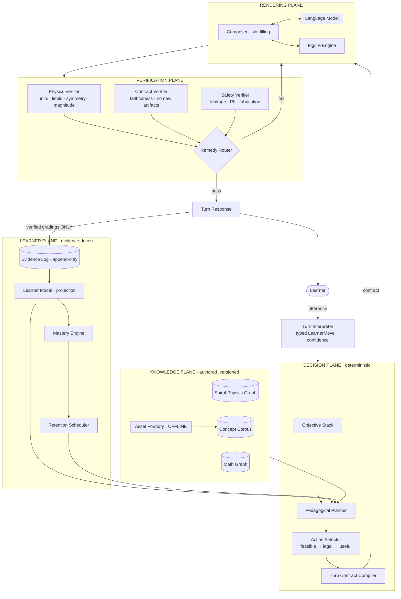
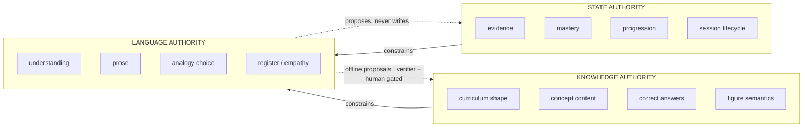
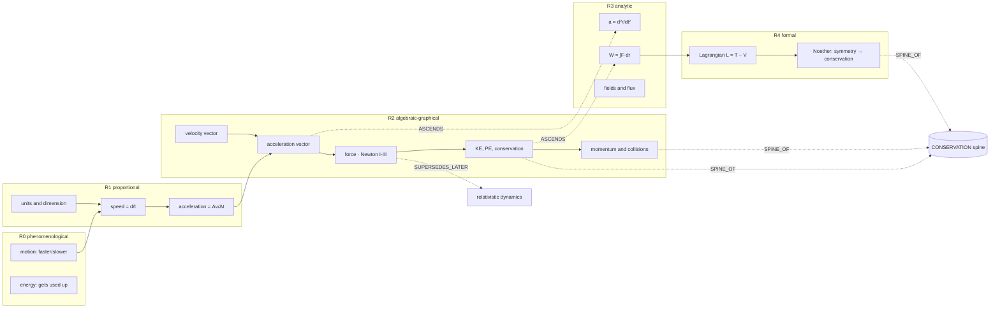
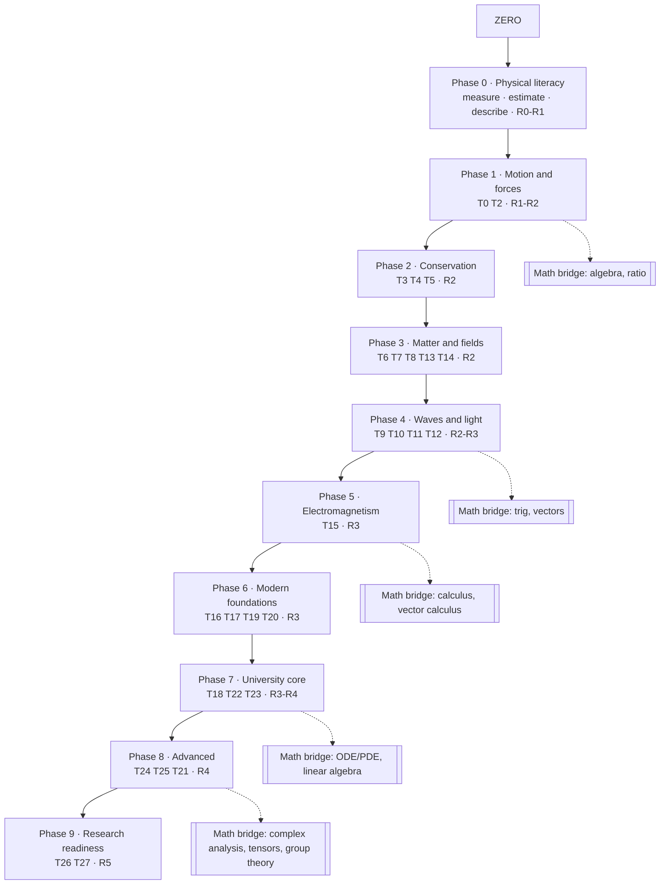
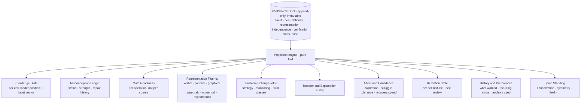
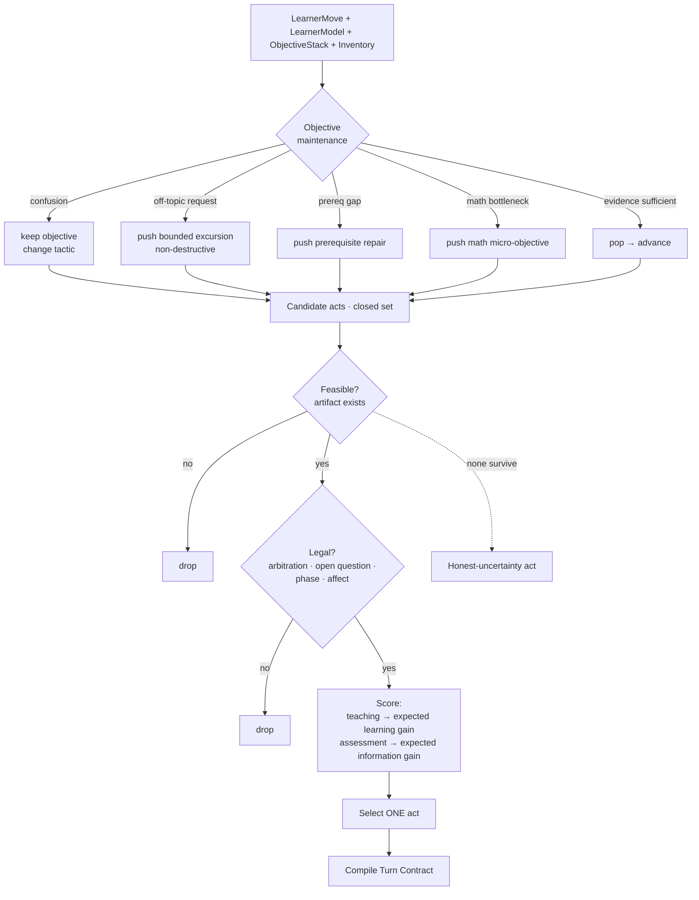
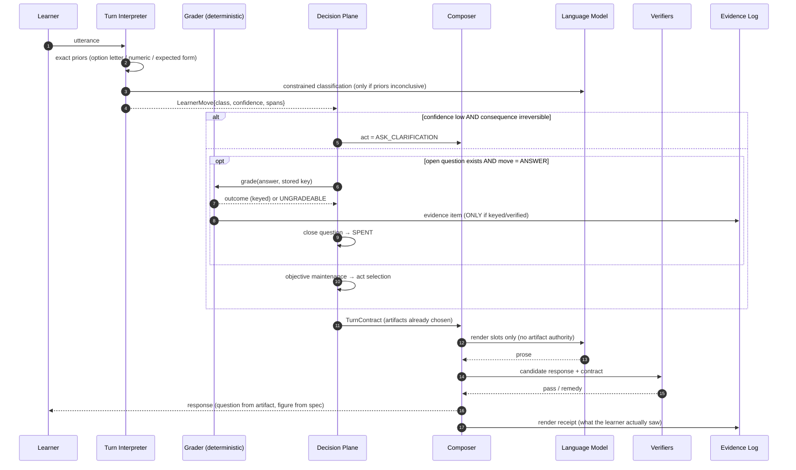
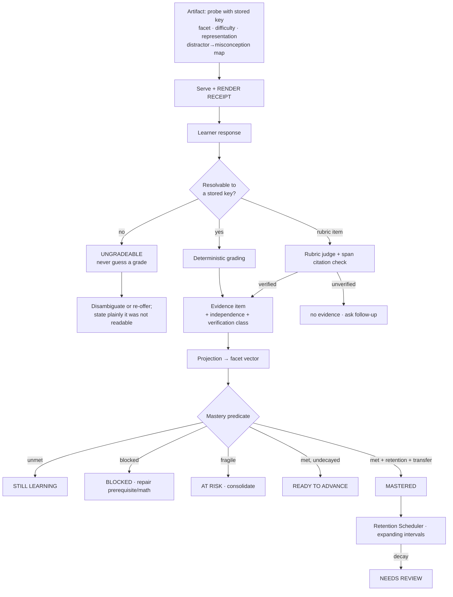
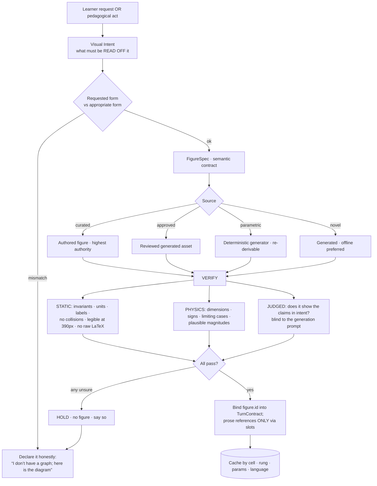
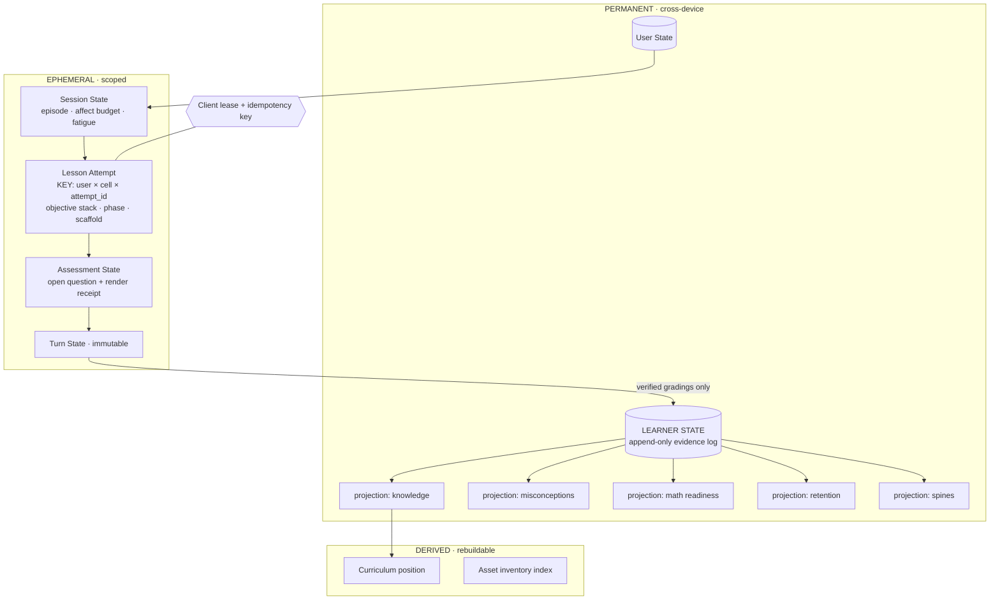

# Personal Physics Teacher — Zero → Research-Readiness Architecture

**Status: DESIGN EXERCISE. Not adopted. Not an ADR. Nothing here is implemented.**

| Field | Value |
|---|---|
| Date | 2026-09-12 |
| Kind | From-scratch architecture design, commissioned as a first-principles exercise |
| Authority | **None.** This document does not supersede, amend, or reopen `EDUCATIONAL_BRAIN_BIBLE.md` or any ADR |
| Governance | Every runtime/schema/route change implied here remains gated by the standing G1/G2 rule (Canonical KG v1 freeze + explicit per-item owner approval) |
| Scope of change in this commit | This file only. No runtime, schema, route, curriculum, KG, Blueprint, or Educational Brain content was touched |

The brief that produced this document explicitly asked for a design that does **not**
assume the existing My Tutor architecture is correct. Several of its central decisions are
therefore rejected below, with reasons. That rejection is an argument, not a decision —
adopting any of it is an owner call, and the ADR/Bible discipline applies to anything that
ever leaves this file.

Evidence used, and its limits:

- Direct read of `docs/physics/kg/graph.json` — 238 concepts, 12 domains, single root
  `phys.meas.units`, the canonical 10-field schema.
- The engine defect history recorded in `CLAUDE.md`, used as a **corpus of real failure
  modes** rather than as a description of intended design.
- No claim in this document is asserted as verified production behaviour. It is a design
  document; the only measured facts in it are the KG shape above.

---

## 0. The central diagnosis — why a redesign, not a refactor

The current system's shape is: **the model speaks, then the system repairs what it said.**
Its own recorded history is the evidence — a post-hoc question withholder, a
false-confirmation stripper, a phantom-figure-reference stripper, a filler repairer, a
stance enforcer, a prose-option stripper, an answer-confirmation enforcer, a disambiguation
prepender, seven prompt blocks each claiming authority "over everything above," and an
arbitration layer added later to adjudicate between them.

Each of those fixes was correct. The **shape** is wrong, for three structural reasons that
no amount of care removes:

1. **It is an open-ended exclusion problem.** Any guard whose default answer is "yes,
   unless one of N exclusions fires" will meet its N+1th counterexample. Observed in this
   codebase: I1 shipped three exclusions, I4 added two more, and ENG-D02 then measured nine
   phrasings escaping all of them.
2. **It cannot restore information the generator never produced.** You cannot strip a
   missing MCQ stem into existence.
3. **It composes badly.** Individually-correct refusals compose into absorbing states.
   Observed: the GUIDE deadlock, the excursion gate, the pending-probe latch.

The redesign inverts it: **the system decides, then the model speaks what was decided.**
Every graded artifact and every figure exists as a typed object *before* any prose is
generated. Prose is rendered around those objects and may not introduce new ones.
Verification then checks *faithfulness of the rendering to the decision* — a closed,
checkable question — instead of trying to classify unbounded free text.

This is the **Artifact-First Rule**. It is the highest-leverage decision in this document,
and roughly 60% of the recorded defect history becomes unreachable under it.

---

## 1. What "real physics teacher" means — the behavioural contract

### 1.1 What an expert teacher continuously holds

A good physics teacher is not primarily a good explainer. They are a person who holds a
**model of the student** and acts to reduce the distance between that model and a target.
At every instant they hold, without re-deriving it from the conversation:

| Held state | What it means |
|---|---|
| **Identity** | who this is; age, language, why they are here, what they fear, what they already succeeded at, how they take correction |
| **Knowledge** | which concepts they hold, at which representational rung, with what independence, how fresh |
| **Ignorance** | what they don't know — and, separately, what they don't know that they don't know. Physics teaching lives here |
| **Prerequisites** | which missing upstream idea explains the present failure. Novices treat failures as local; experts treat them as symptoms |
| **Misconceptions** | the specific wrong model generating wrong answers, its birth type, strength, repair history, and the learner's own phrase for it |
| **Math ceiling** | the exact symbolic operation that is the bottleneck — not "weak at algebra" but "cannot isolate a divisor" |
| **Objective** | one active learning objective, held across many turns and many digressions. Experts are objective-stable; novices are turn-reactive |
| **Open question** | exactly which question is live, what its answer is, and what the learner's last utterance was in relation to it |
| **Evidence** | what has actually been demonstrated, how independently, how long ago |
| **Readiness** | whether evidence suffices to advance, and precisely what is still missing |
| **Next move** | the act that maximizes expected learning or expected information |
| **Approximations** | which simplifications have been told to *this* student, which are unpaid, and when they must be repaid |

The last row is physics-specific and is usually missing from AI tutors. *"Mass is
constant." "Light travels in straight lines." "Current is like water."* Each is a debt. A
teacher who forgets them creates the classic physics failure: a student who cannot learn
relativity because nobody told them Newtonian mass was a model.

### 1.2 What the LLM should and should not control

The stated principle — *"the LLM is the teacher's language/reasoning engine, not the sole
authority over curriculum, learner state, assessment, or mastery"* — is accepted, and
sharpened. As written it is still too generous: "not the sole authority" invites shared
authority, and **shared authority over state is the same as no authority.**

The operative rule is **authority separation**, three disjoint classes:

- **Knowledge authority** — curriculum structure, concept content, correct answers, figure
  semantics. Owned by an authored, versioned, verified corpus. The LLM may *render* it and
  may *propose* additions offline; it may never originate it at serve time.
- **State authority** — learner model, evidence, mastery, progression, session lifecycle.
  Owned by deterministic code. Writable only by a verified grading event or an explicit
  learner action. The LLM has **no** write path, not even an advisory one.
- **Language & interpretation authority** — natural-language understanding, prose, analogy
  selection, register, empathy, real-time adaptation. Owned by the LLM. This is genuinely
  hard and genuinely what models are for.

The bridge rule between class 3 and class 2 — the most important sentence in this document:

> **Interpretation may steer. Only verified grading may score.**

An LLM's reading of *"I think it's B, but why does the sign flip?"* can change what we teach
next — steering, reversible, cheap to get wrong. It can never, by itself, move a mastery
counter — scoring, irreversible, expensive to get wrong. Scoring requires a machine-checkable
comparison against a stored key, or a rubric evaluation that is itself verified and recorded
with its evidence.

### 1.3 What the teacher must never do

- advance on conversational momentum ("great, you've got it!")
- grade something the learner never saw
- abandon the objective because the learner said "I don't understand"
- answer a different question than the one asked
- narrate a figure that is not on screen
- teach a second thing before the first is resolved
- present a simplification as final truth with no ledger entry
- hide failure — silently ignore a request, or emit content-free filler
- claim certainty it does not have

---

## 2. Executive architecture

Seven subsystems, one hot path, one offline path.

| Plane | Contents |
|---|---|
| **Knowledge** | Spiral Physics Graph · Concept Corpus · Math Graph · Asset Foundry (offline authoring + verification) |
| **Learner** | Evidence Log (append-only) · Learner Model (projection) · Mastery Engine · Retention Scheduler |
| **Decision** | Objective Stack · Pedagogical Planner · Action Selector · Turn Contract Compiler |
| **Interpretation** | Turn Interpreter (exact priors + constrained classifier + confidence gate) |
| **Rendering** | Composer (slot filling) · Language Model · Figure Engine |
| **Verification** | Physics Verifier · Contract Verifier · Safety Verifier · Remedy Router |
| **Runtime** | Session/Lease Manager · Turn Executor · Telemetry |

Cardinal flow: a learner utterance is **interpreted** into a typed move; the **decision**
plane (which owns objective and state) chooses one pedagogical act and compiles a **turn
contract** naming every artifact the turn may contain and every action it may not take; the
**rendering** plane fills the contract's language slots; the **verification** plane checks
faithfulness and physics; only then does anything reach the learner — and only a verified
grading writes evidence.

### Diagram A — overall system architecture



### Diagram B — authority map



---

## 3. Physics knowledge architecture — the Spiral Graph

### 3.1 Why a flat DAG is wrong

The current corpus is a flat DAG: 238 nodes, one root, `requires` edges. It cannot express
the fact that a learner meets **energy** at least five times in a physics education, and
that these are the same idea:

| When | What energy is |
|---|---|
| age 11 | a thing that gets used up and moved around |
| age 15 | `E = mgh`, `½mv²`, conservation in collisions |
| age 17 | `W = ∫F·dr`, potential from a conservative field |
| year 2 | `L = T − V`, the Hamiltonian, Noether's theorem |
| year 4 | the 00-component of the stress-energy tensor |

In a flat DAG these are either one node (so "mastered energy" is meaningless) or five
unrelated nodes (so the learner's three-year relationship with energy is lost). Both are
wrong.

### 3.2 The model: nodes are (concept × rung)

- **Concept** — a persistent physical idea with stable identity.
- **Rung** — the representational level at which it is currently held.

| Rung | Name | Character |
|---|---|---|
| R0 | Phenomenological | notice, describe, predict direction of change. No symbols |
| R1 | Proportional | ratios, units, one-step relations, estimation |
| R2 | Algebraic-graphical | symbolic manipulation, vectors, graphs, free-body diagrams |
| R3 | Analytic | calculus: rates, integrals, differential statements, field/flux |
| R4 | Formal | variational and structural: Lagrangian/Hamiltonian, Maxwell differential, operators, tensors, symmetry → conservation |
| R5 | Research | approximation control, model construction, open problems, knowing what is *not* known |

A **cell** is `(concept, rung)` and carries the teaching content. A **concept** carries
identity, misconception history, and spine membership. Most concepts occupy 2–3 rungs; very
few occupy all six — so cell count is roughly 2.5× concept count, not 6×.

### 3.3 Edge types — the graph is not one relation

| Edge | Meaning |
|---|---|
| `REQUIRES(c₁@rᵢ → c₂@rⱼ)` | hard prerequisite, blocking, with a **per-edge threshold** |
| `ENABLES` | soft: makes learning easier, not required |
| `ASCENDS(c@rᵢ → c@rᵢ₊₁)` | rung ascent within one concept, carrying a **reframe protocol**: what the learner already believes, what survives, what changes |
| `SUPERSEDES(c@rᵢ ⊐ c'@rⱼ)` | the new idea invalidates a prior claim. **Always** paired with an Approximation Ledger entry |
| `MATH_REQUIRES(c@r → m)` | into the Math Graph, typed by *operation*, not course name |
| `ANALOGOUS_TO(c₁ ~ c₂)` | structural isomorphism for transfer (SHM ↔ LC circuit), carrying **where the analogy breaks** |
| `CONTRASTS_WITH(c₁ ⊥ c₂)` | pairs the learner reliably conflates (mass/weight, heat/temperature, velocity/acceleration, emf/voltage) |
| `MEASURED_BY(c → exp)` | the experiment that makes it real |
| `SPINE_OF(c → s)` | membership in a cross-cutting big idea |

**Spines** are the long-term continuity objects: *conservation, symmetry, field,
superposition, quantization, statistical reasoning, approximation & limits, measurement &
uncertainty.* A spine accumulates evidence from dozens of concepts across years, so
"does this student think in terms of conservation?" becomes a first-class queryable fact.

### 3.4 Strands

`T0` measurement, units, dimension, uncertainty, modelling ·
`T1` mathematical methods (bridging) ·
`T2` kinematics → dynamics → Newton's laws → friction, circular motion ·
`T3` work, energy, power, conservation of energy ·
`T4` momentum, impulse, collisions, centre of mass ·
`T5` rotation: torque, angular momentum, rigid bodies ·
`T6` gravitation: fields, orbits, potential ·
`T7` fluids: statics, buoyancy, flow, viscosity ·
`T8` thermal: temperature, heat, kinetic theory, laws, entropy ·
`T9` oscillations: SHM, damping, resonance ·
`T10` waves: superposition, interference, standing waves, Doppler ·
`T11` sound ·
`T12` optics: geometric → physical → polarization ·
`T13` electrostatics → potential → capacitance ·
`T14` circuits: current, resistance, networks, RC/RL/RLC ·
`T15` magnetism → induction → AC → Maxwell ·
`T16` relativity: special → spacetime → general ·
`T17` quantum: photon, de Broglie, uncertainty, Schrödinger, spin ·
`T18` statistical mechanics: ensembles, partition function, entropy ·
`T19` atomic, molecular, condensed matter ·
`T20` nuclear ·
`T21` particle & Standard Model ·
`T22` analytical mechanics (Lagrangian/Hamiltonian/Noether) ·
`T23` advanced EM (potentials, radiation, covariant form) ·
`T24` advanced QM (formalism, perturbation, scattering, identical particles) ·
`T25` general relativity ·
`T26` QFT ·
`T27` research branches (cosmology, condensed matter theory, plasma, biophysics, computational, instrumentation)

### 3.5 Prerequisite integrity with multiple valid paths

The graph does not define *a* path; it defines the **set of admissible paths**. Path
selection is a runtime policy, not curriculum data:

```
READY(cell) ⟺ ∀ e ∈ REQUIRES(cell): mastery(e) ≥ θ(e, cell.rung)
              ∧ ∀ m ∈ MATH_REQUIRES(cell): mathReady(m)
              ∧ no ACTIVE blocking misconception in CONTRASTS_WITH

FRONTIER(learner) = { cell : READY(cell) ∧ ¬mastered(cell) }

NEXT = argmax over FRONTIER of
         w₁·goalProximity    shortest path to the learner's stated goal
       + w₂·unlockValue      how many cells it opens
       + w₃·spineCoherence   continues the current big idea
       + w₄·readinessMargin  comfortable, not brittle
       + w₅·interestSignal   what the learner asked about
       − w₆·loadCost         math burden + novelty
```

`θ` is **per-edge, not global**: acceleration requires velocity at INDEPENDENT but requires
units only at ASSISTED. This is the single most important knob in the system and must be
authored per edge — a global threshold is either too strict (nobody progresses) or too loose
(everything collapses two layers downstream).

### Diagram C — spiral knowledge graph (fragment)



### Diagram I — zero → advanced curriculum shape



---

## 4. Concept architecture

Two levels, because the two levels have different economics.

### CONCEPT — identity level, stable across rungs, small, durable

```
id, canonical name, aliases, strand, spines
physical_quantity?     symbol, SI dimension, tensor rank, sign convention
contrast_set           concepts reliably conflated with this one
misconception_family   persistent across rungs — a learner who thinks "heavier
                       falls faster" at R0 often re-expresses it at R2 as
                       "mg bigger ⇒ a bigger"
approximation_debts    simplifications standardly told here, each with a domain
                       of validity and the cell that repays it
provenance, version, status
```

### CELL — (concept × rung), where teaching content lives

```
EPISTEMIC
  definition            precise, at this rung's formality
  intuition             the pre-formal grip; what to feel before symbols
  why_it_exists         the problem this idea was invented to solve
  boundary              where this rung stops being true

RELATIONAL
  requires · enables · math_requires · ascends_from · supersedes
  analogous_to (+ where it breaks) · measured_by

FORMAL
  laws[]                statement, scope, conditions
  equations[]           symbolic form; every symbol typed with dimension;
                        validity conditions; common misuse
  derivations[]         step list; each step tagged with its justifying
                        principle and its math dependency
  limiting_cases[]      what the equation must reduce to — consumed by the
                        Physics Verifier (§11)

REPRESENTATIONS
  verbal · pictorial (FBD/ray/field-line) · graphical · algebraic ·
  numerical · experimental — each with an authored exemplar and a
  translation task to at least two others

PHENOMENA
  real_world_examples[] with the everyday anchor made explicit
  experiments[]         apparatus, procedure, expected result, what goes
                        wrong, what it proves
  simulations[]         parameter set, invariants, what varies

MISCONCEPTION MODULE
  misconceptions[]      { id, statement in learner's words, birth type,
                          diagnostic probe, characteristic wrong answer,
                          collision (the case it cannot explain),
                          replacement, re-probe, regression prior }

INSTRUMENTS  ← the durable asset
  probes[]              by facet × difficulty × representation; each with a
                        key, a distractor→misconception map, independence tag
  worked_examples[]     with the reasoning made visible
  guided_problems[]     with a scaffold ladder and a fade schedule
  transfer_items[]      novel surface, same deep structure
  explanation_tasks[]   rubric-graded

MASTERY SPEC
  required_facets · per-facet thresholds · retention half-life prior ·
  publishability (see revision R1, §16)
```

**Asset economics.** Prose — definitions, analogies, examples — is a *depreciating* asset:
models will regenerate it better every year. **Instruments** — probes with verified keys,
distractor→misconception maps, limiting cases, collision cases, rubrics, contrast sets — are
the *durable* asset. They are what lets the system **measure**, and no model can invent them
for a specific learner at serve time. Authoring effort goes to instruments first. This
inverts the intuitive priority and is correct.

---

## 5. Student model

The learner model is a **projection of an append-only Evidence Log**, never a directly
edited record. Every field can answer "which events produced you?"

### Diagram D — student model



### 5.1 The knowledge ladder (per cell)

```
UNKNOWN → EXPOSED → RECOGNIZES → APPLIES-WITH-SCAFFOLD →
APPLIES-INDEPENDENTLY → FLUENT → TRANSFERS → EXPLAINS/TEACHES
```

Two properties simple counters cannot provide:

- a **high-water mark** kept separate from the current decayed position, so a returning
  learner is never re-taught from zero;
- descent only via the decay model or contradicting evidence — never via a single bad turn.

### 5.2 Facet vector — this is what "mastery" is

`recognition · conceptual · explanation · mathematical-reasoning · numerical-execution ·
application · transfer · misconception-resistance · retention`

Each facet holds: strength ∈ [0,1]; **confidence** as a Beta posterior, so "unknown" is
distinguishable from "known to be weak"; last evidence timestamp; evidence count; max
independence achieved.

### 5.3 Evidence item — the atom

```
{ learner, cell, facet, outcome, difficulty, representation,
  independence     ∈ {unaided, hinted, scaffolded, co-solved, revealed},
  verification_class ∈ {keyed, rubric-verified, computed, self-report},
  latency, misconception_targets[], session, timestamp, source_turn }
```

Two fields here are absent from most tutors and are load-bearing:

- **Independence** — a correct answer after three hints is not the same evidence as an
  unaided one. Without this discount, a patient tutor manufactures fake mastery, which is
  the most common failure mode of LLM tutors.
- **Verification class** — self-report ("I get it now") is *recorded*, because it is useful
  for steering, and is *structurally incapable* of advancing mastery. It sits in the log,
  visible, weightless.

### 5.4 How state changes

Only these transitions write:

| Trigger | Writes |
|---|---|
| keyed grading | evidence (facet from probe metadata) |
| verified rubric grading | evidence (explanation / transfer facets) |
| computed check | evidence (numerical / derivation facets) |
| misconception detection | ledger update — **never** a mastery decrement |
| time passing | decay recomputation, lazily at read |
| learner declaration | preference / affect only |
| explicit review outcome | retention update + half-life re-estimate |

Everything else — interpretation, praise, "seems to understand," LLM confidence — steers
planning and **writes nothing**.

---

## 6. Pedagogical engine

### 6.1 Two levels

- **Strategic** (changes rarely): what cell, what rung, what facet gap, what session shape,
  when to stop.
- **Tactical** (every turn): which one act now.

Conflating these is why tutors drift. The Objective Stack is the structural fix.

### 6.2 The objective stack

```
[0] SESSION GOAL         "acceleration @R1 to APPLIES-INDEPENDENTLY"
[1] ACTIVE OBJECTIVE     "separate speed-change from speed"
[2] SUB-OBJECTIVE        "resolve misconception MC-2"
[3] EXCURSION (bounded)  the learner's off-objective question
```

Rules:

- Push only for a reason with a defined pop condition.
- Excursions are bounded in turns and **non-destructive**: the paused objective keeps its
  assessment state, its pending question, and its figure.
- **"I don't understand" never pops the stack.** It changes the tactic. This is the single
  most common failure of chat tutors — confusion read as a topic change.
- Popping to `[0]` requires evidence, not sentiment.

### 6.3 Action set — closed, typed, feasibility-checked

| Family | Acts |
|---|---|
| **Expository** | explain · re-explain-differently · simplify · analogy · anti-analogy · concrete anchor · formal definition · derivation · summarize |
| **Demonstrative** | worked example · demonstration · diagram · graph · animation · simulation · virtual experiment |
| **Interrogative** | Socratic question · conceptual probe · prediction request · numerical problem · graphical problem · transfer item · explanation task · confidence elicitation |
| **Diagnostic** | misconception probe · prerequisite check · math bottleneck probe · representation-translation probe |
| **Corrective** | elicit-commit-collide-replace · targeted correction · prerequisite repair · error analysis |
| **Regulative** | increase/decrease difficulty · scaffold up/down · pause-and-consolidate · schedule review · advance · close session · honest-uncertainty declaration |

### 6.4 Selection pipeline — three filters, then a score

1. **Feasibility** — does the required artifact *exist* for this cell at this rung/band? No
   probe ⇒ "give independent problem" is not a candidate. No verified figure ⇒ "show
   diagram" is not a candidate. This filter is what prevents the model from being asked to
   invent a graded artifact, the root of most grading defects.
2. **Legality** — turn arbitration (§7). An unresolved question forbids opening a second
   one. A recovery state forbids assessment. A closing turn forbids new content.
3. **Utility** — score the survivors:

```
teaching acts:    expected learning gain
  = P(objective progress | act, learner state) × objective weight
    − cognitive load cost − redundancy penalty (already used)

assessment acts:  expected INFORMATION gain
  = H(belief) − E[H(belief | outcome)]
```

That second line is the mechanism that makes the tutor feel expert: it asks the question
that would tell a human teacher the most — the probe that best *discriminates* between live
hypotheses about the learner — not the next question in a list. If we believe there is a
50/50 chance the learner holds MC-2, the probe whose distractor is MC-2 is worth far more
than a probe they will certainly pass.

### 6.5 The hard constraint

> The system does not generate a response to every message. It selects an **act**, then
> renders it.

If no act is legal and feasible, that is a first-class outcome with its own honest output —
*"I don't have a good way to check that yet; let me show you instead"* — never silence,
never filler, never a repaired blank.

### Diagram E — pedagogical decision engine



---

## 7. The teaching turn contract

### 7.1 The object

Compiled **before** generation; the only thing the renderer may realize.

```
TurnContract {
  turn_id, idempotency_key, session, lesson_attempt, client_lease
  cell, rung, objective_id, sub_objective
  phase              ORIENT | BUILD | CHECK | PRACTICE | TRANSFER | CLOSE
  act                exactly one from §6.3
  teacher_objective  one sentence, machine-set, not modelled

  inbound {
    learner_move           typed, with confidence
    resolved_question_ref  which open question this answers, or null
    grading                keyed outcome, or null — PRE-COMPUTED
  }

  artifacts {
    question?        { id, stem, options[], key, facet, difficulty,
                       representation, distractor→misconception map }
    figure?          { id, semantic contract (§9), render ref }
    worked_example?  { id, step refs }
    equation_refs[]  from corpus, never free-form
  }

  expected_evidence      which facet(s) this turn can produce
  allowed_actions[]      what the prose may do
  forbidden_actions[]    explicit, checkable
  mastery_implications   what a correct/incorrect answer will write
  length_budget, register, language
}
```

### 7.2 The invariants

| # | Invariant | Failure it closes |
|---|---|---|
| I1 | At most **one** open question per session | no second assessment before the first resolves |
| I2 | A grading may only reference a question with status `SERVED` and a recorded **render receipt** | no grading an unseen question |
| I3 | Every graded artifact comes from the corpus by id with a stored key. Prose may never introduce an option list, a numbered choice, or a question the contract did not authorize | no ungradeable prose questions, no missing stems/options |
| I4 | A question's lifetime is explicit: `OPEN → ANSWERED / RELEASED / SUPERSEDED`; a released question is `SPENT` and never re-served | no stale questions, no infinite re-offer |
| I5 | `cell(turn) ∈ {objective cell, excursion target, prerequisite target}` | no topic drift |
| I6 | Mastery writes are a pure function of graded outcomes; praise is generated **after** the write, **from** the write | no contradictory praise, no premature mastery, no fabricated grading |
| I7 | A figure reference in prose must resolve to `figure.id` in this contract | no phantom figures, no prose/figure contradiction |
| I8 | If the learner made a REQUEST, the turn must satisfy it or explicitly decline with a reason | no silently ignored requests |
| I9 | **Liveness:** every open objective carries a progress counter; N turns with no state change forces a bounded escalation ladder ending in a **named** failure | no silent absorbing states |
| I10 | Every turn is idempotent on its key | no double-grading from a retry or a second tab |

**I9 deserves emphasis.** Every guard in a system like this answers *"may this happen?"*
Nothing answers *"has anything happened?"* Individually correct refusals then compose into
absorbing states — empirically how real lessons in the current system died. Liveness must be
an explicit, separately-owned counter, not an emergent property.

### Diagram B2 — teaching turn lifecycle



The **render receipt** is essential and usually missing. Grading is only legitimate against
something the learner provably saw. The receipt closes the loop that caused, in practice,
both "graded an unseen question" and "the server thinks a probe is on screen; the client
shows none."

---

## 8. Assessment and mastery

### 8.1 Mastery is a vector with a predicate, not a counter

`correct MCQ ≠ mastery`. Nor is "3 correct." A counter is gameable by the tutor itself (ask
easy questions) and by the learner (pattern-match distractors).

```
MASTERY(cell) ⟺
    recognition           ≥ θ_rec
  ∧ conceptual            ≥ θ_con   with ≥1 unaided item
  ∧ application           ≥ θ_app   with ≥2 items, ≥1 unaided
  ∧ misconception-resist  ≥ θ_mis   for every ACTIVE misconception in family
  ∧ explanation           ≥ θ_exp   rubric-verified
  ∧ (rung ≥ R2 ⇒ mathematical-reasoning ≥ θ_math)
  ∧ transfer              ≥ θ_tra   ≥1 item with novel surface
  ∧ retention             ≥ θ_ret   ≥1 correct item ≥3 days later
  ∧ representation_span   ≥ 2 distinct representations
```

Facet strength is a discounted, decayed accumulation:

```
strength = Σᵢ wᵢ · outcomeᵢ · indep(iᵢ) · diff(iᵢ) · e^(−Δtᵢ/τ)   [normalized]
           with a Beta posterior giving confidence

indep:  unaided 1.0 · hinted 0.7 · scaffolded 0.45 · co-solved 0.2 · revealed 0.0
```

### 8.2 Six states, not two

| State | Meaning |
|---|---|
| **STILL LEARNING** | predicate unmet, no blocking problem. Continue |
| **NEEDS REVIEW** | predicate previously met, decayed below θ_ret, or a dormant misconception re-activated. Reactivate — do not re-teach from zero |
| **READY TO ADVANCE** | predicate met at this rung **and** the downstream cell's θ requirements satisfied. Distinct from mastery: readiness is relative to the *next* cell's demands |
| **MASTERED** | predicate met including retention and transfer, at high confidence |
| **BLOCKED** | a prerequisite or math bottleneck explains the failures. Continuing here is malpractice |
| **AT RISK** | correct answers with long latency, low confidence, or heavy scaffolding — "passing but fragile." Predicts collapse two concepts downstream |

### 8.3 Evidence independence from praise

The language model may not emit a mastery claim. The composer computes `feedback = f(outcome)`
**first**, then gives the model the verdict to render warmly. It can never congratulate a
wrong answer or hedge a right one, because it is not deciding.

### 8.4 Rubric-graded facets

Explanation, derivation and transfer cannot be keyed:

- authored rubric per item: required elements, forbidden claims, misconception markers;
- LLM judge with the rubric, **blind to learner history**, so it cannot be primed to be
  generous;
- the judge's output is itself verified — every "present" claim must cite a span of the
  learner's text; uncited ⇒ discarded;
- uncertain ⇒ **no evidence written**, and the tutor asks a follow-up. Silence beats a
  fabricated score.

### Diagram F — assessment / mastery pipeline



---

## 9. Visual and simulation architecture

### 9.1 The root fix

A figure and the prose about it must be generated from the **same structured object**, and
the prose must reference the figure through **resolved slots**. If prose can describe a
figure in free text, it will eventually describe one that is not there, or describe the one
that is there incorrectly. This is not fixable downstream.

### 9.2 The semantic contract

```
FigureSpec {
  intent              what the learner must be able to READ OFF this figure
                      — a list of claims, not a description
  medium              static | graph | animation | simulation | experiment
  entities[]          objects with roles (block, incline, charge, wave)
  quantities[]        symbol, value, unit, dimension — bound to the example
                      actually under discussion
  relations[]         "F_net points left" · "slope = a" · "λ = 2L"
  required_elements[] what MUST be visible and labelled
  prohibited[]        inaccuracies this figure class attracts (no force arrow
                      along motion at constant velocity; field lines must not
                      cross)
  invariants[]        machine-checkable: arrows sum to zero; curve passes
                      through stated points; axes labelled with units
  a11y_text           the figure as a sentence, always
}
```

### Diagram G — visual / simulation pipeline



Two rules close specific failure classes:

- **Any "unsure" resolves to HOLD**, never to serve. An unreachable or unreadable judge is
  an "unsure."
- **A closed set of figure forms must always contain "none of these."** Without an exit, a
  list gets drawn as a process flow and a classification gets drawn as a sequence. Declining
  is a *correct* outcome and must be stated as such in the generator's instructions.

### 9.3 Medium selection

| Medium | Use when |
|---|---|
| **Static diagram** | spatial relationships, force/field configuration, ray paths, circuit topology. Default for "what is the situation?" |
| **Graph** | functional dependence; slopes and areas as meanings. Mandatory when the objective *is* a relationship between variables |
| **Animation** | time evolution where the order matters and working memory cannot hold it (wave propagation, collision sequence, phase difference) |
| **Simulation** | the objective is a **dependence** — the learner must vary a parameter and see the causal consequence. Requires a pure, re-derivable generator, plus predict-then-reveal |
| **Virtual experiment** | measurement, uncertainty, and the gap between model and world are the point. Must include noise |

Never animate what a static diagram shows better; never simulate what the learner cannot yet
predict — simulation before prediction is entertainment.

---

## 10. Mathematics ↔ physics

### 10.1 Principle

Math is a **bottleneck to clear**, not a wall to wait behind. Hard-gating physics on prior
math mastery is pedagogically wrong (much physics is learnable at R0/R1 with no algebra) and
motivationally fatal. But ignoring math dependency produces the classic silent failure: a
learner who understands force perfectly, fails every problem because they cannot isolate a
variable, and concludes they are bad at physics.

### 10.2 Structure

- A **separate Math Graph**, with its own cells and rungs.
- `MATH_REQUIRES` edges typed by **operation**, not course: *"isolate a multiplicative
  factor" · "read a slope" · "resolve a vector into components" · "differentiate a
  polynomial" · "evaluate a line integral" · "solve a 2nd-order linear ODE with constant
  coefficients" · "diagonalize a Hermitian operator."* This granularity is what makes
  just-in-time repair possible: "needs algebra" is unactionable; "cannot isolate a divisor"
  is a ten-minute intervention.
- Each edge has a **severity**: `BLOCKING` · `WORKAROUNDABLE` (proceed at a lower rung, or
  by a numerical/graphical route) · `COSMETIC`.

### 10.3 The bottleneck detector

Triggered when errors are physics-correct but algebra-incorrect. Detection is **structural,
not linguistic**: every multi-step problem artifact carries a **step decomposition**, each
step tagged `PHYSICS` or `MATH`. A learner failing only `MATH`-tagged steps is diagnosed in
one problem, not five. This is the artifact-first rule paying off again — you cannot
attribute a failure to a step that does not exist as an object.

### 10.4 The micro-intervention protocol

1. **Name it, protecting identity.** *"Your physics is right. F = ma says exactly what you
   said. The step that's biting is rearranging it."*
2. **Push a math micro-objective** — bounded: one operation, ≤N turns, taught *in the physics
   context* (isolate `m` in `F = ma`, not in `ax = b`; generalize only after success).
3. **Its own tiny predicate:** two unaided correct.
4. **Pop automatically and return** to the exact physics problem, with the original question
   still open and the learner's own prior reasoning restated so continuity is visible.
5. **Write evidence to the Math Graph**, so the repair is permanent across all future physics
   that needs it.

If a bottleneck exceeds the micro-intervention budget, escalate to a parallel math strand and
take the `WORKAROUNDABLE` route in physics meanwhile. **Physics must not stop for math.**

---

## 11. Conversational intelligence — without a regex zoo

### 11.1 The problem with detectors

A collection of pattern detectors is an exclusion list with an unbounded complement. Proven
repeatedly in practice: intensifiers break negation patterns; a discourse noun eats a topic;
a topic detector extracts *"we learning today"* as a subject; adding one synonym is never
enough because the space is not enumerable.

### 11.2 The design: one classifier, closed taxonomy, confidence gate

`LearnerMove` — exactly one primary class from a closed set, optional secondary:

`ANSWER_ATTEMPT` (+ extracted answer, + form: choice/numeric/symbolic/prose) ·
`QUESTION_ABOUT_TOPIC` (+ target: current cell | named other | unknown) ·
`QUESTION_ABOUT_TASK` · `CLARIFICATION_REQUEST` · `CONFUSION` (+ locus if stated) ·
`NOT_KNOWING` · `REQUEST` (+ kind: simpler | different | example | figure | slower | harder |
practice | repeat) · `ACKNOWLEDGEMENT` · `AGREEMENT` / `DISAGREEMENT` (+ what is disputed) ·
`SELF_CORRECTION` · `META` · `TOPIC_CHANGE_REQUEST` · `DEFERRAL` · `STOP` ·
`AFFECT_DISTRESS` (+ type: fear | shame | frustration | fatigue) · `OFF_DOMAIN` ·
**`UNINTERPRETABLE`** — first-class, mandatory, never squeezed away.

### 11.3 The hybrid

| Layer | Role |
|---|---|
| **1 — exact priors** | Only where truly exact, and only when a question is open: an isolated option letter; a numeric value matching the key's tolerance; an exact match to an expected answer form. These are equalities, not heuristics. They short-circuit the model and cost nothing |
| **2 — constrained classifier** | The LLM, given the closed taxonomy, the open question, the objective, and the last two turns. Must return **spans** supporting its classification; no span ⇒ downgrade confidence |
| **3 — confidence gate** | Irreversible consequence (grading) → require very high confidence, else `UNGRADEABLE` and say so plainly. Steering consequence → moderate confidence is fine. Low confidence with any consequence → **ask** one short disambiguating question. Asking is not a failure; guessing is |
| **4 — revisability** | A classification is recorded; if the next turn contradicts it, the planner revises. Because interpretation never wrote evidence (§1.2), nothing needs un-writing |

### 11.4 Why this beats detectors

Detectors must enumerate the ways of *saying* a thing. A classifier with a closed output
space must only choose among a fixed set of *meanings*, and its residual error concentrates
in **one place** — the confidence gate — where it is handled once, honestly, by asking. The
detector approach distributes its error across N call sites, invisibly. The deterministic
priors are retained precisely because they are the cases where a model adds risk without
adding capability.

---

## 12. LLM architecture

### 12.1 Five roles, deliberately separated

| Role | On hot path? | Notes |
|---|---|---|
| **R1 Interpreter** | yes | utterance → typed `LearnerMove`. Small fast model, constrained decoding, temperature 0 |
| **R2 Renderer** | yes | `TurnContract` → prose. The main model. Sees artifacts as data it must present, never decisions it may revise. The only creative role at serve time |
| **R3 Judge** | only when a rubric item was served | separate prompt, blind to generation context and learner history |
| **R4 Author** | **no — offline** | generates candidate content, probes, distractors, worked examples, figures. Enters the corpus only after verification + human review |
| **R5 Analyst** | **no — offline** | mines evidence logs for probe quality, misconception prevalence, decay estimates, curriculum gaps. Writes proposals, never production data |

### 12.2 Where determinism is mandatory

Grading against a key · mastery predicate evaluation and all state writes ·
prerequisite/readiness computation · question lifecycle, arbitration, liveness counters ·
dimensional analysis, unit conversion, numeric checking · figure invariant checks ·
session/lease/idempotency.

### 12.3 Where probabilistic behaviour is right

Understanding messy natural language · choosing which *authored* analogy fits this learner ·
wording, register, warmth, pacing · rubric judgement with citation (verified) · offline
authoring proposals.

### 12.4 The Physics Verifier — the deterministic layer most tutors lack

Physics is unusually machine-checkable. Before any response leaves:

| Check | What it enforces |
|---|---|
| **Dimensional** | every equation and numeric result is dimensionally consistent; units convert correctly |
| **Symbolic** | stated algebraic steps verified by a CAS against the corpus equation |
| **Numeric** | values recomputed independently; tolerance and significant figures checked |
| **Limiting cases** | the corpus stores, per equation, what it must reduce to (θ→0, m→∞, v≪c, R→∞). A result violating a stored limit is rejected |
| **Sign / convention** | the corpus declares the convention in force; signs are checked against it |
| **Order of magnitude** | quantities checked against plausible ranges (a 40 m/s human sprint is rejected) |
| **Conservation** | where applicable, invariants checked on the stated numbers |

This turns most physics errors from *"hopefully the model is right"* into *"rejected at the
boundary."* It is cheap, exact, and the strongest argument for a physics-specific tutor over
a general one.

### 12.5 Budget

Common turn: one interpreter call (small) + one renderer call + zero judge calls +
deterministic verification. A second renderer call only on verification failure requiring
recomposition — target < 5% of turns. Figure generation is offline by default; on-turn
generation is a fallback with a hard deadline that **abandons rather than serves unvetted**.
Authoring is where most tokens are spent, and it is batched.

---

## 13. Verification and safety layer

### 13.1 Checks, cheap → expensive, short-circuit on fail

1. **Contract faithfulness** — no artifact in prose that is not in the contract: no invented
   question, no option list, no figure reference, no equation outside `equation_refs`, no
   claim of completion.
2. **Question/answer alignment** — the feedback addresses the question actually served and
   answered.
3. **Concept alignment** — content is about `cell(turn)`.
4. **Physics correctness** — §12.4 suite.
5. **Mathematical correctness** — symbolic + numeric.
6. **Learner-state consistency** — no reference to things not taught; no "as we saw earlier"
   for an unserved item; register matches profile.
7. **Assessment integrity** — no answer leakage in stem or preamble; no second question;
   open-question invariant.
8. **Mastery integrity** — no completion or advancement claim unless the predicate is met in
   state.
9. **Visual integrity** — §9 suite plus prose/figure agreement.
10. **Curriculum integrity** — no forward reference to unmet prerequisites presented as
    assumed knowledge.
11. **Safety and leakage** — no system-prompt text, no internal ids, no other learners' data,
    no PII in stored artifacts, no fabricated citation.

### 13.2 Remedy router — the failure class determines the response

| Failure | Remedy |
|---|---|
| missing / extra artifact | **recompose** — re-render with the offending capability removed from the slot set. Not "strip and hope" |
| physics / math error | **regenerate once** with the verifier's specific complaint; second failure ⇒ fall back to the authored corpus text verbatim |
| alignment error | **recompose** with the resolved question pinned |
| mastery / assessment violation | **hard block.** Never repaired by text — the state is authoritative; the turn is recomposed without the claim |
| visual failure | **drop figure + declare** honestly |
| interpretation uncertainty | **ask** a clarifying question |
| no feasible act | **honest-uncertainty act** |
| repeated failure (≥3) | **degrade to corpus** — serve authored content with minimal framing, and log a **named** failure. Never silence, never filler, never a fabricated turn |

### 13.3 The rule that matters

> A failed generation may never become a teaching decision.

If verification cannot produce a sound turn, the system says so. *"I want to be careful here
— let me show you the worked case instead"* is a better teacher than a confident wrong
sentence, and it is the only honest thing a system that cannot verify itself may do.

---

## 14. State and session architecture

### 14.1 Scopes and ownership

| Scope | Contents | Owner | Lifetime |
|---|---|---|---|
| **User state** | identity, language, goals, accessibility, consent | account service | slow-changing |
| **Learner state** | evidence log + projections + misconceptions + math readiness + spines + retention | Learner Plane | **permanent, cross-session, cross-device** |
| **Curriculum state** | position, goal path, unlocks | derived from learner state | cache with a derivation key |
| **Session state** | one continuous sitting: episode phase, affect budget, fatigue, session goal | Session Manager | ephemeral; expires on inactivity gap |
| **Lesson attempt** | objective stack, phase ladder, scaffolding level, concept budget. **Keyed by `(user, cell, attempt_id)` — not by user alone** | Lesson Manager | per attempt |
| **Turn state** | the contract, the receipt, the interpretation | Turn Executor | immutable once written |
| **Assessment state** | the open question and its lifecycle; `SERVED` set **only** by a render receipt | owned by Lesson Attempt | per question |

### 14.2 Concurrency model — the important part

"Read, modify, write whole blob" optimistic concurrency loses fields on conflict, and
re-deriving the lost fields by hand is a patch that will be incomplete again. The
architectural answer:

> **All learner-state mutations are append-only, commutative, idempotent events. State is a
> fold over events, not a mutable document.**

Consequences: concurrent writes merge by construction; there is no conflict to resolve, so
there is no rederivation to get wrong; replay is possible; every field is auditable to its
causes; a lost response does not lose state.

For the genuinely mutable, non-commutative things — which tab owns the lesson:

- **Lease** — a lesson attempt is held by a client lease with a TTL. A turn from a
  non-holder is **rejected** with a clear "this lesson is open elsewhere," not silently
  applied to the wrong attempt.
- **Idempotency key** — every turn carries one; a retry is deduplicated, so double-grading is
  impossible.
- **Monotonic** — high-water marks never decrease. Decay is computed at read from
  timestamps, never written as a decrement.

### 14.3 Failure modes closed

| Failure | Closed by |
|---|---|
| multi-tab contamination | lease + attempt-scoped state |
| stale session | inactivity boundary + explicit episode id |
| concurrent-write loss | commutative event log |
| hidden assessment state | explicit question lifecycle with a render receipt; the client cannot hold state the server assumes |
| cross-session contamination | learner state is cross-session **by design**; session/lesson state never is |
| incorrect lesson restoration | restoration replays the attempt's event log; anything not derivable is **not restored and is announced**, never invented |

### Diagram H — state ownership



---

## 15. Worked journey — "I know nothing about acceleration"

**Turn 0 — entry.** Interpreter: `REQUEST{topic: acceleration}` plus a self-report of zero
knowledge. Planner: target cell = acceleration. Which rung? Self-reports are systematically
miscalibrated in both directions, so the system does not trust "nothing" — it **verifies
cheaply and never insults**. Prereq check: `acceleration@R1 REQUIRES velocity@R1` at
θ = APPLIES-INDEP and `units@R1` at θ = ASSISTED. Learner state: no evidence for either.
Act: one low-stakes diagnostic item at `velocity@R1`, framed as orientation, not testing.

**Turn 1 — placement probe.** *"A car covers 100 m in 5 s. Roughly how fast is it going?"* →
*"20 m/s"*. Keyed, correct, unaided. Evidence written: `velocity@R1 / numerical +
application`, independence 1.0. One item is not mastery, but it clears the entry threshold
for a light touch; proceed, carrying a note that velocity is **thin**. Objective pushed:
`[1] "distinguish speed from change of speed."`

**Turn 2 — intuition before definition.** Act: concrete anchor; no symbols, no definition.
*"Two cars are both doing 20 m/s. One has been cruising for a minute. The other just pulled
away from the lights and is still pushing. Which one are you being pressed back into your
seat in?"* Chosen because it targets the known misconception family (speed vs change-of-speed)
with a bodily anchor. **No question is opened for grading** — it is marked rhetorical in the
contract, so invariant I1 is not violated and the reply is not mis-graded.

**Turn 3 — learner engages.** *"the one pulling away."* Treated as engagement, not evidence
(no key exists ⇒ nothing written). Act: explain, building on their own words. *"Right — and
both are at 20. So what you felt isn't speed. It's speed changing. That's acceleration."*
Figure bound: `FigureSpec{intent: "two cars at equal speed, one with a Δv arrow"}`, static,
curated, verified.

**Turn 4 — precise definition and the symbol.** `a = Δv/Δt`, units m/s² **derived** rather
than asserted: *"metres per second, per second."* Approximation Ledger entry written: *we are
treating acceleration as constant and one-dimensional; both debts are repaid at R2 (vectors)
and R3 (instantaneous).* Verifier: dimensional check passes.

**Turn 5 — guided item.** Artifact-first: a probe is *selected* from the corpus —
facet = application, difficulty = low, representation = numerical, one distractor mapped to
MC-1 *"acceleration means fast."* *"A bike goes from 0 to 6 m/s in 3 s. What's its
acceleration?"*

**Turn 6 — the wrong-answer branch.** *"6 m/s."* Keyed, incorrect, distractor → MC-1. Writes:
an evidence item (incorrect, application) and a misconception ledger hypothesis with the
learner's verbatim. **Note what does not happen:** no affect budget spent on a first wrong
answer, no phase demotion, no abandonment, no "let's move on." Act: corrective,
elicit–commit–collide–replace, because the grading identified a *specific* misconception, not
generic failure.

- *elicit* — "Say what you did — I want to see your reasoning."
- *collide* — "Your number, 6, is where it **ended up**. Now change the story: same bike,
  same 0 to 6, but it takes 30 seconds. Same answer?"
- *replace* — "So the number has to include the time. 6 divided by 3."
- *re-probe* — a **different** probe, same misconception target; the spent one is never
  re-served.

**Turn 7 — re-probe correct.** Evidence: application correct, independence = hinted (0.7).
MC-1 → WEAKENED, not resolved: resolution requires an unaided misconception-resistance item
and a delayed re-check. Mastery predicate unmet (conceptual thin, no unaided application, no
transfer, no retention) ⇒ **STILL LEARNING**. No advancement.

### Branch A — *"Why does acceleration happen?"*

`QUESTION_ABOUT_TOPIC`, target = a different cell (force / Newton II), high confidence. A
legitimate causal question one prerequisite ahead. It does **not** pop the objective; it
pushes a **bounded excursion**: answer at honest depth (*"something has to push or pull —
that's force, and it's exactly the next thing we do"*), one sentence of genuine content not a
deflection, no assessment opened inside the excursion, then an explicit return: *"Before that
lands, let's nail down measuring the change itself — otherwise force won't have anything to
act on."* The open question, the figure, and the scaffold level survive untouched.

### Branch B — *"I still don't understand."*

`CONFUSION`, no stated locus. This does **not** change the objective, does **not** count as
failure, does **not** spend the affect budget, and does **not** trigger closure. The last act
was `EXPLAIN(mechanism)`; the rule is *never repeat the same strategy with different words*,
so choose a different **representation** — the previous was verbal/numerical, so go embodied:

> "Forget the numbers. Stand up and walk. Now walk faster than you were. The moment where
> you were speeding **up** — that's the whole idea. When you're at your new steady walk, it's
> over."

Also: attempt to **localize** the confusion with one targeted question, because "I don't
understand" is a location problem, not a volume problem. If three different strategies fail,
escalate *down the graph* to `velocity@R1` — the thin prerequisite flagged at turn 1 — which
is where persistent failure usually actually lives.

### Branch C — *"Can you show me?"*

`REQUEST{kind: figure}`. Visual intent: *speed increasing over time, and the slope being the
acceleration.* Form check: the objective is a **relationship between variables** ⇒ **graph**,
not a scene diagram. If only a scene diagram exists, say so rather than substituting
silently: *"I don't have the graph for this yet — here's the motion picture instead, and
here's what the graph would show."* If a v–t graph exists: bound, verified (axes labelled
with units; slope equals the stated `a`; passes through stated points), prose references it
by slot — and the learner is asked to **read it**, so the figure becomes an assessment
instrument rather than decoration.

### Continuing to mastery at `acceleration@R1`

unaided application item (independence 1.0) → representation translation (read `a` off a v–t
graph) → misconception-resistance item whose distractor is MC-1, unaided → explanation task
*"explain to someone younger what acceleration is, without using the word 'fast'"*,
rubric-judged with cited spans → transfer item on a novel surface (a braking train — negative
acceleration, its own misconception) → three days later, a retention probe from the
scheduler. **Only then** MASTERED@R1, and `acceleration@R2` becomes READY.

### Months later — R2 ascent

Not a new lesson from zero. The `ASCENDS` edge carries a reframe protocol: *"Everything you
know stays true. What changes is that direction now matters, and slowing down is the same
phenomenon with a sign."* The learner's **own turn-2 car anchor** is retrieved from history
and reused. R1 evidence is not discarded; it is the floor.

### Years later — R3 / R4

`a = d²r/dt²` is presented as the same idea with the limit taken, and the Approximation
Ledger entry from turn 4 is **repaid by name**: *"Remember when I said we'd assume
acceleration is constant? Here's what happens when it isn't."* Debts being repaid by name is
what makes a whole education feel like one thing.

---

## 16. Zero → advanced long-term learning

### 16.1 Continuity mechanisms

| Mechanism | Effect |
|---|---|
| **Spines** | standing in CONSERVATION accumulates from ~40 concepts across years; re-entering energy at R4 reads the spine, not just the cell |
| **Ascent edges** | a higher rung is entered as a reframe, never a restart. Re-teaching from zero becomes structurally impossible |
| **High-water mark** | permanent; decay moves the *current* position while the mark records what was once true, so recovery is cued, fast and dignified |
| **Approximation Ledger** | every debt is a scheduled future teaching moment. The system knows what it owes this learner |
| **Anchor reuse** | the learner's own successful analogies and phrasings are stored and reused years later — this is what makes a human teacher feel like they know you |

### 16.2 Forgetting and review

- Per-cell retention half-life, initialized from a corpus prior and **re-estimated per
  learner** from actual retrieval outcomes.
- Expanding intervals, but **semantic, not flashcard**: the review item is a *different* item
  testing the same facet, ideally embedded in new work (*"we need velocity for this — here,
  you do it"*) rather than a quiz interruption.
- **Prerequisite-driven review** is the most valuable form: when a new cell requires X and X
  has decayed, review X as the on-ramp. It costs nothing motivationally because it is visibly
  needed.
- **FORGOTTEN ≠ UNKNOWN.** Forgotten is a cueing problem and recovers in minutes. Treating it
  as unknown is insulting and wastes months.

### 16.3 Re-entry after a gap

| Gap | Protocol |
|---|---|
| < 1 week | no change |
| 1–4 weeks | one warm-up retrieval at the frontier |
| 1–6 months | re-place from the high-water mark using cut-nodes (binary search, 3–5 items) — never a full re-assessment |
| > 6 months | the same, plus goal renegotiation, plus a spine-level check (*do they still think in conservation terms?*), plus an engineered early win |

### 16.4 Goal re-planning

The goal — *"pass an exam" / "understand black holes" / "become a physicist"* — defines the
path weighting and changes over years. The graph supports re-planning because **the path was
never baked in**; only the frontier and the policy exist.

---

## 17. Steelman — attacking this design

### 17.1 Expected failure modes

| # | Failure |
|---|---|
| **F1** | **Asset starvation kills the system.** The feasibility filter is load-bearing: if a cell lacks probes at the right facet/rung, no assessment act is feasible, the predicate can never be met, and the lesson cannot close. Not hypothetical — this happened here: a subject sat at two probes where three were required, so no lesson in that subject could close, for months, invisibly |
| **F2** | **The spiral graph explodes.** Naive (concept × rung) with per-edge thresholds is a large authoring and consistency burden |
| **F3** | **Determinism becomes rigidity.** Objective-stability is right for confusion and wrong for genuine curiosity, and the boundary is fuzzy |
| **F4** | **The interpreter is still an LLM.** A closed taxonomy reduces but does not eliminate misclassification — and worse, it *invites* forcing an odd utterance into the nearest class |
| **F5** | **Verifier over-blocking.** Eleven checks with non-zero false-positive rates compose. A hedging tutor is also a teaching failure |
| **F6** | **Latency and cost.** Interpreter + renderer + judge + verification can exceed a conversational budget; figure generation certainly can |
| **F7** | **Rubric judging is the weak joint.** Explanation and transfer are the facets that actually distinguish understanding — and they are model-graded |
| **F8** | **Evidence log growth.** Append-only across years, folded on every read |
| **F9** | **Over-engineering.** Seven planes, five LLM roles, eleven verifiers, for a small userbase. Complexity that is not exercised rots |
| **F10** | **Misconception false positives.** A distractor→misconception map assumes the distractor was chosen for that reason. Sometimes it was a slip |
| **F11** | **The Approximation Ledger is unbounded.** Debts accumulate; most are never repaid because the learner stops before the repaying cell |

### 17.2 Redesign of the weak parts

**R1 (F1) — publishability gate, and a contract derived from the predicate.** A cell is
PUBLISHED only if its inventory can satisfy its own mastery predicate *for a learner who
makes reasonable mistakes.* Concretely: the required probe count is **computed** from the
predicate plus a failure allowance — if the predicate needs 3 unaided correct and we allow 2
wrong answers, we need ≥5 non-repeating probes at that facet/rung — not chosen as a constant.
Unpublished cells are teachable at a lower ceiling (up to APPLIES-WITH-SCAFFOLD) and are
marked as such to the learner. CI computes this per cell; falling below contract is an
**alarm, not a discovery six months later.** This converts F1 from a silent killer into a
dashboard.

**R2 (F2) — rungs are sparse and derived.** Do not author six rungs per concept. Author rungs
only where the concept genuinely reappears (~2 per concept; ~5 for a dozen keystone ideas).
Per-edge thresholds default to a strand-level policy and are overridden only where authored
evidence says otherwise. Start with R0–R2, covering zero→school; add R3–R5 as the learner
population reaches them. **The graph grows with demand.**

**R3 (F3) — curiosity is promoted, not suppressed.** Distinguish CONFUSION (keep objective,
change tactic) from CURIOSITY (a *named* topic — positive evidence of a different target).
Curiosity gets a bounded excursion with real content, and — the addition — **repeated
curiosity about the same area is evidence that feeds goal re-planning.** A learner who keeps
asking about black holes should find the path bending toward gravitation, not fighting them.
The excursion bound is turns, not depth, and the paused objective is preserved losslessly
including its open question.

**R4 (F4) — UNINTERPRETABLE is first-class and rewarded.** The classifier's instructions must
state that returning `UNINTERPRETABLE` is a **correct outcome**, with examples — exactly as a
figure generator must be able to answer "no suitable form." A closed set without an exit
bends everything into the nearest member. Additionally: for any irreversible consequence,
require agreement between the deterministic prior and the classifier, or ask.

**R5 (F5, F7) — verifiers tiered by consequence; the fallback is content, not hedging.**

- *Tier A, block absolutely*: mastery integrity, assessment integrity, safety. False
  positives here are acceptable.
- *Tier B, recompose*: contract faithfulness, alignment, figure.
- *Tier C, warn and serve*: register, redundancy, style.

And crucially: because every published cell has authored content, a verification failure
falls back to **authored text**, not an apology. The learner gets a correct, slightly less
personalized turn — a much better floor than hedging, and only possible because of the
publishability gate, which is another reason R1 is load-bearing. For F7 specifically: **rubric
judging never grades alone at the decisive moment.** An explanation facet may be advanced by a
judge, but MASTERED additionally requires a keyed misconception-resistance item and a delayed
retrieval, so a soft judge cannot by itself manufacture mastery.

**R6 (F6) — the cost architecture is "offline by default."** Hot path: interpreter (small
model, ~200 tokens) + renderer (one call) + deterministic verification. Everything else —
figures, probes, worked examples, explanations — is authored offline, cached, and merely
**selected** at serve time. On-turn generation exists only as a deadline-bounded fallback
that abandons rather than serves unverified. This also degrades gracefully under provider
outage: selection still works; only the personalization of wording is lost. (A
single-provider configuration turns a rate limit into a total teaching outage; the chain
needs a real fallback.)

**R7 (F8) — evidence is tiered.** Recent evidence stays hot; older evidence is compacted into
per-`(cell, facet)` sufficient statistics (count, weighted sum, last timestamp, max
independence, posterior), with raw items archived. The fold runs over the compaction plus the
hot window. **Breakthrough moments and severe negative events are never compacted away** —
they are the learner's story.

**R8 (F9) — phase the architecture, not just the features.** Phase 1 implements the full
*shape* on one strand and three rungs, with the smallest real version of each plane. A plane
not exercised by Phase 1 is not built in Phase 1. The Physics Verifier's dimensional check
alone delivers most of its value and is a day of work; CAS integration can wait.

**R9 (F10) — misconceptions require corroboration.** One distractor selection sets a
**hypothesis**, not a ledger entry. The entry is written on a second consistent signal
(another item, or the learner's own phrasing). Hypotheses are visible to the planner — they
drive probe selection, which is the information-gain criterion doing real work — but never
drive corrective teaching that *tells the learner what they believe.* Telling a learner they
hold a misconception they do not hold is worse than missing one.

**R10 (F11) — debts have scope and expiry.** An approximation debt is recorded against a
**repaying cell** and surfaced only if the learner reaches it. Debts whose repaying cell lies
far outside the learner's goal path are DORMANT and not tracked as owed; a debt that becomes
relevant (goal change, or a question that touches it) is promoted. The learner is never told
about a simplification they will never need to unlearn.

### 17.3 What I changed about my own first draft

Three things designed and then rejected on attack:

1. **A separate LLM "planner" role producing teaching plans — removed.** A probabilistic
   planner over a state machine is the worst of both: non-reproducible *and* constrained
   anyway. The planner is deterministic; model judgement enters through interpretation and
   rendering only. This also halves hot-path cost.
2. **Letting the renderer propose a question when the corpus had none, subject to
   verification — removed.** That is repair-after-generation reintroduced by the back door.
   If no probe exists, the honest act is to teach, and the missing probe is an authoring
   ticket the system should *surface*, not paper over.
3. **Mastery as a single scalar with facet weights — rejected.** A scalar hides *which* facet
   is missing, which is exactly what the planner needs to choose the next act. The vector is
   not decoration; it is the planner's input.

---

## 18. Final hard architectural principles

1. **Artifact-first.** Nothing graded and nothing drawn may originate in free prose.
2. **Authority separation.** Knowledge, state and language are three disjoint authorities. No
   component holds two.
3. **Interpretation may steer; only verified grading may score.**
4. **One open question.** Exactly one assessment context is live at a time, with an explicit
   lifecycle.
5. **No grading without a receipt.** A learner is never graded against something the system
   cannot prove they saw.
6. **Evidence, not momentum.** Advancement requires evidence that is independent,
   multi-facet, transferred and retained. Warmth is never evidence.
7. **The objective survives confusion.** "I don't understand" changes the tactic, never the
   goal.
8. **State is an append-only fold.** All learner-state mutations are commutative, idempotent
   and monotone, so concurrency cannot lose them and audit is free.
9. **Session state and learner state are different kinds of thing.** One is permanent and
   cross-device; the other is scoped, leased and disposable.
10. **Visuals have semantic contracts, and prose references them only through resolved
    slots.** An unverifiable figure is not shown, and its absence is stated.
11. **Physics is machine-checkable — check it.** Dimensions, limiting cases, signs,
    magnitudes, conservation.
12. **A failed generation may never become a teaching decision.** Recompose, regenerate once,
    fall back to authored content, or declare honestly. Never filler, never silence, never a
    guess.
13. **Honest uncertainty beats fabricated teaching.**
14. **Every closed set has an exit.** Interpreters, form-choosers and classifiers must be able
    to answer "none of these" — and must be told that doing so is correct.
15. **Liveness is an explicit property.** Every guard answers "may this happen"; something
    must separately answer "has anything happened."
16. **Mathematics is a bottleneck to clear, not a wall to wait behind.**
17. **A cell is not published until its inventory can satisfy its own mastery predicate.**
18. **Simplifications are debts**, recorded with a domain of validity and a repaying cell.
19. **High-water marks are permanent.** Nobody is ever re-taught from zero.
20. **Generation belongs offline.** The hot path selects and renders; the foundry authors.

---

## 19. Recommended implementation phases

Each phase has an **exit criterion that is a measurement, not a feature list.** No phase
begins until the previous one's criterion is met on real learners.

| Phase | Build | Exit criterion |
|---|---|---|
| **0 — Spine**<br/>one strand, three rungs, ~20 cells | graph loader · Concept/Cell corpus · evidence log + projection · keyed grading · Turn Contract + the ten invariants · single renderer role · contract verifier · dimensional verifier. Scope: T0 + T2 at R0–R2 | 20 consecutive cells taught end-to-end by real beginners with **zero invariant violations**, and mastery reached by evidence only |
| **1 — Interpretation & liveness** | hybrid Turn Interpreter with closed taxonomy + confidence gate + `UNINTERPRETABLE` · objective stack with bounded excursions · liveness counters and escalation ladder | on an adversarial corpus (14 classes × 20 phrasings): ≥95% correct class or explicit clarification, and **zero** cases of confusion read as topic change |
| **2 — Assessment depth** | facet vector · independence discount · misconception ledger with corroboration · rubric judging with span citation · publishability gate in CI | every published cell passes its predicate-derived inventory contract; a learner making two mistakes per concept can still reach mastery; no cell can be "taught but never assessable" |
| **3 — Visual plane** | FigureSpec contracts · curated/parametric/approved tiers · static + physics + judged verification · slot-only prose references · medium-selection policy · warm cache | zero phantom references and zero prose/figure contradictions across a 200-turn audit; every declined figure declared honestly |
| **4 — Math bridge** | Math Graph with operation-typed edges · step decomposition in problem artifacts · bottleneck detector · micro-intervention protocol | a learner with correct physics and broken algebra is diagnosed within **one** problem and returned to the same physics question after repair, with math evidence persisted |
| **5 — Ascent & long-term** | ASCENDS edges + reframe protocols · spines · scoped Approximation Ledger · retention scheduler with per-learner half-life · re-entry protocol · anchor reuse | a learner returning after 3 months is re-placed in ≤5 items from their high-water mark and re-enters at a higher rung without being re-taught |
| **6 — Foundry at scale** | offline authoring pipeline (author → verify → human review → publish) · analyst role mining probe quality and misconception prevalence · coverage dashboards | authoring throughput exceeds curriculum demand; probe quality **measured** from real outcomes, not assumed |
| **7 — Advanced rungs** | extend R3–R5 across T15–T27 | driven by the actual learner frontier, never speculatively |

**Sequencing rule:** never build a plane ahead of the strand it serves. Twenty cells taught
genuinely well is a better foundation than 1,775 cells that cannot close a lesson.

---

## 20. Relationship to the existing repository

Stated explicitly so nothing here is mistaken for an adopted decision.

- **This document changes nothing.** No runtime, schema, route, KG, Blueprint, Educational
  Brain, or curriculum file was modified in the commit that added it.
- **It does not supersede `EDUCATIONAL_BRAIN_BIBLE.md` or any ADR.** Educational Brain
  Architecture v1.0 remains frozen and authoritative.
- **Ideas here that would ever become code are G1/G2-gated** like everything else: Canonical
  KG v1 freeze plus explicit per-item owner approval, tracked through
  `WAVE_0_APPROVAL_CHECKLIST.md`.
- **Convergent ideas already present in the repo**, noted so the design is not read as
  dismissing them: the asset contract (a direct ancestor of R1's publishability gate), the
  misconception birth taxonomy, the excursion lifecycle, turn arbitration, the figure critic
  and its `no-suitable-form` exit, the liveness programme's `turnProgress` counters, and the
  append-only evidence spine. Several of this document's principles are those discoveries
  generalized rather than replaced.
- **The genuinely new proposals** are: the Artifact-First Rule as a system-wide shape, the
  Spiral (concept × rung) graph with ASCENDS/SUPERSEDES, the Approximation Ledger, the
  operation-typed Math Graph with step decomposition, expected-information-gain probe
  selection, the render receipt, commutative learner-state events, and the deterministic
  Physics Verifier.
